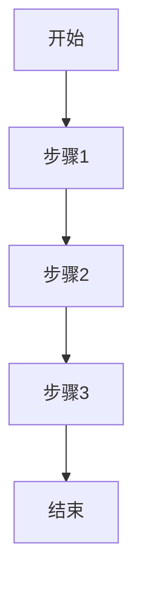
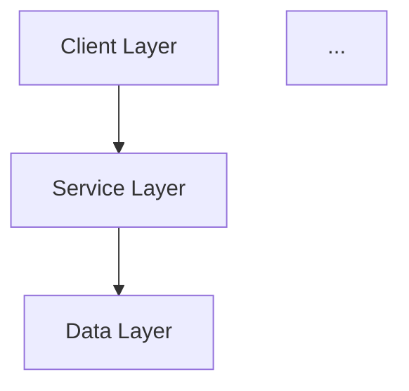
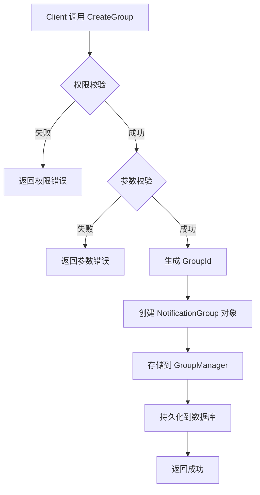

# 输出文件模板

本文件包含 Feature-Agent 各阶段产出的文件模板。

**重要约定**：
- 所有过程文档存放在 `.opencode/kb/features/${feature-name}/` 目录下
- `${feature-name}`：需求名称，用作目录名，英文小写字母，多个单词用 `-` 连接
- 模板中的路径需要替换为实际路径

## 1. feature-architecture.md 输出文件模板

文件路径：`.opencode/kb/features/${feature-name}/feature-architecture.md`

实际路径示例：`.opencode/kb/features/notification-group-management/feature-architecture.md`

```markdown
# Feature Architecture - 架构设计文档

## 1. 需求背景与价值

### 1.1 使用场景

**用户痛点**：
- <描述真实用户遇到的问题>
- <问题发生的频率和影响范围>

**问题分析**：
- 当前解决方案：<描述现有的临时方案或替代方案>
- 问题影响：<描述问题对用户或系统的影响>

### 1.2 业务价值

**不实现的影响**：
- 用户影响：<用户体验下降、功能缺失等>
- 业务影响：<业务流程受阻、效率降低等>
- 系统影响：<系统稳定性、可维护性等>

**实现的收益**：
- 效率提升：<量化指标，如提升X%>
- 成本降低：<量化指标，如降低Y%>
- 能力扩展：<新增的能力描述>

**量化指标**（如有数据支撑）：
- 预期用户覆盖：<数字>
- 预期调用频率：<数字>
- 预期性能提升：<百分比>

### 1.3 优先级

**为什么现在做**：
- 业务紧迫性：<描述紧迫的原因>
- 技术依赖：<描述技术上的依赖关系>
- 资源可用性：<描述开发资源的可用情况>

**优先级判断**：
- 影响面：<高/中/低>
- 复杂度：<高/中/低>
- 风险等级：<高/中/低>
- 最终优先级：<P0/P1/P2>

## 2. 上下游与边界

### 2.1 依赖方

**上游调用者**：
| 调用方 | 调用频率 | 调用场景 | 调用方式 |
|--------|----------|----------|----------|
| <调用方1> | <频率> | <场景> | <API/事件等> |

**依赖的服务**：
| 服务名称 | 依赖类型 | 稳定性要求 | 失败影响 |
|----------|----------|------------|----------|
| <服务1> | <强依赖/弱依赖> | <可用性要求> | <失败后的影响> |

**数据来源**：
| 数据源 | 数据类型 | 数据质量 | 更新频率 |
|--------|----------|----------|----------|
| <来源1> | <类型> | <质量评估> | <频率> |

### 2.2 影响方

**下游影响的模块**：
| 模块名称 | 影响程度 | 影响方式 | 需要的改动 |
|----------|----------|----------|------------|
| <模块1> | <高/中/低> | <接口/数据/行为> | <改动说明> |

**系统影响**：
| 系统名称 | 影响范围 | 协调方 | 协调事项 |
|----------|----------|----------|----------|
| <系统1> | <范围> | <协调方> | <事项> |

**数据影响**：
- 是否影响现有数据结构：<是/否>
- 是否需要数据迁移：<是/否>
- 迁移策略：<如有迁移，描述策略>

### 2.3 边界

**包含的功能**：
| 功能点 | 优先级 | 实现范围 | 说明 |
|--------|--------|----------|------|
| <功能1> | 核心 | <范围描述> | <补充说明> |
| <功能2> | 核心 | <范围描述> | <补充说明> |
| <功能3> | 扩展 | <范围描述> | <补充说明> |

**不包含的功能**：
| 功能点 | 排除原因 | 后续规划 |
|--------|----------|----------|
| <功能1> | <原因> | <后续安排> |

**MVP范围**（如有分期）：
- 第一期：<列出第一期的功能清单>
- 后续分期：<列出后续分期的规划>

## 3. 功能细节

### 3.1 业务流程

**核心路径**：
<使用 mermaid 流程图表示正常场景的完整流程>



**异常路径**：
| 异常场景 | 触发条件 | 处理方式 | 返回结果 |
|----------|----------|----------|----------|
| <异常1> | <条件> | <处理方式> | <结果> |

**边界场景**：
| 边界条件 | 触发场景 | 处理方式 | 注意事项 |
|----------|----------|----------|----------|
| <边界1> | <场景> | <处理方式> | <注意事项> |

### 3.2 数据流向

**数据来源**：
- 来源1：<描述数据的来源、获取方式>
- 来源2：<描述数据的来源、获取方式>

**数据去向**：
- 去向1：<描述数据的去向、使用方>
- 去向2：<描述数据的去向、使用方>

**数据格式**：
| 数据名称 | 格式定义 | 字段说明 | 示例 |
|----------|----------|----------|------|
| <数据1> | <格式> | <字段说明> | <示例> |

**数据转换**：
<描述中间的数据转换和处理逻辑>

### 3.3 接口定义

**API接口列表**：
| 接口名称 | 接口类型 | 调用场景 | 说明 |
|----------|----------|----------|------|
| <API1> | <同步/异步> | <场景> | <功能说明> |

**接口详情**：

#### API1: <接口名称>

**接口路径**：<API路径>

**请求参数**：
| 参数名 | 类型 | 必填 | 默认值 | 说明 | 取值范围 |
|--------|------|------|--------|------|----------|
| <参数1> | <类型> | <是/否> | <默认值> | <说明> | <范围> |

**返回值**：
| 字段名 | 类型 | 说明 | 示例 |
|--------|------|------|------|
| <字段1> | <类型> | <说明> | <示例> |

**错误码**：
| 错误码 | 错误场景 | 错误信息 | 处理建议 |
|--------|----------|----------|----------|
| <错误码1> | <场景> | <信息> | <建议> |

## 4. 实现方案

### 4.1 技术方案

**可选方案**：
| 方案名称 | 方案描述 | 优点 | 缺点 | 适用场景 |
|----------|----------|------|------|----------|
| 方案A | <描述> | <优点> | <缺点> | <场景> |
| 方案B | <描述> | <优点> | <缺点> | <场景> |

**技术风险**：
| 风险点 | 风险等级 | 影响范围 | 应对措施 |
|--------|----------|----------|----------|
| <风险1> | <高/中/低> | <范围> | <措施> |

**推荐方案**：
- 方案选择：<选择方案A/B，说明理由>
- 实现路径：<简述实现路径>

### 4.2 性能要求

**并发要求**：
- 预期并发量：<数字>
- 峰值场景：<描述峰值场景>
- 峰值并发：<峰值数字>

**响应时间**：
- 预期响应时间：<数字ms/s>
- 超时阈值：<超时时间>
- 超时处理：<超时后的处理方式>

**数据量**：
- 预期数据规模：<数字>
- 增长趋势：<增长率>
- 数据存储：<存储方式和容量>

### 4.3 容错处理

**失败策略**：
| 失败场景 | 失败原因 | 处理方式 | 重试策略 |
|----------|----------|----------|----------|
| <场景1> | <原因> | <处理方式> | <重试策略> |

**降级方案**：
- 降级触发条件：<触发条件>
- 降级逻辑：<降级后的处理逻辑>
- 降级影响：<降级对用户的影响>

**重试机制**：
- 是否需要重试：<是/否>
- 重试策略：<重试次数、间隔、条件>
- 重试失败处理：<最终失败的处理>

## 5. 约束与要求

### 5.1 权限控制

**权限清单**：
| 权限名称 | 权限类型 | 权限来源 | 使用场景 |
|----------|----------|----------|----------|
| <权限1> | <系统/应用/用户> | <来源> | <场景> |

**权限校验**：
- 校验时机：<在哪个环节校验>
- 校验方式：<如何校验权限>
- 校验失败处理：<失败后的处理>

**权限管理**：
- 权限申请：<如何申请权限>
- 权限分配：<如何分配权限>
- 权限回收：<如何回收权限>

### 5.2 参数校验

**入参规则**：
| 参数名 | 格式要求 | 取值范围 | 长度限制 | 必填规则 |
|--------|----------|----------|----------|----------|
| <参数1> | <格式> | <范围> | <长度> | <必填规则> |

**边界值处理**：
| 参数名 | 最大值 | 最小值 | 边界场景 | 处理方式 |
|--------|--------|--------|----------|----------|
| <参数1> | <最大值> | <最小值> | <场景> | <处理方式> |

**校验时机**：
- 校验位置：<在哪里校验>
- 校验失败处理：<失败后的处理>

### 5.3 埋点打点

**上报指标**：
| 指标名称 | 指标类型 | 上报时机 | 上报维度 | 说明 |
|----------|----------|----------|----------|------|
| <指标1> | <计数/计时/状态> | <时机> | <维度> | <说明> |

**监控项**：
| 监控项 | 监控类型 | 监控阈值 | 告警级别 | 说明 |
|----------|----------|----------|----------|------|
| <监控1> | <可用性/性能/错误> | <阈值> | <级别> | <说明> |

**告警策略**：
| 告警项 | 告警条件 | 告警方式 | 告警接收方 | 处理流程 |
|----------|----------|----------|----------|----------|
| <告警1> | <条件> | <方式> | <接收方> | <流程> |

### 5.4 兼容性要求

**版本兼容**：
- 是否兼容老版本：<是/否>
- 兼容范围：<兼容的版本范围>
- 兼容方式：<如何兼容>

**数据迁移**：
- 是否需要迁移：<是/否>
- 迁移范围：<需要迁移的数据范围>
- 迁移策略：<迁移的方式和步骤>

**回滚机制**：
- 是否需要回滚：<是/否>
- 回滚触发：<回滚的触发条件>
- 回滚方式：<如何回滚>

## 6. 测试策略

### 6.1 测试场景

**正常场景**：
| 场景名称 | 场景描述 | 测试重点 | 验证点 |
|----------|----------|----------|--------|
| <场景1> | <描述> | <重点> | <验证点> |

**异常场景**：
| 场景名称 | 异常类型 | 异常触发 | 测试重点 | 验证点 |
|----------|----------|----------|----------|--------|
| <场景1> | <类型> | <触发> | <重点> | <验证点> |

**边界场景**：
| 场景名称 | 边界条件 | 测试重点 | 验证点 |
|----------|----------|----------|--------|
| <场景1> | <条件> | <重点> | <验证点> |

### 6.2 验证方法

**功能验证**：
- 验证方式：<如何验证功能正确>
- 验证工具：<使用的工具>
- 验证标准：<验证的标准>

**性能验证**：
- 验证方式：<如何验证性能达标>
- 测试工具：<使用的工具>
- 性能指标：<要验证的指标>

**兼容验证**：
- 验证方式：<如何验证兼容性>
- 测试范围：<兼容性测试范围>
- 验证标准：<兼容性标准>

### 6.3 测试数据

**测试环境**：
- 环境要求：<测试环境的要求>
- 环境搭建：<如何搭建环境>
- 环境差异：<与生产环境的差异>

**测试数据准备**：
| 数据类型 | 数据来源 | 数据规模 | 准备方式 |
|----------|----------|----------|----------|
| <类型1> | <来源> | <规模> | <准备方式> |

**数据隔离**：
- 测试数据：<测试数据的范围>
- 生产数据：<生产数据的范围>
- 隔离策略：<如何隔离>

---

## 附录

### A. 相关模块清单

| 模块名称 | 模块路径 | 模块职责 | 相关性 |
|----------|----------|----------|--------|
| <模块1> | <路径> | <职责> | <为何相关> |

### B. 技术架构快照

<使用 mermaid 表示当前的技术架构>

### C. 决策记录

| 决策点 | 决策结果 | 决策理由 | 决策时间 | 决策人 |
|----------|----------|----------|----------|----------|
| <决策1> | <结果> | <理由> | <时间> | <架构师> |

### D. 待确认事项

| 事项 | 状态 | 负责人 | 预计完成时间 |
|----------|----------|----------|----------|
| <事项1> | <待确认/已确认> | <负责人> | <时间> |
```

---

## 2. feature-context.md 输出文件模板

文件路径：`.opencode/kb/features/${feature-name}/feature-context.md`

实际路径示例：`.opencode/kb/features/notification-group-management/feature-context.md`

**生成时机**：Dev-Design 阶段由 Dev-Design 子代理生成

```markdown
# Feature Context - 需求上下文

## 1. 需求名称
<feature_name>

## 2. 需求描述
<详细的需求描述>

## 3. 入口文件
| 文件路径 | 类型 | 说明 |
|----------|------|------|
| <path1> | 入口 | <说明> |

## 4. 排除文件
| 文件路径 | 原因 |
|----------|------|
| <path1> | <原因> |

## 5. 验收标准列表
| ID | 验收标准 | 类型 | 功能点 |
|----|----------|------|--------|
| AC-001 | <标准> | 功能 | 功能点1 |
| AC-002 | <标准> | 性能 | 功能点2 |

## 6. 功能点列表
| ID | 功能点 | 优先级 | 验收标准 |
|----|--------|--------|----------|
| FP-001 | <功能点> | 核心 | AC-001 |
| FP-002 | <功能点> | 核心 | AC-002 |

## 7. 上下文约束
- 设计约束: <如有>
- 实现约束: <如有>
- 测试约束: <如有>
```

---

## 3. feature-dev-design.md 输出文件模板

文件路径：`.opencode/kb/features/${feature-name}/feature-dev-design.md`

实际路径示例：`.opencode/kb/features/notification-group-management/feature-dev-design.md`

```markdown
# Feature Dev-Design - 开发设计方案

## 1. 开发概述

### 1.1 功能实现概述
<从开发视角说明如何实现功能,包含具体的实现路径>

**实现路径**：
1. <步骤1>: <具体实现内容>
2. <步骤2>: <具体实现内容>
3. <步骤3>: <具体实现内容>

### 1.2 开发目标
- 目标1: <具体的开发目标说明>
- 目标2: <具体的开发目标说明>
- 目标3: <具体的开发目标说明>

### 1.3 开发约束
- 约束1: <具体的开发约束说明>
- 约束2: <具体的开发约束说明>
- 约束3: <具体的开发约束说明>

## 2. 开发架构设计

### 2.1 整体架构图
<使用 mermaid 表示架构图,包含具体的类和模块名称>



### 2.2 新增模块说明
| 模块名称 | 文件路径 | 说明 | 职责 |
|----------|----------|------|------|
| NotificationGroup | frameworks/ans/core/notification_group.h/cpp | 新增类 | 分组管理 |

### 2.3 扩展点说明
| 扩展点 | 现有文件 | 说明 | 扩展方式 |
|--------|----------|------|----------|
| NotificationManager接口 | interfaces/inner_api/notification_manager_interface.h | 公共接口 | 添加新方法 |

### 2.4 与现有架构集成方式
<说明具体的集成代码和集成步骤>

**集成步骤**：
1. <步骤1>: <具体的集成操作>
2. <步骤2>: <具体的集成操作>

## 3. 详细开发设计

### 3.1 类图
<使用 mermaid 表示类图,包含所有新增和修改的类>

```mermaid
classDiagram
    class NotificationGroup {
        +string id
        +string name
        +GetId() string
        +SetName(string) void
    }
    ...
```

### 3.2 核心类设计

#### NotificationGroup 类（新增）

**文件位置**: `frameworks/ans/core/notification_group.h` 和 `frameworks/ans/core/notification_group.cpp`

**类定义框架**:
```cpp
#include <string>
#include "parcel.h"

namespace OHOS {
namespace Notification {

class NotificationGroup : public Parcelable {
public:
    NotificationGroup();
    NotificationGroup(const std::string& id, const std::string& name);
    ~NotificationGroup();

    std::string GetId() const;
    std::string GetName() const;
    void SetName(const std::string& name);
    
    virtual bool Marshalling(Parcel& parcel) const override;
    static NotificationGroup* Unmarshalling(Parcel& parcel);

private:
    std::string id_;
    std::string name_;
};

}  // namespace Notification
}  // namespace OHOS
```

**实现要点**:
- 使用 `std::string` 存储分组 ID 和名称
- 继承 `Parcelable` 以支持 IPC 传输
- 实现 `Marshalling/Unmarshalling` 序列化方法
- ID 在构造时自动生成,使用 UUID 或时间戳

### 3.3 接口定义

#### 公共接口（新增）

**文件位置**: `interfaces/inner_api/notification_manager_interface.h`

**接口签名**:
```cpp
/**
 * @brief Creates a new notification group.
 * 
 * @param name The name of the group to create.
 * @param groupId Output parameter for the created group ID.
 * @return Returns ERR_OK on success, error code on failure.
 */
ErrCode CreateGroup(const std::string& name, std::string& groupId);

/**
 * @brief Gets all notification groups.
 * 
 * @param groups Output parameter for the list of groups.
 * @return Returns ERR_OK on success, error code on failure.
 */
ErrCode GetGroups(std::vector<NotificationGroup>& groups);

/**
 * @brief Deletes a notification group.
 * 
 * @param groupId The ID of the group to delete.
 * @return Returns ERR_OK on success, error code on failure.
 */
ErrCode DeleteGroup(const std::string& groupId);
```

**实现要点**:
- 所有接口返回 `ErrCode` 类型
- 使用输出参数返回结果数据
- 需要权限校验（使用 `PermissionHelper`）
- 需要参数校验（名称长度、ID 格式）

#### 内部接口（新增）

**文件位置**: `frameworks/ans/core/notification_group_manager.h`

**接口签名**:
```cpp
class NotificationGroupManager {
public:
    bool AddGroup(const sptr<NotificationGroup>& group);
    bool RemoveGroup(const std::string& groupId);
    sptr<NotificationGroup> GetGroup(const std::string& groupId);
    std::vector<sptr<NotificationGroup>> GetAllGroups();
    
private:
    std::map<std::string, sptr<NotificationGroup>> groups_;
};
```

### 3.4 数据结构定义

#### NotificationGroup 数据结构

**内存结构**:
```cpp
struct GroupData {
    std::string id;           // UUID 格式: xxxxxxxx-xxxx-xxxx-xxxx-xxxxxxxxxxxx
    std::string name;         // 分组名称,最大长度 64 字符
    int64_t createTime;       // 创建时间戳
    std::string creatorUid;   // 创建者 UID
};
```

**序列化格式**:
```cpp
// Marshalling 实现
bool NotificationGroup::Marshalling(Parcel& parcel) const
{
    if (!parcel.WriteString(id_)) {
        return false;
    }
    if (!parcel.WriteString(name_)) {
        return false;
    }
    if (!parcel.WriteInt64(createTime_)) {
        return false;
    }
    return parcel.WriteString(creatorUid_);
}
```

## 4. 开发流程设计

### 4.1 核心流程图
<使用 mermaid 表示流程图,包含具体的代码步骤>



### 4.2 关键场景流程（含代码示例）

#### 创建分组场景

**代码步骤**:
```cpp
// Step 1: 权限校验
if (!PermissionHelper::VerifyPermission(token, "ohos.permission.NOTIFICATION_CONTROLLER")) {
    return ERR_ANS_PERMISSION_DENIED;
}

// Step 2: 参数校验
if (name.empty() || name.length() > MAX_GROUP_NAME_LENGTH) {
    return ERR_ANS_INVALID_PARAM;
}

// Step 3: 生成 GroupId
std::string groupId = GenerateUUID();

// Step 4: 创建对象
sptr<NotificationGroup> group = new NotificationGroup(groupId, name);

// Step 5: 存储
if (!groupManager_->AddGroup(group)) {
    return ERR_ANS_GROUP_ALREADY_EXISTS;
}

// Step 6: 持久化
if (!Preferences::GetInstance()->SaveGroup(group)) {
    ANS_LOGE("Failed to save group to preferences");
    // 不返回错误,因为内存已保存成功
}

return ERR_OK;
```

### 4.3 异常处理流程（含代码示例）

#### 权限错误处理

**代码示例**:
```cpp
ErrCode result = PermissionHelper::VerifyPermission(token, permission);
if (result != ERR_OK) {
    ANS_LOGE("Permission denied: %{public}d", result);
    return ERR_ANS_PERMISSION_DENIED;
}
```

#### 参数错误处理

**代码示例**:
```cpp
if (name.empty()) {
    ANS_LOGE("Group name is empty");
    return ERR_ANS_INVALID_PARAM;
}

if (name.length() > MAX_GROUP_NAME_LENGTH) {
    ANS_LOGW("Group name too long: %{public}zu", name.length());
    return ERR_ANS_INVALID_PARAM;
}
```

#### 存储失败处理

**代码示例**:
```cpp
if (!groupManager_->AddGroup(group)) {
    ANS_LOGE("Failed to add group: %{public}s", groupId.c_str());
    return ERR_ANS_GROUP_ALREADY_EXISTS;
}

// 持久化失败不影响内存操作
if (!Preferences::GetInstance()->SaveGroup(group)) {
    ANS_LOGW("Failed to save group to preferences, but memory save success");
}
```

## 5. 接口定义文档

### 5.1 公共接口定义

#### CreateGroup 接口

**完整定义**:
```cpp
/**
 * @brief Creates a new notification group.
 * @param name The name of the group (1-64 characters, non-empty).
 * @param groupId Output parameter for the created group ID (UUID format).
 * @return ERR_OK on success.
 * @return ERR_ANS_PERMISSION_DENIED if permission check fails.
 * @return ERR_ANS_INVALID_PARAM if name is invalid.
 * @return ERR_ANS_GROUP_ALREADY_EXISTS if group with same name exists.
 */
ErrCode CreateGroup(const std::string& name, std::string& groupId);
```

**调用示例**:
```cpp
std::string groupId;
ErrCode result = NotificationManager::CreateGroup("Important", groupId);
if (result == ERR_OK) {
    ANS_LOGI("Group created: %{public}s", groupId.c_str());
} else {
    ANS_LOGE("Failed to create group: %{public}d", result);
}
```

### 5.2 内部接口定义

#### GroupManager 内部接口

**完整定义**:
```cpp
class NotificationGroupManager {
public:
    /**
     * @brief Adds a group to the manager.
     * @param group The group to add.
     * @return true on success, false if group already exists.
     */
    bool AddGroup(const sptr<NotificationGroup>& group);
    
    /**
     * @brief Removes a group from the manager.
     * @param groupId The ID of the group to remove.
     * @return true on success, false if group not found.
     */
    bool RemoveGroup(const std::string& groupId);
    
    /**
     * @brief Gets a group by ID.
     * @param groupId The ID of the group to get.
     * @return The group object, nullptr if not found.
     */
    sptr<NotificationGroup> GetGroup(const std::string& groupId);
    
    /**
     * @brief Gets all groups.
     * @return Vector of all group objects.
     */
    std::vector<sptr<NotificationGroup>> GetAllGroups();

private:
    std::map<std::string, sptr<NotificationGroup>> groups_;
};
```

### 5.3 NAPI 接口定义（如需要）

#### JavaScript 接口绑定

**NAPI 实现示例**:
```cpp
static napi_value CreateGroupNapi(napi_env env, napi_callback_info info)
{
    // 获取参数
    size_t argc = 1;
    napi_value args[1];
    napi_get_cb_info(env, info, &argc, args, nullptr, nullptr);
    
    // 获取 name 参数
    std::string name;
    NapiUtils::GetStringValue(env, args[0], name);
    
    // 调用 C++ 接口
    std::string groupId;
    ErrCode result = NotificationManager::CreateGroup(name, groupId);
    
    // 返回结果
    napi_value ret;
    napi_create_object(env, &ret);
    NapiUtils::SetInt32Value(env, ret, "code", result);
    NapiUtils::SetStringValue(env, ret, "groupId", groupId);
    return ret;
}
```

**JavaScript 调用示例**:
```javascript
const result = await notificationManager.createGroup("Important");
if (result.code === 0) {
    console.log("Group created:", result.groupId);
}
```

### 5.4 接口兼容性说明

#### 新增接口兼容性

**兼容性处理**:
- 新增接口不影响现有接口
- 新增数据结构独立存储
- 新增功能需要权限申请

**兼容性检查代码**:
```cpp
// 版本检查
if (!IsFeatureSupported("NotificationGroup")) {
    ANS_LOGW("NotificationGroup feature not supported in this version");
    return ERR_ANS_FEATURE_NOT_SUPPORTED;
}
```

## 6. 开发测试策略

### 6.1 单元测试策略

#### 测试框架选择
- 使用 GoogleTest 框架
- 使用 HWTEST_F 宏定义测试用例
- 使用 EXPECT_EQ/ASSERT_EQ 进行断言

#### 测试命名规范
```cpp
HWTEST_F(NotificationGroupTest, GetId_00001, Function | SmallTest | Level1)
{
    // 测试用例命名: ClassName_MethodName_ScenarioNumber
}
```

#### 测试代码示例
```cpp
#define private public
#include "notification_group.h"
#undef private

HWTEST_F(NotificationGroupTest, CreateGroup_00001, Function | SmallTest | Level1)
{
    std::string name = "TestGroup";
    sptr<NotificationGroup> group = new NotificationGroup(name);
    
    EXPECT_NE(group, nullptr);
    EXPECT_FALSE(group->GetId().empty());
    EXPECT_EQ(group->GetName(), name);
}
```

### 6.2 功能测试策略

#### 正常场景测试
```cpp
HWTEST_F(NotificationGroupTest, CreateGroup_00001, Function | SmallTest | Level1)
{
    // 正常创建分组
    std::string groupId;
    ErrCode result = NotificationManager::CreateGroup("TestGroup", groupId);
    EXPECT_EQ(result, ERR_OK);
    EXPECT_FALSE(groupId.empty());
}
```

#### 边界场景测试
```cpp
HWTEST_F(NotificationGroupTest, CreateGroup_00002, Function | SmallTest | Level1)
{
    // 名称长度边界
    std::string longName(65, 'a'); // 65 字符
    std::string groupId;
    ErrCode result = NotificationManager::CreateGroup(longName, groupId);
    EXPECT_EQ(result, ERR_ANS_INVALID_PARAM);
}
```

#### 异常场景测试
```cpp
HWTEST_F(NotificationGroupTest, CreateGroup_00003, Function | SmallTest | Level1)
{
    // 重复创建分组
    std::string groupId1, groupId2;
    NotificationManager::CreateGroup("TestGroup", groupId1);
    ErrCode result = NotificationManager::CreateGroup("TestGroup", groupId2);
    EXPECT_EQ(result, ERR_ANS_GROUP_ALREADY_EXISTS);
}
```

### 6.3 性能测试策略（如有性能要求）

#### 性能测试场景
```cpp
HWTEST_F(NotificationGroupTest, CreateGroupPerformance_00001, Performance | MediumTest | Level2)
{
    // 测试创建 100 个分组的性能
    int count = 100;
    auto start = std::chrono::high_resolution_clock::now();
    
    for (int i = 0; i < count; i++) {
        std::string groupId;
        NotificationManager::CreateGroup("Group" + std::to_string(i), groupId);
    }
    
    auto end = std::chrono::high_resolution_clock::now();
    auto duration = std::chrono::duration_cast<std::chrono::milliseconds>(end - start);
    
    EXPECT_LT(duration.count(), 1000); // 应小于 1 秒
}
```

### 6.4 测试覆盖目标

#### 覆盖率要求
- 单元测试覆盖率: ≥90% 分支覆盖率
- 功能测试覆盖率: 100% 正常场景 + 80% 异常场景
- 性能测试: 关键性能指标验证

#### 覆盖率检查命令
```bash
# 运行单元测试
./build.sh --product-name rk3568 --build-target distributed_notification_service_test

# 生成覆盖率报告
lcov --capture --directory . --output-file coverage.info
genhtml coverage.info --output-directory coverage_report
```

## 7. 开发要点说明

### 7.1 关键实现要点

#### 内存管理
```cpp
// 使用 sptr 管理对象生命周期
sptr<NotificationGroup> group = new NotificationGroup();

// 不要使用裸指针
// NotificationGroup* group = new NotificationGroup(); // 错误!
```

#### 线程安全
```cpp
// 使用 std::mutex 保护共享数据
std::lock_guard<std::mutex> lock(groupsMutex_);
groups_[groupId] = group;
```

#### 日志规范
```cpp
// 使用 ANS_LOG* 宏
ANS_LOGI("Group created: %{public}s", groupId.c_str());  // Info
ANS_LOGE("Failed to create group: %{public}d", result);  // Error

// 使用 %{public}s/d 格式化,确保日志可见
```

### 7.2 技术难点

#### IPC 序列化
**难点**: 需要正确实现 Parcelable 序列化

**解决方案**:
```cpp
// 确保所有字段都正确序列化
bool NotificationGroup::Marshalling(Parcel& parcel) const
{
    // 检查每个 WriteString/WriteInt 返回值
    if (!parcel.WriteString(id_)) {
        ANS_LOGE("Failed to write id");
        return false;
    }
    // ... 其他字段
    return true;
}

// Unmarshalling 时检查读取结果
NotificationGroup* NotificationGroup::Unmarshalling(Parcel& parcel)
{
    std::string id;
    if (!parcel.ReadString(id)) {
        ANS_LOGE("Failed to read id");
        return nullptr;
    }
    // ... 其他字段
    return new NotificationGroup(id, name);
}
```

#### 持久化处理
**难点**: 需要正确持久化分组数据

**解决方案**:
```cpp
// 使用 Preferences 持久化
void SaveGroupToPreferences(const sptr<NotificationGroup>& group)
{
    std::string key = "group_" + group->GetId();
    std::string value = SerializeGroup(group);
    
    if (!Preferences::GetInstance()->PutString(key, value)) {
        ANS_LOGE("Failed to save group");
    }
}
```

### 7.3 实现建议

#### 代码组织建议
- 新增类放在 `frameworks/ans/core/` 目录
- 新增接口放在 `interfaces/inner_api/` 目录
- 测试代码放在 `test/unittest/` 对应子目录

#### 命名规范建议
- 类名: PascalCase (NotificationGroup)
- 方法名: PascalCase (GetId, SetName)
- 变量名: camelCase (groupId, groupName)
- 常量: UPPER_SNAKE_CASE (MAX_GROUP_NAME_LENGTH)

#### 最佳实践建议
- 使用智能指针 (sptr/std::shared_ptr) 管理对象生命周期
- 使用 RAII 机制管理锁和资源
- 使用 ANS_LOG* 宏记录关键日志
- 使用 ErrCode 返回错误,避免抛出异常
- 实现 Parcelable 以支持 IPC 传输
```

---

## 4. feature-plan.md 输出文件模板

文件路径：`.opencode/kb/features/${feature-name}/feature-plan.md`

实际路径示例：`.opencode/kb/features/notification-group-management/feature-plan.md`

```markdown
# Feature Plan - 任务分解计划

## 1. 任务列表

| ID | 名称 | 类型 | Wave | 依赖 |
|----|------|------|------|------|
| T001 | 实现 NotificationGroup 类 | 核心实现 | wave-1 | - |
| T002 | 实现分组创建接口 | 核心实现 | wave-1 | T001 |
| T003 | 实现分组查询接口 | 核心实现 | wave-1 | T001 |

## 2. DAG 任务图

<使用 mermaid 表示任务依赖关系图>

## 3. Wave 分批实现图

### Wave 1: 核心实现
- T001: 实现 NotificationGroup 类
- T002: 实现分组创建接口
- T003: 实现分组查询接口

### Wave 2: 扩展功能
- T004: 实现分组排序功能
- T005: 实现分组重命名功能

### Wave 3: 测试验证
- T006: 编写单元测试
- T007: 编写功能测试
- T008: 执行测试验证

### Wave 4: 文档完善
- T009: 更新 API 文档
- T010: 编写使用文档
- T011: 提供示例代码

## 4. 任务详情

### T001: 实现 NotificationGroup 类

**类型**: 核心实现
**Wave**: wave-1
**依赖**: -

**files_write**:
- frameworks/ans/core/notification_group.h
- frameworks/ans/core/notification_group.cpp

**files_read**:
- frameworks/ans/core/notification_manager.h

**验收标准**:
- [ ] 类定义完整
- [ ] 基本方法实现
- [ ] 编译通过

**测试命令**:
```bash
./build.sh --product-name rk3568 --build-target distributed_notification_service
```

## 5. 测试用例清单

### 单元测试用例
| ID | 测试用例 | 覆盖功能 |
|----|----------|----------|
| UT-001 | NotificationGroup_GetId_00001 | GetId() |
| UT-002 | NotificationGroup_SetName_00001 | SetName() |

### 功能测试用例
| ID | 测试用例 | 场景 |
|----|----------|------|
| FT-001 | CreateGroup_00001 | 正常创建 |
| FT-002 | CreateGroup_00002 | 重复创建 |

## 6. 文档更新计划

| ID | 文档 | 更新内容 |
|----|------|----------|
| DOC-001 | API 文档 | 新增分组接口文档 |
| DOC-002 | 使用文档 | 分组功能使用说明 |
```

---

## 5. feature-plan.md 结构化输出模板(JSON)

文件路径：`.opencode/kb/features/${feature-name}/feature-plan.md`（包含JSON结构化输出）

实际路径示例：`.opencode/kb/features/notification-group-management/feature-plan.md`

```json
{
  "waves": [
    {
      "id": "wave-1",
      "name": "core_implementation",
      "tasks": ["T001", "T002", "T003"]
    },
    {
      "id": "wave-2",
      "name": "extended_features",
      "tasks": ["T004", "T005"]
    },
    {
      "id": "wave-3",
      "name": "test_validation",
      "tasks": ["T006", "T007", "T008"]
    },
    {
      "id": "wave-4",
      "name": "documentation",
      "tasks": ["T009", "T010", "T011"]
    }
  ],
  "dag": {
    "T001": { "depends": [] },
    "T002": { "depends": ["T001"] },
    "T003": { "depends": ["T001"] }
  },
  "tasks": {
    "T001": {
      "id": "T001",
      "name": "实现 NotificationGroup 类",
      "wave_id": "wave-1",
      "type": "core_implementation",
      "depends": [],
      "files_write": [
        "frameworks/ans/core/notification_group.h",
        "frameworks/ans/core/notification_group.cpp"
      ],
      "files_read": [
        "frameworks/ans/core/notification_manager.h"
      ],
      "acceptance_criteria": [
        "类定义完整",
        "基本方法实现",
        "编译通过"
      ],
      "test_commands": [
        "./build.sh --product-name rk3568 --build-target distributed_notification_service"
      ],
      "evidence_required": [
        "源代码文件",
        "编译日志",
        "单元测试代码（如有）"
      ],
      "risk_level": "low",
      "description": "实现 NotificationGroup 类，包含基本属性和方法"
    },
    "T002": {
      "id": "T002",
      "name": "实现分组创建接口",
      "wave_id": "wave-1",
      "type": "core_implementation",
      "depends": ["T001"],
      "files_write": [
        "frameworks/ans/core/notification_manager.cpp",
        "interfaces/inner_api/notification_manager_interface.h"
      ],
      "files_read": [
        "frameworks/ans/core/notification_group.h"
      ],
      "acceptance_criteria": [
        "接口定义完整",
        "实现逻辑正确",
        "单元测试覆盖"
      ],
      "test_commands": [
        "./build.sh --product-name rk3568 --build-target distributed_notification_service",
        "./build.sh --product-name rk3568 --build-target distributed_notification_service_test"
      ],
      "evidence_required": [
        "接口定义文档",
        "实现代码",
        "单元测试代码",
        "测试执行结果"
      ],
      "risk_level": "medium",
      "description": "在 NotificationManager 中实现分组创建接口"
    },
    "T003": {
      "id": "T003",
      "name": "实现分组查询接口",
      "wave_id": "wave-1",
      "type": "core_implementation",
      "depends": ["T001"],
      "files_write": [
        "frameworks/ans/core/notification_manager.cpp",
        "interfaces/inner_api/notification_manager_interface.h"
      ],
      "files_read": [
        "frameworks/ans/core/notification_group.h"
      ],
      "acceptance_criteria": [
        "接口定义完整",
        "实现逻辑正确",
        "单元测试覆盖"
      ],
      "test_commands": [
        "./build.sh --product-name rk3568 --build-target distributed_notification_service",
        "./build.sh --product-name rk3568 --build-target distributed_notification_service_test"
      ],
      "evidence_required": [
        "接口定义文档",
        "实现代码",
        "单元测试代码",
        "测试执行结果"
      ],
      "risk_level": "medium",
      "description": "在 NotificationManager 中实现分组查询接口"
    }
  }
}
```

**tasks 字段说明**：

每个任务必须包含以下字段：

| 字段 | 类型 | 必填 | 说明 |
|------|------|------|------|
| `id` | string | 是 | 任务唯一标识（如 T001） |
| `name` | string | 是 | 任务名称 |
| `wave_id` | string | 是 | 所属 wave ID（如 wave-1） |
| `type` | string | 是 | 任务类型：core_implementation / extended_features / test_validation / documentation |
| `depends` | array | 是 | 依赖的任务 ID 列表 |
| `files_write` | array | 是 | 可写文件路径列表（相对于工作区根目录） |
| `files_read` | array | 是 | 只读文件路径列表（相对于工作区根目录） |
| `acceptance_criteria` | array | 是 | 验收标准列表 |
| `test_commands` | array | 是 | 测试命令列表 |
| `evidence_required` | array | 是 | 需要的证据产物列表 |
| `risk_level` | string | 是 | 风险等级：low / medium / high |
| `description` | string | 是 | 任务描述（供 Execute 参考） |

---

## 6. feature-<task-name>.md 任务总结文档模板

文件路径：`.opencode/kb/features/${feature-name}/feature-<task-name>.md`

实际路径示例：`.opencode/kb/features/notification-group-management/feature-create-group-interface.md`

```markdown
# Feature Task Summary - <task-name>

## 1. 任务信息

- 任务ID: <task_id>
- 任务名称: <task_name>
- 任务类型: <task_type>
- Wave: <wave_id>

## 2. 实现说明

### 2.1 实现内容
<详细说明实现了什么>

### 2.2 关键代码
<关键代码片段>

### 2.3 实现要点
<实现过程中的关键要点>

## 3. 文件变更

### 3.1 新增文件
| 文件 | 说明 |
|------|------|
| <file1> | <说明> |

### 3.2 修改文件
| 文件 | 变更说明 |
|------|----------|
| <file1> | <变更说明> |

## 4. 测试情况

### 4.1 测试用例
<列出相关测试用例>

### 4.2 测试结果
<测试执行结果>

## 5. 验收标准验证

| 验收标准 | 验证结果 |
|----------|----------|
| <标准1> | ✅ |
| <标准2> | ✅ |

## 6. 验证日志

<验证过程记录>
```