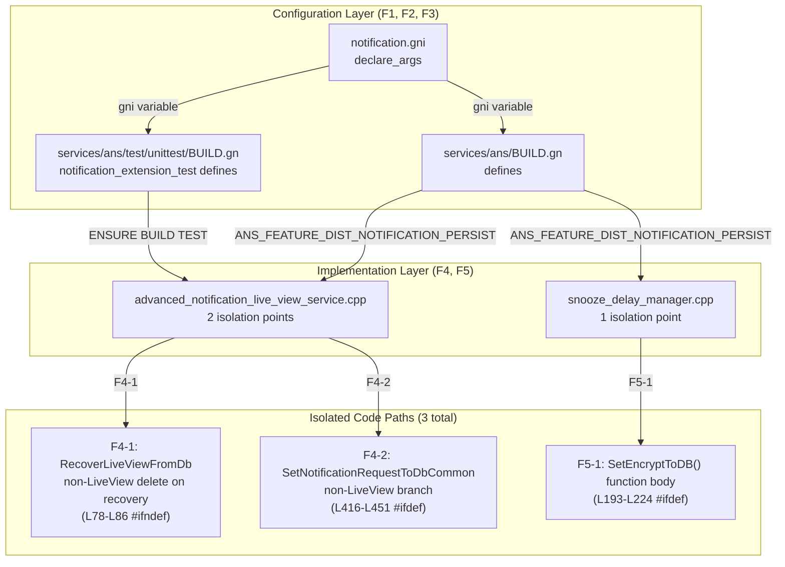
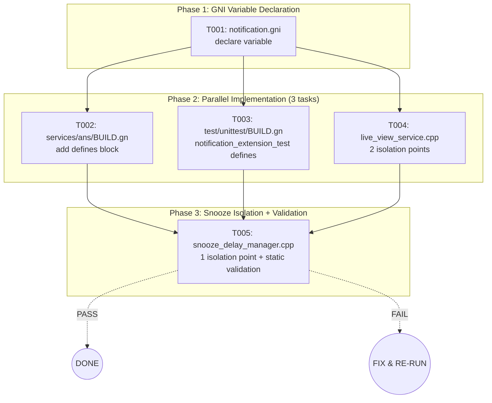
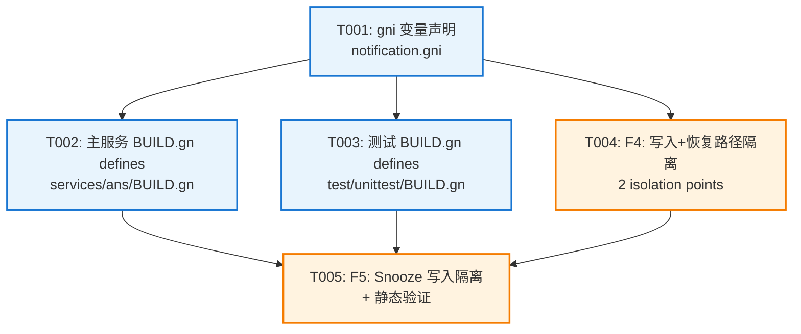

# Feature Development Plan: dist-notification-persist-isolation

> 开发实施设计文档 — 分布式通知持久化编译宏隔离

---

## 1. 开发概述

### 1.1 开发目标

通过编译宏 `ANS_FEATURE_DIST_NOTIFICATION_PERSIST` 隔离以下路径：
1. **非 LiveView 通知的 DB 写入路径**：`SetNotificationRequestToDbCommon()` 中非 LiveView 分支
2. **稍后提醒(Snooze)的 DB 写入路径**：`SetEncryptToDB()` 函数体
3. **非 LiveView 通知的恢复路径**：`RecoverLiveViewFromDb()` 中宏关闭时删除非 LiveView 记录

为轻量设备等不支持分布式通知持久化的产品提供按需裁剪能力,同时保证三方实况(LiveView)持久化功能不受任何影响。

### 1.2 实现范围

✅ **包含(Scope In)**：
- 非 LiveView 通知的 DB 写入隔离（`SetNotificationRequestToDbCommon` else 分支）
- Snooze 的 DB 写入隔离（`SetEncryptToDB` 函数体）
- 非 LiveView 通知的恢复路径隔离（`RecoverLiveViewFromDb` 中宏关闭时删除非 LiveView 记录以保证向后兼容）
- 编译宏声明（gni 变量 + BUILD.gn defines + C++ 宏）

❌ **不包含(Scope Out)**：
- 三方实况（IsCommonLiveView）持久化（保持不变）
- 系统实况（IsSystemLiveView）持久化（保持不变）
- DB 删除路径（保留,以便清理可能的残留数据）
- Snooze 恢复路径中的定时器启动（`StartSnoozeTimer` 保持不变）
- 单元测试更新
- 运行时配置

> **变更记录**：
> - v1：原方案包含 Snooze 恢复隔离（`IsCanRecoverSnooze` L78-L80、`StartSnoozeTimer` L126），用户终审移除，隔离点从 4→2。
> - v2：用户追加方案变更——为保证向后兼容，宏关闭时恢复路径中遇到非 LiveView 记录直接从 DB 删除，不再恢复。隔离点从 2→3。

### 1.3 关键约束

- **编译宏默认值**：`false`（默认关闭）
- **宏独立**：与 `ANS_FEATURE_ORIGINAL_DISTRIBUTED` 等其他 feature flag 相互独立
- **返回值约束**：宏关闭时,隔离路径返回成功（`ERR_OK` 或 `true`）,调用方无需改动
- **向后兼容**：宏关闭时，恢复路径中遇到已持久化的非 LiveView 记录直接从 DB 删除，保证旧数据不残留

### 1.4 开发者交互确认摘要

| 阶段 | 维度 | 关键结论 |
|------|------|----------|
| **P1** | 实现边界 | 仅隔离写入路径（SetNotificationRequestToDbCommon 非 LiveView 分支）+ Snooze 写入/恢复,恢复路径保持其他不变用 `#ifdef` 包裹代码块 |
| **P2** | 核心设计 | 方案 A：`#ifdef/#else/#endif` 整体包裹 + `#else return ERR_OK/true`；测试 BUILD.gn 同步添加宏定义 |
| **P3** | 文件与集成 | 5 个文件（F1-F5）,`notification_extension_test` 也添加 define |
| **P4** | 任务拆分 | 原 7 任务,用户要求合并后 T004 包含 F4 所有隔离点 |
| **P5** | 测试执行 | `test_first=false`,静态验证,无编译验证,验证清单充分 |
| **用户终审** | 方案确认 | 恢复路径不做编译宏隔离,移除 F4-1/F4-2,隔离点从 4→2,任务 7→5 |
| **方案变更 v2** | 向后兼容 | 宏关闭时恢复路径中非 LiveView 记录直接从 DB 删除,隔离点从 2→3 |

---

## 2. 开发架构设计

### 2.1 开发架构图



### 2.2 新增模块说明

本次需求**不新增模块**,仅在现有代码中添加 `#ifdef` 条件编译。

### 2.3 扩展点说明

**编译宏定义路径**：
```
notification.gni (gni variable)
    ↓ (GN/Ninja build system)
BUILD.gn (defines += "ANS_FEATURE_DIST_NOTIFICATION_PERSIST")
    ↓ (compiler flag: -DANS_FEATURE_DIST_NOTIFICATION_PERSIST)
*.cpp (#ifdef ANS_FEATURE_DIST_NOTIFICATION_PERSIST)
```

### 2.4 与现有架构的集成方式

**不改变任何现有架构**,仅通过编译宏隔离特定分支：

1. **写入路径隔离**：`SetNotificationRequestToDbCommon()` 与 `SetEncryptToDB()` 的函数体用 `#ifdef` 包裹,宏关闭时函数仍被调用但函数体为空操作
2. **恢复路径隔离**：`RecoverLiveViewFromDb()` 中用 `#ifndef` 检查非 LiveView 记录,宏关闭时直接从 DB 删除并 continue,不恢复。保证向后兼容——已持久化的旧数据不会残留

**保留的调用链**：
- 宏关闭时,`SetNotificationRequestToDbCommon()` 仍然被调用,但函数体为空（`#else return ERR_OK`）,调用方无需改动
- 宏关闭时,`ExcuteSnoozeNotification()` 仍然调用 `SetSnoozeDelayTimeToDB()`,但内部 `SetEncryptToDB()` 函数体为空（`#else return true`）,因此内存中仍可设置延迟定时器,仅不持久化

---

## 3. 详细开发设计

### 3.1 F1: `notification.gni` 变量声明

**文件路径**：`notification.gni`（仓库根目录）  
**修改位置**：`declare_args()` 块内,建议在 L92 附近（`distributed_notification_service_feature_ai_engine = true` 下方）

**代码内容**：
```gni
  distributed_notification_service_feature_dist_notification_persist = false
```

**注意事项**：
- 缩进保持与现有变量一致（2 空格）
- 变量名必须与架构文档一致：`distributed_notification_service_feature_dist_notification_persist`
- 默认值必须为 `false`

---

### 3.2 F2: `services/ans/BUILD.gn` defines 配置

**文件路径**：`services/ans/BUILD.gn`  
**修改位置**：建议在 L242-243 之间（`ANS_FEATURE_NOTIFICATION_STATISTICS` 块之后,L244 之前）

**代码内容**：
```gn
  if (distributed_notification_service_feature_dist_notification_persist) {
    defines += [ "ANS_FEATURE_DIST_NOTIFICATION_PERSIST" ]
  }
```

**影响范围**：`ohos_source_set("ans_service_sources")` —— 编译 `advanced_notification_live_view_service.cpp`（L114）与 `snooze_delay_manager.cpp`（L179）

---

### 3.3 F3: `services/ans/test/unittest/BUILD.gn` defines 配置

**文件路径**：`services/ans/test/unittest/BUILD.gn`  
**修改位置**：`notification_extension_test` 的 defines 区域,~L2158 附近（`ANS_FEATURE_PRIORITY_NOTIFICATION` 块之后）

**代码内容**：
```gn
  if (distributed_notification_service_feature_dist_notification_persist) {
    defines += [ "ANS_FEATURE_DIST_NOTIFICATION_PERSIST" ]
  }
```

**影响范围**：`ohos_unittest("notification_extension_test")`（L2025）—— 直接编译 `advanced_notification_live_view_service.cpp`（L2063）

**理由**：虽然该测试 target 不包含直接测试隔离路径的用例,但它直接编译了 `advanced_notification_live_view_service.cpp`,为保持行为一致性,需同步添加 define

---

### 3.4 F4: `advanced_notification_live_view_service.cpp` 隔离（2 处）

**文件路径**：`services/ans/src/advanced_notification_live_view_service.cpp`

> **变更记录**：
> - v1：仅 1 处隔离（写入路径），恢复路径不做隔离
> - v2：新增 1 处恢复路径隔离（宏关闭时删除非 LiveView 记录），隔离点从 1→2

#### F4-1: 恢复路径非 LiveView 删除隔离（L78-L86）

**当前位置**：`RecoverLiveViewFromDb()` 函数内部,在 `FillNotificationRecord` 成功后、`IsCanRecoverSnooze` 之前：

**修改后代码**：
```cpp
            }
#ifndef ANS_FEATURE_DIST_NOTIFICATION_PERSIST
            // 宏关闭时：非 LiveView 通知不恢复，直接从 DB 删除以保证向后兼容
            if (!requestObj.request->IsCommonLiveView()) {
                int32_t userId = requestObj.request->GetReceiverUserId();
                DoubleDeleteNotificationFromDb(requestObj.request->GetKey(),
                    requestObj.request->GetSecureKey(), userId);
                continue;
            }
#endif
            if (IsCanRecoverSnooze(record)) {
```

**宏关闭时行为**：非 LiveView 记录（包括 Snooze）不恢复,直接从 DB 删除并 continue,跳过后续所有恢复操作。保证向后兼容——已持久化的旧数据不会残留。

**宏开启时行为**：`#ifndef` 块被编译器剔除,恢复流程与原代码完全一致。

#### F4-2: 非 LiveView 写入路径隔离（L416-L451）

**当前位置**：`SetNotificationRequestToDbCommon()` 函数内部,L407-L442（`IsCommonLiveView()` 之后,函数末尾之前）

**代码结构（含上下文）**：
```cpp
int32_t AdvancedNotificationService::SetNotificationRequestToDbCommon(
    const NotificationRequestDb &requestDb)
{
    auto request = requestDb.request;
    if (request->IsSystemLiveView()) {
        return ERR_OK;                              // L398-400
    }
    if (request->IsCommonLiveView()) {
        ANS_LOGD("Slot type %{public}d, content type %{public}d.",
            request->GetSlotType(), request->GetNotificationType());
        return SetNotificationRequestToDb(requestDb);  // L401-405
    }

    // ===== L407-L442 需要隔离 =====
    ANS_LOGD("Enter.");
    HaMetaMessage message = HaMetaMessage(EventSceneId::SCENE_6, EventBranchId::BRANCH_3).
        BundleName(request->GetCreatorBundleName()).NotificationId(request->GetNotificationId());
    nlohmann::json jsonObject;
    if (!NotificationJsonConverter::ConvertToJson(request, jsonObject)) {
        ANS_LOGE("Convert request to json object failed, bundle name %{public}s, id %{public}d.",
            request->GetCreatorBundleName().c_str(), request->GetNotificationId());
        NotificationAnalyticsUtil::ReportModifyEvent(message.Message("convert request failed"));
        return ERR_ANS_TASK_ERR;
    }
    auto bundleOption = requestDb.bundleOption;
    if (!NotificationJsonConverter::ConvertToJson(bundleOption, jsonObject)) {
        ANS_LOGE("Convert bundle to json object failed, bundle name %{public}s, id %{public}d.",
            bundleOption->GetBundleName().c_str(), request->GetNotificationId());
        NotificationAnalyticsUtil::ReportModifyEvent(message.Message("convert option failed"));
        return ERR_ANS_TASK_ERR;
    }
    
    std::string encryptValue;
    ErrCode errorCode = AesGcmHelper::Encrypt(jsonObject.dump(), encryptValue);
    if (errorCode != ERR_OK) {
        ANS_LOGE("SetNotificationRequestToDb encrypt error");
        return static_cast<int>(errorCode);
    }
    auto result = NotificationPreferences::GetInstance()->SetKvToDb(
        request->GetSecureKey(), encryptValue, request->GetReceiverUserId());
    if (result != ERR_OK) {
        ANS_LOGE("Set failed, bundle name %{public}s, id %{public}d, key %{public}s, ret %{public}d.",
            request->GetCreatorBundleName().c_str(), request->GetNotificationId(), request->GetKey().c_str(), result);
        NotificationAnalyticsUtil::ReportModifyEvent(message.ErrorCode(result).Message("set failed"));
        return result;
    } else {
        DeleteNotificationRequestFromDb(request->GetKey(), request->GetReceiverUserId());
    }

    return result;
}
```

**修改后代码**（使用 P2 确认的方案 A）：
```cpp
    if (request->IsCommonLiveView()) {
        ANS_LOGD("Slot type %{public}d, content type %{public}d.",
            request->GetSlotType(), request->GetNotificationType());
        return SetNotificationRequestToDb(requestDb);
    }

#ifdef ANS_FEATURE_DIST_NOTIFICATION_PERSIST
    ANS_LOGD("Enter.");
    HaMetaMessage message = HaMetaMessage(EventSceneId::SCENE_6, EventBranchId::BRANCH_3).
        BundleName(request->GetCreatorBundleName()).NotificationId(request->GetNotificationId());
    nlohmann::json jsonObject;
    if (!NotificationJsonConverter::ConvertToJson(request, jsonObject)) {
        ANS_LOGE("Convert request to json object failed, bundle name %{public}s, id %{public}d.",
            request->GetCreatorBundleName().c_str(), request->GetNotificationId());
        NotificationAnalyticsUtil::ReportModifyEvent(message.Message("convert request failed"));
        return ERR_ANS_TASK_ERR;
    }
    auto bundleOption = requestDb.bundleOption;
    if (!NotificationJsonConverter::ConvertToJson(bundleOption, jsonObject)) {
        ANS_LOGE("Convert bundle to json object failed, bundle name %{public}s, id %{public}d.",
            bundleOption->GetBundleName().c_str(), request->GetNotificationId());
        NotificationAnalyticsUtil::ReportModifyEvent(message.Message("convert option failed"));
        return ERR_ANS_TASK_ERR;
    }
    
    std::string encryptValue;
    ErrCode errorCode = AesGcmHelper::Encrypt(jsonObject.dump(), encryptValue);
    if (errorCode != ERR_OK) {
        ANS_LOGE("SetNotificationRequestToDb encrypt error");
        return static_cast<int>(errorCode);
    }
    auto result = NotificationPreferences::GetInstance()->SetKvToDb(
        request->GetSecureKey(), encryptValue, request->GetReceiverUserId());
    if (result != ERR_OK) {
        ANS_LOGE("Set failed, bundle name %{public}s, id %{public}d, key %{public}s, ret %{public}d.",
            request->GetCreatorBundleName().c_str(), request->GetNotificationId(), request->GetKey().c_str(), result);
        NotificationAnalyticsUtil::ReportModifyEvent(message.ErrorCode(result).Message("set failed"));
        return result;
    } else {
        DeleteNotificationRequestFromDb(request->GetKey(), request->GetReceiverUserId());
    }

    return result;
#else
    return ERR_OK;
#endif
}
```

**宏关闭时行为**：
- 非 LiveView 通知：函数在 `IsCommonLiveView()` 判断失败后,进入 `#else` 分支,直接 `return ERR_OK`
- 三方 LiveView：仍然走 `IsCommonLiveView()` 分支,正常调用 `SetNotificationRequestToDb()`,**完全不受影响**
- 系统 LiveView：仍然走 `IsSystemLiveView()` 分支,正常返回 `ERR_OK`

---

### 3.5 F5: `snooze_delay_manager.cpp` 隔离（1 处）

**文件路径**：`services/ans/src/snooze_delay_manager.cpp`

#### F5-1: `SetEncryptToDB()` 函数体隔离（L191-L224）

**当前位置**：L191-L224：
```cpp
bool AdvancedNotificationService::SetEncryptToDB(const NotificationRequestDb &requestDb)
{
    auto request = requestDb.request;
    auto bundleOption = requestDb.bundleOption;
    if (!request || !bundleOption) {
        return false;
    }
    nlohmann::json jsonObject;
    if (!NotificationJsonConverter::ConvertToJson(request, jsonObject)) {
        ANS_LOGE("Convert request to json object failed, bundle name %{public}s, id %{public}d.",
            request->GetCreatorBundleName().c_str(), request->GetNotificationId());
        return false;
    }
    if (!NotificationJsonConverter::ConvertToJson(bundleOption, jsonObject)) {
        ANS_LOGE("Convert bundle to json object failed, bundle name %{public}s, id %{public}d.",
            bundleOption->GetBundleName().c_str(), request->GetNotificationId());
        return false;
    }
    std::string encryptValue;
    ErrCode errorCode = AesGcmHelper::Encrypt(jsonObject.dump(), encryptValue);
    if (errorCode != ERR_OK) {
        ANS_LOGE("SetSnoozeDelayTimeToDB encrypt error %{public}d", errorCode);
        return false;
    }
    std::string secureKey = request->GetSecureKey();
    auto secureResult = NotificationPreferences::GetInstance()->SetKvToDb(
        secureKey, encryptValue, request->GetReceiverUserId());
    if (secureResult != ERR_OK) {
        ANS_LOGE("SetSnoozeDelayTimeToDB SetKvToDb error %{public}d", secureResult);
        return false;
    }

    return true;
}
```

**修改后代码**：
```cpp
bool AdvancedNotificationService::SetEncryptToDB(const NotificationRequestDb &requestDb)
{
#ifdef ANS_FEATURE_DIST_NOTIFICATION_PERSIST
    auto request = requestDb.request;
    auto bundleOption = requestDb.bundleOption;
    if (!request || !bundleOption) {
        return false;
    }
    nlohmann::json jsonObject;
    if (!NotificationJsonConverter::ConvertToJson(request, jsonObject)) {
        ANS_LOGE("Convert request to json object failed, bundle name %{public}s, id %{public}d.",
            request->GetCreatorBundleName().c_str(), request->GetNotificationId());
        return false;
    }
    if (!NotificationJsonConverter::ConvertToJson(bundleOption, jsonObject)) {
        ANS_LOGE("Convert bundle to json object failed, bundle name %{public}s, id %{public}d.",
            bundleOption->GetBundleName().c_str(), request->GetNotificationId());
        return false;
    }
    std::string encryptValue;
    ErrCode errorCode = AesGcmHelper::Encrypt(jsonObject.dump(), encryptValue);
    if (errorCode != ERR_OK) {
        ANS_LOGE("SetSnoozeDelayTimeToDB encrypt error %{public}d", errorCode);
        return false;
    }
    std::string secureKey = request->GetSecureKey();
    auto secureResult = NotificationPreferences::GetInstance()->SetKvToDb(
        secureKey, encryptValue, request->GetReceiverUserId());
    if (secureResult != ERR_OK) {
        ANS_LOGE("SetSnoozeDelayTimeToDB SetKvToDb error %{public}d", secureResult);
        return false;
    }

    return true;
#else
    return true;
#endif
}
```

**关键设计考量**：
- 函数签名 `bool SetEncryptToDB(const NotificationRequestDb &requestDb)` 必须保留在 `#ifdef` 之外,确保函数声明不变
- `#else` 分支返回 `true`,不引用任何被 ifdef 保护的局部变量（`request`, `bundleOption`, `jsonObject`, `encryptValue`, `errorCode`, `secureKey`, `secureResult`）
- 调用方（如 `SetSnoozeDelayTimeToDB()`）仍然会调用 `SetEncryptToDB()`,但宏关闭时函数返回 true,后续的 `InsertsnoozeDelayTimer(snoozeRecord)` 仍然会执行,因此本次会话仍可设置延迟定时器,仅不持久化

**宏关闭时行为**：
- `SetSnoozeDelayTimeToDB()` 仍然调用成功,L137 `InsertsnoozeDelayTimer(snoozeRecord)` 仍执行,因此本次会话内仍可"稍后提醒"
- 但不持久化到 DB,重启后该 Snooze 状态丢失（符合预期,因为宏关闭的产品不需要持久化）
- `TriggerSnoozeDelay()`（L240）调用的 `SetEncryptToDB()` 同样被隔离,定时器触发后不再更新 DB

**保留的删除路径**：
- `DeleteSnoozeNotificationFromDB()`（L170-L178）：**保持原样,不隔离**
- `RemoveAllFromSnoozeDelayList()`（L350 调用）：**保持原样**
- `RemoveAllFromSnoozeDelayListByUser()`（L366 调用）：**保持原样**

**理由**：与架构文档"删除路径保留"一致,确保宏关闭的产品仍可清理可能的残留数据

---

## 4. 开发流程设计

### 4.1 核心流程图



### 4.2 正常路径

1. **Phase 1（T001）**：声明 gni 变量,后续所有 BUILD.gn 依赖该变量
2. **Phase 2（T002-T004）**：3 个并行任务
   - T002：添加主服务 BUILD.gn 的 defines 块
   - T003：添加测试 BUILD.gn 的 defines 块
   - T004：隔离 `advanced_notification_live_view_service.cpp` 的写入路径（1 处）+ 恢复路径（1 处）
3. **Phase 3（T005）**：隔离 `snooze_delay_manager.cpp` 的写入路径 + 静态语法验证
4. **完成**：所有文件修改完毕,进入集成测试阶段

### 4.3 异常路径

- **语法验证失败**：T005 中静态验证失败,需回到对应任务（T001-T004）修复,重新执行 T005
- **Execute 子代理执行失败**：由于每个任务文件边界清晰,可单独重试失败任务

### 4.4 关键实现步骤

1. **T001 优先**：必须先完成 gni 变量声明,后续构建任务依赖该变量
2. **并行友好**：Phase 2 的 3 个任务文件无重叠,可安全并行执行
3. **验证严谨**：T005 必须等待 Phase 2 全部完成后才能开始,验证所有隔离点正确性

---

## 5. 任务计划

### 5.1 任务列表

> **变更记录**：
> - v1：用户在终审阶段将原 7 任务缩减为 5 任务——移除恢复路径隔离（F4-1/F4-2），合并 T005/T006 为新的 T005。
> - v2：追加恢复路径非 LiveView 删除隔离（F4-1），T004 隔离点从 1→2，总隔离点从 2→3。

| ID | 任务名称 | 类型 | 修改文件 | 依赖 | 风险 |
|----|---------|------|---------|------|------|
| T001 | gni 变量声明 | config | F1: `notification.gni` | 无 | low |
| T002 | 主服务 BUILD.gn defines | config | F2: `services/ans/BUILD.gn` | T001 | low |
| T003 | 测试 BUILD.gn defines | config | F3: `services/ans/test/unittest/BUILD.gn` | T001 | low |
| T004 | F4: 非 LiveView 写入路径 + 恢复路径隔离 | core_implementation | F4: `advanced_notification_live_view_service.cpp`（2 处） | T001 | medium |
| T005 | F5: Snooze 写入隔离 + 静态验证 | core + validation | F5: `snooze_delay_manager.cpp` + 只读 F1-F5 | T002, T003, T004 | medium |

### 5.2 DAG 任务图



### 5.3 并行机会分析

| 执行轮次 | 任务数 | 可并行组合 | 说明 |
|---------|----|-----------|------|
| **第 1 轮** | 1 | T001 | gni 变量是唯一根依赖,必须先行 |
| **第 2 轮** | 3 | T002+T003+T004 | 3 个任务修改不同文件,完全并行 |
| **第 3 轮** | 1 | T005 | Snooze 写入隔离 + 等待所有前置任务完成后执行静态验证 |

**最优并行执行时间（估算）**：
- T001：1 分钟（简单变量声明）
- T002-T004：并行 3 分钟
- T005：5 分钟（隔离 + 静态验证）
- **总计**：~9 分钟

### 5.4 高风险任务说明

**T004（F4 隔离,medium risk）**：

**风险：L407-L442 边界准确性**
- 必须严格包含从 L407 的 `ANS_LOGD("Enter.");` 到 L442 的 `return result;`
- 如果 `return result;` 未被包含,则 `#else` 分支会引用未定义的 `result` 变量,导致编译错误
- 如果 `return result;` 被包含但后续代码也被包含（如 L443 的函数闭合括号 `}`）,会导致语法错误

**应对策略**：T004 验收标准明确要求 `#ifdef`/`#else`/`#endif` 严格配对，函数闭合括号保留在 `#endif` 之后

**T005（F5 隔离+验证,medium risk）**：

**风险 1：函数签名完整性**
- 必须确保 L191 的 `bool AdvancedNotificationService::SetEncryptToDB(...)` 保留在 `#ifdef` 之外
- 必须确保 L224 的函数闭合括号 `}` 保留在 `#endif` 之后

**应对策略**：T005 静态验证阶段检查函数签名与闭合括号保留

**风险 2：`#else` 分支变量引用**
- `#else return true;` 绝不能引用任何 `#ifdef` 内定义的局部变量
- 当前设计：`return true;` 是字面量,无变量引用,安全

**应对策略**：静态验证检查 `#else` 分支不引用被 ifdef 保护的变量

---

## 6. 测试与验证计划

### 6.1 测试策略

由于本需求的本质是**编译配置隔离**,而非运行时行为变更,测试策略以**静态验证**为主：

| 测试类型 | 是否执行 | 说明 |
|---------|---------|------|
| 单元测试（新增） | 否 | 编译配置变更,无运行时行为变更,无需新增测试 |
| 单元测试（已有） | 仅保留 | 现有测试 BUILD.gn 同步添加宏定义（默认开启）,行为不变 |
| 静态语法验证 | **是** | 7 项检查清单,见下文 |
| 编译验证 | 否 | 无可用的完整 OpenHarmony 构建环境 |

所有任务设置 `tdd.test_first = false`,理由为编译配置隔离需求,无法在完整构建环境外编写有效的"红-绿"测试。

### 6.2 静态验证清单（T005 验证阶段）

| 验证项 | 检查内容 | 验证方式 |
|------|---------|---------|
| 1 | `notification.gni` 变量名拼写正确,默认值为 `false` | grep 检查 |
| 2 | 两个 BUILD.gn 中 `if` / `defines +=` 格式正确,宏名与 cpp 中 `#ifdef` 完全一致 | grep 检查 |
| 3 | F4 中 2 处 `#ifdef`/`#ifndef` / `#else` / `#endif` 严格配对,位置准确 | 读取代码检查 |
| 4 | F5 中 1 处 `#ifdef` / `#else` / `#endif` 严格配对,位置准确 | 读取代码检查 |
| 5 | F5 的 `SetEncryptToDB()` `#else` 分支返回 `true`,不引用任何被 ifdef 保护的局部变量 | 读取代码检查 |
| 6 | F4 的恢复路径 `#ifndef` 非LiveView删除逻辑正确：`IsCommonLiveView()` 检查 + `DoubleDeleteNotificationFromDb()` + `continue` | 读取代码检查 |
| 7 | F5 的 `SetEncryptToDB()` 函数签名与闭合括号保持在 `#ifdef` 外 | 读取代码检查 |

**额外验证（防御性）**：
- 8. 删除路径未被修改：diff 验证 `DeleteSnoozeNotificationFromDB()`, `ProcForDeleteNotificationFromDb()` 等函数未添加 `#ifdef`
- 9. 检查所有 `#ifdef ANS_FEATURE_DIST_NOTIFICATION_PERSIST` 出现次数,应当恰好为 2 次（F4-2 + F5-1）；检查 `#ifndef ANS_FEATURE_DIST_NOTIFICATION_PERSIST` 出现次数,应当恰好为 1 次（F4-1）

### 6.3 功能验证方向（如构建环境可用时）

- **宏开启验证**：
  - 验证现有功能无破坏（非 LiveView 通知仍持久化,Snooze 仍持久化）
  - 验证三方 LiveView 持久化行为不变
  - 命令（如可用）：`./build.sh --product-name rk3568 --build-target distributed_notification_service`

- **宏关闭验证**：
  - 验证条件编译无语法错误
  - 验证非 LiveView 通知不写入 DB
  - 验证 Snooze 不写入 DB、重启后不恢复
  - 验证三方 LiveView 持久化行为不受影响
  - 命令（如可用）：先临时修改 `notification.gni` 默认值为 `true`,编译后再改回,对比行为

### 6.4 验收目标

| 验收编号 | 验收标准 | 编译宏状态 | 验证方式 |
|---------|---------|----------|---------|
| AT-1 | 非 LiveView 通知发布时,DB 中无对应写入记录 | 关闭 | 功能测试（如可构建） |
| AT-2 | 进程重启后,非 LiveView 通知不恢复、不展示,且旧数据从 DB 中被删除 | 关闭 | 功能测试（如可构建） |
| AT-3 | Snooze 通知发布时,本次会话内"稍后提醒"仍生效 | 关闭 | 功能测试（如可构建） |
| AT-4 | 三方 LiveView 通知发布时,DB 正常写入 | 关闭/开启 | 功能测试 |
| AT-5 | 进程重启后,三方 LiveView 通知正常恢复 | 关闭/开启 | 功能测试 |
| AT-6 | 非 LiveView 通知发布时,DB 正常写入 | 开启 | 功能测试（如可构建） |
| AT-7 | 进程重启后,非 LiveView 通知正常恢复 | 开启 | 功能测试（如可构建） |
| AT-8 | 静态语法验证 7 项全部通过（含恢复路径 #ifndef 验证） | 任意 | 静态验证（T005） |

### 6.5 任务级验收证据

- **T001**：`notification.gni` 中 `distributed_notification_service_feature_dist_notification_persist = false` 存在
- **T002**：`services/ans/BUILD.gn` 中 `ANS_FEATURE_DIST_NOTIFICATION_PERSIST` 条件块存在
- **T003**：`services/ans/test/unittest/BUILD.gn` 中 `notification_extension_test` target 包含同一宏
- **T004**：`advanced_notification_live_view_service.cpp` 中 2 处隔离点正确,`#ifdef`/`#ifndef` 配对完整,恢复路径 `#ifndef` 非LiveView删除逻辑正确
- **T005**：`snooze_delay_manager.cpp` 中 `SetEncryptToDB()` 隔离正确 + 7 项静态验证全部通过

---

## 7. 文档更新计划

### 7.1 需要更新的文档

- **架构决策文档**：同步更新 `RecoverLiveViewFromDb()` 隔离范围（v2 变更：恢复路径新增 `#ifndef` 非LiveView删除隔离，保证向后兼容）
- **AGENTS.md**：可选,提及 `ANS_FEATURE_DIST_NOTIFICATION_PERSIST` 编译宏

### 7.2 示例代码

**隔离后的 `SetEncryptToDB()` 函数示例**（F5,宏关闭时的行为）：
```cpp
bool AdvancedNotificationService::SetEncryptToDB(const NotificationRequestDb &requestDb)
{
#ifdef ANS_FEATURE_DIST_NOTIFICATION_PERSIST
    // ... 原有 DB 写入逻辑 ...
    return true;
#else
    return true;  // 宏关闭时,直接返回成功,跳过 DB 操作
#endif
}
```

---

## 8. 风险与应对

### 8.1 主要风险

| 风险 | 等级 | 应对策略 |
|------|------|---------|
| 存量产品未开启宏导致行为变更 | 低 | 宏关闭时恢复路径会删除非 LiveView 旧数据,保证向后兼容——旧数据不残留 |
| `#ifdef` 条件遗漏导致部分路径未隔离 | 中 | 7 项静态验证检查清单,逐项核对 |
| 误隔离 LiveView 路径 | 低 | F4-3 仅包裹 `IsCommonLiveView()` 之后的 else 分支,LiveView 分支不受影响 |
| 变量跨 ifdef 引用导致编译错误 | 低 | 所有 `#else` 分支不引用 ifdef 内变量,使用字面量 |
| Snooze 功能在宏关闭时完全失效 | 低 | 设计保证：宏关闭时 `SetEncryptToDB` 仍被调用（返回 true）,内存中仍设置定时器,仅不持久化 |

### 8.2 架构变更说明

与最初架构文档的差异（含执行阶段最终确认）：

| 维度 | 原架构文档描述 | 最终开发方案 | 变更原因 |
|------|--------------|-----------|---------|
| **恢复路径（非 LiveView）** | "RecoverLiveViewFromDb 中非 LiveView 恢复逻辑的隔离" | **新增 #ifndef 非LiveView删除隔离**：宏关闭时非 LiveView 记录从 DB 删除并 continue | v2 变更：保证向后兼容,旧数据不残留 |
| **恢复路径（Snooze）** | "RecoverLiveViewFromDb 中 Snooze 恢复逻辑的隔离" | **保持原样,不做编译宏隔离**（`IsCanRecoverSnooze`、`StartSnoozeTimer` 不受影响） | 用户终审明确：Snooze 恢复不做编译宏隔离 |
| **Snooze 删除路径** | 未提及 | 保留原样,不隔离 | P3+终审确认：与架构文档"删除路径保留"策略一致 |
| **Snooze 写入** | 未提及 | 新增隔离点（`SetEncryptToDB`） | 用户需求扩展 |
| **隔离点总数** | 最初 4 处（F4×3 + F5×1）| **最终 3 处**（F4×2 + F5×1）| v1 移除 Snooze 恢复隔离→2处；v2 新增非LiveView删除→3处 |
| **任务数** | 最初 7 个（T001-T007）| **最终 5 个**（T001-T005）| 恢复隔离和独立验证任务移除 |

---

## 附录 A: 文件清单汇总（最终版）

| 编号 | 文件路径 | 隔离点数量 | 隔离点行号 | 修改类型 |
|------|---------|-----------|-----------|---------|
| F1 | `notification.gni` | 0 | L69 | 新增 gni 变量声明 |
| F2 | `services/ans/BUILD.gn` | 0 | L245-L247 | 新增条件 defines 块 |
| F3 | `services/ans/test/unittest/BUILD.gn` | 0 | L2160-L2162 | 新增条件 defines 块（notification_extension_test） |
| F4 | `services/ans/src/advanced_notification_live_view_service.cpp` | **2** | L78-L86 (#ifndef), L416-L451 (#ifdef) | 1 处 #ifndef 非LiveView删除（恢复路径）+ 1 处 #ifdef 包裹（非 LiveView 写入） |
| F5 | `services/ans/src/snooze_delay_manager.cpp` | **1** | L193-L224 | 1 处 #ifdef 包裹函数体 |

> 总计 **3 处隔离点**：2 处写入路径 #ifdef + 1 处恢复路径 #ifndef。

## 附录 B: 验证项汇总（最终版）

| 验证项 | 必选/可选 | 验证对象 |
|-------|---------|---------|
| 1. gni 变量名与默认值 | 必选 | F1 |
| 2. BUILD.gn defines 格式 | 必选 | F2, F3 |
| 3. F4 隔离点配对完整（2 处：#ifndef + #ifdef） | 必选 | F4 |
| 4. F5 隔离点配对完整（1 处） | 必选 | F5 |
| 5. `#else` 分支不引用 ifdef 内变量 | 必选 | F5 |
| 6. F4 恢复路径 #ifndef 非LiveView删除逻辑正确 | 必选 | F4 |
| 7. F5 函数签名与闭合括号保留 | 必选 | F5 |
| 8. 删除路径未被修改 | 可选（防御性） | F4, F5 |
| 9. `#ifdef` 出现总次数 = **2**，`#ifndef` 出现总次数 = **1** | 可选（防御性） | F4, F5 |
