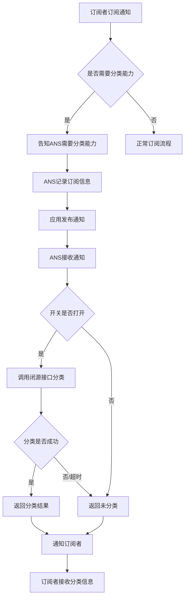
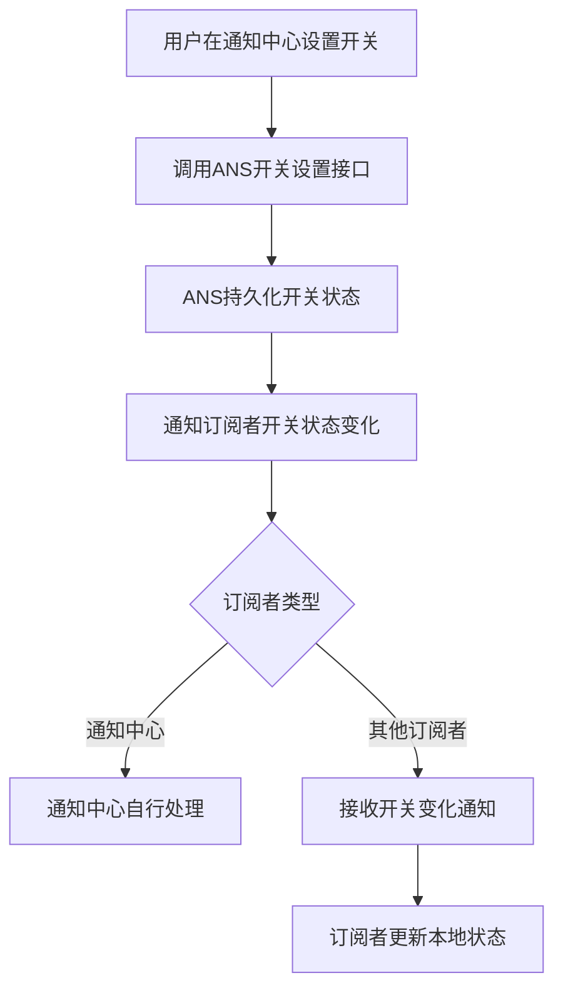
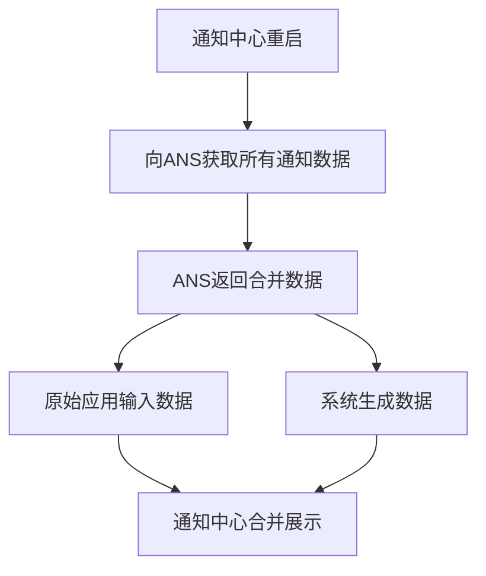
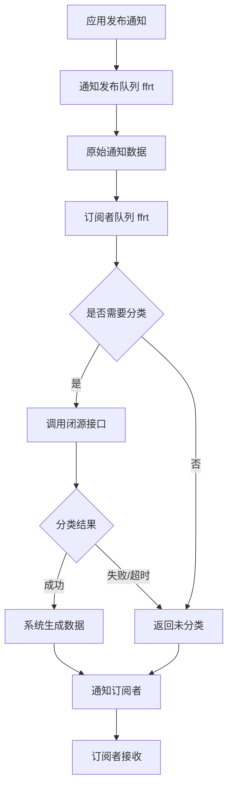
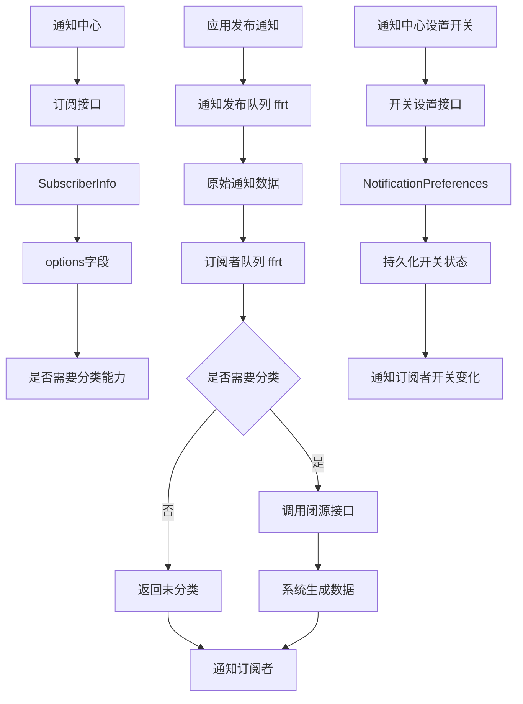

# Feature Architecture - 架构设计文档

## 1. 需求背景与价值

### 1.1 使用场景

**用户痛点**：
- 用户在通知中心看到大量同类消息（如多条动账通知、多条物流更新），消息过多难以查看
- 存在重复消息问题，特别是动账类消息，同一笔扣款可能应用和银行都发送通知
- 本质是同一个问题的多条消息，用户需要逐条查看，效率低下

**问题分析**：
- 当前解决方案：用户需要逐条查看通知，无法快速识别同类消息
- 问题影响：用户体验差，重要信息可能被淹没，查找特定消息困难

**发生频率**：
- 动账类和物流类通知都是高频场景
- 用户每天可能收到多条同类通知

### 1.2 业务价值

**不实现的影响**：
- 用户影响：通知中心消息过多，用户体验下降，重要信息可能被忽略
- 系统影响：通知中心无法提供消息聚合能力，功能缺失

**实现的收益**：
- 效率提升：用户可以快速查看同类消息，提升查看效率
- 体验优化：避免重复消息困扰，改善用户体验
- 能力扩展：为通知中心提供消息聚合分类能力

**量化指标**：
- 预期减少通知卡片数量：同类消息合并展示
- 预期提升用户查看效率：快速识别同类消息

### 1.3 优先级

**为什么现在做**：
- 业务紧迫性：通知领域消息聚合需求的一部分，P0优先级
- 技术依赖：通知中心依赖ANS，ANS数据流上依赖闭源接口
- 资源可用性：实现上是倒置的，ANS定义接口，闭源实现

**优先级判断**：
- 影响面：高（影响所有通知用户）
- 复杂度：中（需要新增多个接口，涉及闭源交互）
- 风险等级：中（闭源接口调用可能时延大）
- 最终优先级：P0

## 2. 上下游与边界

### 2.1 依赖方

**上游调用者**：
| 调用方 | 调用频率 | 调用场景 | 调用方式 |
|--------|----------|----------|----------|
| 通知中心 | 高频 | 订阅通知时告知是否需要分类能力 | 订阅接口 |
| 其他订阅者 | 中频 | 订阅通知时告知是否需要分类能力 | 订阅接口 |

**依赖的服务**：
| 服务名称 | 依赖类型 | 稳定性要求 | 失败影响 |
|----------|----------|------------|----------|
| 闭源接口 | 弱依赖 | 可用性要求中等 | 不做分类，不影响通知发布 |

**数据来源**：
| 数据源 | 数据类型 | 数据质量 | 更新频率 |
|--------|----------|----------|----------|
| 本地应用 | 通知内容 | 高 | 实时 |
| 云推push | 通知内容 | 高 | 实时 |

### 2.2 影响方

**下游影响的模块**：
| 模块名称 | 影响程度 | 影响方式 | 需要的改动 |
|----------|----------|----------|------------|
| 通知中心 | 高 | 接口/数据 | 接收分类信息，实现聚合展示 |
| 其他订阅者 | 中 | 接口/数据 | 接收分类信息（如需要） |

**系统影响**：
| 系统名称 | 影响范围 | 协调方 | 协调事项 |
|----------|----------|----------|----------|
| 闭源接口提供方 | 接口定义 | ANS团队 | 定义分类接口规范 |

**数据影响**：
- 是否影响现有数据结构：是（订阅接口新增字段）
- 是否需要数据迁移：是（开关状态数据需要迁移）
- 迁移策略：开关状态数据持久化在ANS，需要迁移到新结构

### 2.3 边界

**包含的功能**：
| 功能点 | 优先级 | 实现范围 | 说明 |
|--------|--------|----------|------|
| 生成分类信息 | 核心 | 分类接口实现 | 调用闭源接口返回分类结果 |
| 设备级开关管理 | 核心 | 开关设置/查询接口 | 动账类、物流类各一个开关 |
| 开关状态变化通知 | 核心 | 回调机制 | 通知订阅者开关状态变化 |
| 订阅接口扩展 | 核心 | 新增字段 | 订阅者告知是否需要分类能力 |
| 类别枚举定义 | 核心 | 枚举定义 | 动账类、物流类、未分类等 |
| 闭源接口定义 | 核心 | 接口定义 | 定义分类接口规范 |

**不包含的功能**：
| 功能点 | 排除原因 | 后续规划 |
|--------|----------|----------|
| 最终视觉聚合展示 | 由通知中心实现 | 通知中心负责 |
| 闭源接口具体实现 | 不在本代码仓 | 闭源团队负责 |
| 其他类型分类 | 暂不包含，但需考虑可扩展性 | 后续可扩展 |

**可扩展性设计**：
- 支持新增消息类型（如社交类、广告类等）
- 支持分类后额外的扩展信息（如动账消息中提取金额，物流消息中提取取件码）

## 3. 功能细节

### 3.1 业务流程

**核心路径**：

**开关状态变化流程**：

**通知中心重启场景**：

**异常路径**：
| 异常场景 | 触发条件 | 处理方式 | 返回结果 |
|----------|----------|----------|----------|
| 闭源接口不可用 | 网络故障、服务异常 | 不做分类 | 返回未分类枚举值 |
| 分类超时 | 发布队列超过1.5s | 不等待分类结果 | 返回未分类枚举值 |
| 闭源队列超时 | 闭源队列超过10s | 丢弃分类结果 | 返回未分类枚举值 |
| 开关设置失败 | 持久化失败 | 参考已有开关类接口设计 | 返回错误码 |
| 数据缺失 | 部分数据缺失 | 不做额外处理 | 返回已有数据 |

**边界场景**：
| 边界条件 | 触发场景 | 处理方式 | 注意事项 |
|----------|----------|----------|----------|
| 开关初始状态 | 新设备首次使用 | 默认为system_default_on | 系统默认打开 |
| 开关关闭 | 用户关闭聚合开关 | 已聚合的通知组取消聚合 | 仅对新通知不聚合 |
| 开关打开 | 用户打开聚合开关 | 仅对新通知聚合 | 不处理历史通知 |
| 订阅者异常 | 订阅者不可达 | 不影响其他订阅者 | 记录日志 |

### 3.2 数据流向

**数据来源**：
- 来源1：本地应用发布的通知内容
- 来源2：云推push通知内容

**数据去向**：
- 去向1：通知中心等订阅者（分类结果）
- 去向2：ANS持久化存储（开关状态）

**数据格式**：
| 数据名称 | 格式定义 | 字段说明 | 示例 |
|----------|----------|----------|------|
| 通知内容 | NotificationRequest | 包含通知标题、内容、时间等 | 现有格式 |
| 分类结果 | 枚举值 + 扩展字段 | 类别枚举、可能的扩展信息 | 动账类、金额等 |
| 开关状态 | 四态枚举 | system_default_on/on/off/system_default_off | 系统默认打开 |
| 订阅信息 | SubscriberInfo + options | 订阅者标识 + 是否需要分类能力 | 新增字段 |

**数据转换**：
- 通知内容 → 闭源接口 → 分类结果（枚举值 + 扩展信息）
- 开关设置 → 持久化存储 → 开关状态变化通知
- 原始数据 + 系统生成数据 → 合并数据（通知中心重启场景）

### 3.3 接口定义

**API接口列表**：
| 接口名称 | 接口类型 | 调用场景 | 说明 |
|----------|----------|----------|------|
| 开关设置接口 | 同步 | 通知中心设置开关 | 设置聚合开关状态 |
| 开关查询接口 | 同步 | 查询开关状态 | 查询当前开关状态 |
| 订阅接口扩展 | 同步 | 订阅者订阅通知 | 新增是否需要分类能力字段 |
| 分类接口 | 内部调用 | 通知发布时分类 | 调用闭源接口返回分类结果 |
| 开关状态变化通知 | 回调 | 开关状态变化时 | 通知订阅者开关状态变化 |

**接口详情**：

#### 开关设置接口

**接口路径**：`SetAggregationSwitch`

**请求参数**：
| 参数名 | 类型 | 必填 | 默认值 | 说明 | 取值范围 |
|--------|------|------|--------|------|----------|
| categoryType | enum | 是 | - | 类别类型 | 动账类、物流类 |
| switchState | enum | 是 | - | 开关状态 | system_default_on/on/off/system_default_off |

**返回值**：
| 字段名 | 类型 | 说明 | 示例 |
|--------|------|------|------|
| resultCode | int | 结果码 | ERR_OK |

**错误码**：
| 错误码 | 错误场景 | 错误信息 | 处理建议 |
|--------|----------|----------|----------|
| ERR_ANS_PERMISSION_DENIED | 权限不足 | 无权限设置开关 | 检查权限 |
| ERR_ANS_INVALID_PARAM | 参数无效 | 参数格式错误 | 检查参数 |

#### 开关查询接口

**接口路径**：`GetAggregationSwitch`

**请求参数**：
| 参数名 | 类型 | 必填 | 默认值 | 说明 | 取值范围 |
|--------|------|------|--------|------|----------|
| categoryType | enum | 是 | - | 类别类型 | 动账类、物流类 |

**返回值**：
| 字段名 | 类型 | 说明 | 示例 |
|--------|------|------|------|
| resultCode | int | 结果码 | ERR_OK |
| switchState | enum | 开关状态 | system_default_on |

#### 订阅接口扩展

**接口路径**：现有订阅接口新增字段

**新增参数**：
| 参数名 | 类型 | 必填 | 默认值 | 说明 | 取值范围 |
|--------|------|------|--------|------|----------|
| needAggregation | bool | 否 | false | 是否需要分类能力 | true/false |

**返回值**：无变化

#### 分类接口（内部调用）

**接口路径**：闭源接口（ANS定义，闭源实现）

**请求参数**：
| 参数名 | 类型 | 必填 | 默认值 | 说明 | 取值范围 |
|--------|------|------|--------|------|----------|
| notificationContent | NotificationRequest | 是 | - | 通知内容 | 现有格式 |

**返回值**：
| 字段名 | 类型 | 说明 | 示例 |
|--------|------|------|------|
| categoryType | enum | 类别枚举 | 动账类、物流类、未分类 |
| extendedInfo | map | 扩展信息 | 金额、取件码等 |

#### 开关状态变化通知

**接口路径**：回调接口

**通知参数**：
| 参数名 | 类型 | 必填 | 默认值 | 说明 | 取值范围 |
|--------|------|------|--------|------|----------|
| categoryType | enum | 是 | - | 类别类型 | 动账类、物流类 |
| switchState | bool | 是 | - | 开关状态 | true/false |

## 4. 实现方案

### 4.1 技术方案

**可选方案**：
| 方案名称 | 方案描述 | 优点 | 缺点 | 适用场景 |
|----------|----------|------|------|----------|
| 方案A：在现有通知发布流程中增加分类逻辑 | 在通知发布主流程中同步调用闭源接口 | 实现简单 | 影响主流程性能 | 不推荐 |
| 方案B：独立的分类服务模块 | 分类逻辑独立于主流程 | 不影响主流程 | 实现复杂 | 推荐 |
| 方案C：参考优先通知实现 | 与优先通知类似的异步处理机制 | 已有成熟方案 | 需要复用现有架构 | 推荐 |

**技术风险**：
| 风险点 | 风险等级 | 影响范围 | 应对措施 |
|--------|----------|----------|----------|
| 闭源接口调用时延大 | 高 | 通知发布性能 | 异步处理，超时机制 |
| 闭源接口不可用 | 中 | 分类功能 | 返回未分类，不影响主流程 |
| 数据合并复杂度 | 中 | 通知中心重启场景 | 参考优先通知实现 |

**推荐方案**：
- 方案选择：方案C - 参考优先通知实现
- 实现路径：
  1. 在SubscriberInfo中增加options字段，表明需要订阅哪些增值数据
  2. 与闭源的交互不在通知发布队列，而是在订阅者队列
  3. 一条通知数据分成两部分：原始应用输入、系统生成数据，分属两个队列两个阶段
  4. 数据分开处理，但在通知中心重启场景需要合并返回

**架构设计**：

### 4.2 性能要求

**并发要求**：
- 预期并发量：现有通知规格，无变更
- 峰值场景：双十一等物流高峰期
- 峰值并发：现有通知规格

**响应时间**：
- 预期响应时间：通知发布主流程不受影响
- 超时阈值：
  - 发布队列：最多1.5s，超过1.5s不会等待闭源结果
  - 闭源队列：超过10s，AI模型还没返回分类结果，丢弃结果
- 超时处理：直接发布，不等待分类结果

**数据量**：
- 预期数据规模：现有通知规格
- 增长趋势：随通知量增长
- 数据存储：开关状态持久化在ANS

### 4.3 容错处理

**失败策略**：
| 失败场景 | 失败原因 | 处理方式 | 重试策略 |
|----------|----------|----------|----------|
| 闭源接口不可用 | 网络故障、服务异常 | 返回未分类枚举值 | 不重试 |
| 分类超时 | 发布队列超过1.5s | 不等待分类结果 | 不重试 |
| 闭源队列超时 | 闭源队列超过10s | 丢弃分类结果 | 不重试 |
| 开关设置失败 | 持久化失败 | 参考已有开关类接口设计 | 参考已有实现 |
| 数据缺失 | 部分数据缺失 | 不做额外处理 | 不重试 |

**降级方案**：
- 降级触发条件：闭源接口持续不可用
- 降级逻辑：返回未分类枚举值，不影响通知发布
- 降级影响：通知中心无法聚合展示，但不影响通知正常发布

**重试机制**：
- 是否需要重试：否
- 重试策略：不重试，依赖现有DFX机制保证
- 重试失败处理：返回未分类枚举值

## 5. 约束与要求

### 5.1 权限控制

**权限清单**：
| 权限名称 | 权限类型 | 权限来源 | 使用场景 |
|----------|----------|----------|----------|
| ohos.permission.NOTIFICATION_CONTROLLER | 系统权限 | 现有权限 | 开关设置接口 |
| 订阅权限 | 系统权限 | 现有权限 | 订阅接口 |

**权限校验**：
- 校验时机：接口调用时，在SA侧（服务端）校验
- 校验方式：参考现有开关类接口的权限校验
- 校验失败处理：返回权限错误码

**权限管理**：
- 权限申请：使用现有权限，无需新增
- 权限分配：系统权限，自动分配
- 权限回收：系统权限，自动回收

### 5.2 参数校验

**入参规则**：
| 参数名 | 格式要求 | 取值范围 | 长度限制 | 必填规则 |
|--------|----------|----------|----------|----------|
| categoryType | 枚举值 | 动账类、物流类 | - | 必填 |
| switchState | 枚举值 | system_default_on/on/off/system_default_off | - | 必填 |
| needAggregation | 布尔值 | true/false | - | 选填，默认false |
| notificationContent | NotificationRequest | 现有格式 | 现有限制 | 必填 |

**边界值处理**：
| 参数名 | 最大值 | 最小值 | 边界场景 | 处理方式 |
|--------|--------|--------|----------|----------|
| categoryType | - | - | 无效枚举值 | 返回参数错误 |
| switchState | - | - | 无效枚举值 | 返回参数错误 |
| needAggregation | - | - | 非布尔值 | 返回参数错误 |

**校验时机**：
- 校验位置：SA侧（服务端）接口入口
- 校验失败处理：返回参数错误码

### 5.3 埋点打点

**上报指标**：
| 指标名称 | 指标类型 | 上报时机 | 上报维度 | 说明 |
|----------|----------|----------|----------|------|
| 分类成功率 | 计数 | 每次分类 | 类别类型 | 分类成功次数/总分类次数 |
| 分类耗时 | 计时 | 每次分类 | 类别类型 | 分类接口调用耗时 |
| 开关设置次数 | 计数 | 每次设置 | 类别类型、开关状态 | 开关设置次数 |
| 订阅者数量 | 计数 | 订阅时 | 是否需要分类能力 | 订阅者数量 |

**监控项**：
| 监控项 | 监控类型 | 监控阈值 | 告警级别 | 说明 |
|----------|----------|----------|----------|------|
| 闭源接口可用性 | 可用性 | 可用率<95% | 高 | 监控闭源接口可用性 |
| 闭源接口响应时间 | 性能 | 平均响应时间>1s | 中 | 监控闭源接口性能 |
| 分类失败率 | 错误 | 失败率>10% | 中 | 监控分类失败率 |
| 分类超时率 | 性能 | 超时率>5% | 中 | 监控分类超时率 |

**告警策略**：
| 告警项 | 告警条件 | 告警方式 | 告警接收方 | 处理流程 |
|----------|----------|----------|----------|----------|
| 闭源接口不可用 | 可用率<95% | 邮件+短信 | ANS团队 | 检查闭源服务状态 |
| 分类失败率高 | 失败率>10% | 邮件 | ANS团队 | 检查分类逻辑 |
| 分类超时率高 | 超时率>5% | 邮件 | ANS团队 | 检查闭源接口性能 |

**埋点设计**：
- 打点指标由闭源定义，ANS中定义一个扩展字段（key-value形式）
- 打点信息结构化承载在扩展字段中
- 上报由通知中心上报
- 打点信息会回调给订阅者（通知中心）

### 5.4 兼容性要求

**版本兼容**：
- 是否兼容老版本：是
- 兼容范围：老版本订阅者（不支持分类能力）
- 兼容方式：新增字段对老版本无影响，老版本忽略新字段

**数据迁移**：
- 是否需要迁移：是
- 迁移范围：开关状态数据
- 迁移策略：开关状态数据持久化在ANS，需要迁移到新结构

**回滚机制**：
- 是否需要回滚：否
- 回滚触发：不涉及
- 回滚方式：不涉及

## 6. 测试策略

### 6.1 测试场景

**正常场景**：
| 场景名称 | 场景描述 | 测试重点 | 验证点 |
|----------|----------|----------|--------|
| 订阅者订阅分类能力 | 订阅者告知ANS需要分类能力 | 订阅流程正确 | 订阅信息正确记录 |
| 开关设置和查询 | 设置和查询聚合开关状态 | 开关状态正确 | 开关状态正确持久化和查询 |
| 通知发布并分类 | 通知发布时调用闭源接口分类 | 分类流程正确 | 分类结果正确返回 |
| 开关状态变化通知 | 开关状态变化时通知订阅者 | 通知机制正确 | 订阅者正确接收通知 |
| 通知中心重启获取合并数据 | 通知中心重启后获取所有通知数据 | 数据合并正确 | 原始数据和系统生成数据正确合并 |
| 动账类通知分类 | 动账类通知正确分类 | 分类准确性 | 返回动账类枚举值 |
| 物流类通知分类 | 物流类通知正确分类 | 分类准确性 | 返回物流类枚举值 |
| 开关关闭场景 | 开关关闭时不分类 | 开关逻辑正确 | 返回未分类枚举值 |
| 开关打开场景 | 开关打开时分类新通知 | 开关逻辑正确 | 新通知正确分类 |

**异常场景**：
| 场景名称 | 异常类型 | 异常触发 | 测试重点 | 验证点 |
|----------|----------|----------|----------|--------|
| 闭源接口不可用 | 服务异常 | Mock闭源接口返回错误 | 不影响通知发布 | 返回未分类枚举值 |
| 分类超时 | 性能异常 | Mock闭源接口延迟>1.5s | 超时处理正确 | 不等待分类结果 |
| 闭源队列超时 | 性能异常 | Mock闭源队列延迟>10s | 超时处理正确 | 丢弃分类结果 |
| 开关设置失败 | 持久化异常 | Mock持久化失败 | 错误处理正确 | 返回错误码 |
| 数据缺失 | 数据异常 | 部分数据缺失 | 数据处理正确 | 返回已有数据 |
| 无效参数 | 参数异常 | 传入无效枚举值 | 参数校验正确 | 返回参数错误 |
| 权限不足 | 权限异常 | 无权限调用接口 | 权限校验正确 | 返回权限错误 |

**边界场景**：
| 场景名称 | 边界条件 | 测试重点 | 验证点 |
|----------|----------|----------|--------|
| 开关初始状态 | 新设备首次使用 | 默认状态正确 | 默认为system_default_on |
| 开关关闭后已聚合通知 | 开关关闭 | 已聚合通知处理正确 | 已聚合通知组取消聚合 |
| 开关打开后历史通知 | 开关打开 | 历史通知处理正确 | 仅对新通知聚合 |
| 订阅者异常 | 订阅者不可达 | 不影响其他订阅者 | 其他订阅者正常接收 |
| 并发分类 | 多条通知同时分类 | 并发处理正确 | 分类结果正确 |
| 大量通知 | 大量通知发布 | 性能达标 | 不影响主流程性能 |

### 6.2 验证方法

**功能验证**：
- 验证方式：
  - 单元测试：验证分类逻辑、开关逻辑、订阅逻辑
  - 集成测试：验证与闭源接口的交互
  - 端到端测试：验证完整流程
- 验证工具：GoogleTest、Mock闭源接口
- 验证标准：
  - 分类结果正确性：分类结果与预期一致
  - 开关状态正确性：开关状态正确持久化和查询
  - 订阅信息正确性：订阅者正确接收分类信息
  - 数据合并正确性：通知中心重启场景数据正确合并

**性能验证**：
- 验证方式：
  - 性能测试：验证通知发布延迟
  - 压力测试：验证并发处理能力
  - 超时测试：验证超时处理正确性
- 测试工具：性能测试工具、Mock闭源接口延迟
- 性能指标：
  - 通知发布延迟：不超过1.5s
  - 分类超时率：不超过5%
  - 并发处理能力：满足现有通知规格

**兼容验证**：
- 验证方式：
  - 版本兼容测试：验证老版本订阅者兼容性
  - 数据迁移测试：验证开关状态数据迁移
- 测试范围：
  - 老版本订阅者：不支持分类能力的订阅者
  - 新版本订阅者：支持分类能力的订阅者
- 验证标准：
  - 老版本订阅者正常工作
  - 新版本订阅者正确接收分类信息
  - 开关状态数据正确迁移

### 6.3 测试数据

**测试环境**：
- 环境要求：
  - OpenHarmony测试环境
  - Mock闭源接口环境
  - 测试设备或模拟器
- 环境搭建：
  - 部署ANS服务
  - 部署Mock闭源接口
  - 配置测试订阅者
- 环境差异：
  - Mock闭源接口替代真实闭源接口
  - 测试数据规模小于生产环境

**测试数据准备**：
| 数据类型 | 数据来源 | 数据规模 | 准备方式 |
|----------|----------|----------|----------|
| 动账类通知 | 测试数据 | 100条 | 包含金额等扩展信息 |
| 物流类通知 | 测试数据 | 100条 | 包含取件码等扩展信息 |
| 其他类通知 | 测试数据 | 50条 | 不包含扩展信息 |
| 开关状态数据 | 测试数据 | 4种状态 | system_default_on/on/off/system_default_off |
| 订阅者数据 | 测试数据 | 10个订阅者 | 包含需要和不需要分类能力的订阅者 |

**数据隔离**：
- 测试数据：测试环境独立数据
- 生产数据：生产环境数据
- 隔离策略：测试环境和生产环境完全隔离

---

## 附录

### A. 相关模块清单

| 模块名称 | 模块路径 | 模块职责 | 相关性 |
|----------|----------|----------|--------|
| NotificationManager | frameworks/ans/core | 通知管理核心 | 新增分类接口 |
| SubscriberInfo | frameworks/ans/core | 订阅者信息管理 | 新增options字段 |
| NotificationPreferences | frameworks/ans/core | 通知偏好设置 | 开关状态持久化 |
| 闭源接口 | 外部模块 | 分类能力提供 | 调用分类接口 |

### B. 技术架构快照

### C. 决策记录

| 决策点 | 决策结果 | 决策理由 | 决策时间 | 决策人 |
|----------|----------|----------|----------|----------|
| 实现方案 | 参考优先通知实现 | 已有成熟方案，不影响主流程 | 2026-05-09 | 架构师 |
| 超时机制 | 发布队列1.5s，闭源队列10s | 参考优先通知规格 | 2026-05-09 | 架构师 |
| 开关状态 | 四态开关 | 用户体验考虑 | 2026-05-09 | 架构师 |
| 数据分离 | 原始数据和系统生成数据分离 | 参考优先通知实现 | 2026-05-09 | 架构师 |
| 权限设计 | 使用现有权限 | 不新增权限 | 2026-05-09 | 架构师 |

### D. 待确认事项

| 事项 | 状态 | 负责人 | 预计完成时间 |
|----------|----------|----------|----------|
| 闭源接口具体定义 | 待确认 | 闭源团队 | 待定 |
| 测试数据准备 | 待补充 | 测试团队 | 待定 |
| 性能基准测试 | 待执行 | 测试团队 | 待定 |