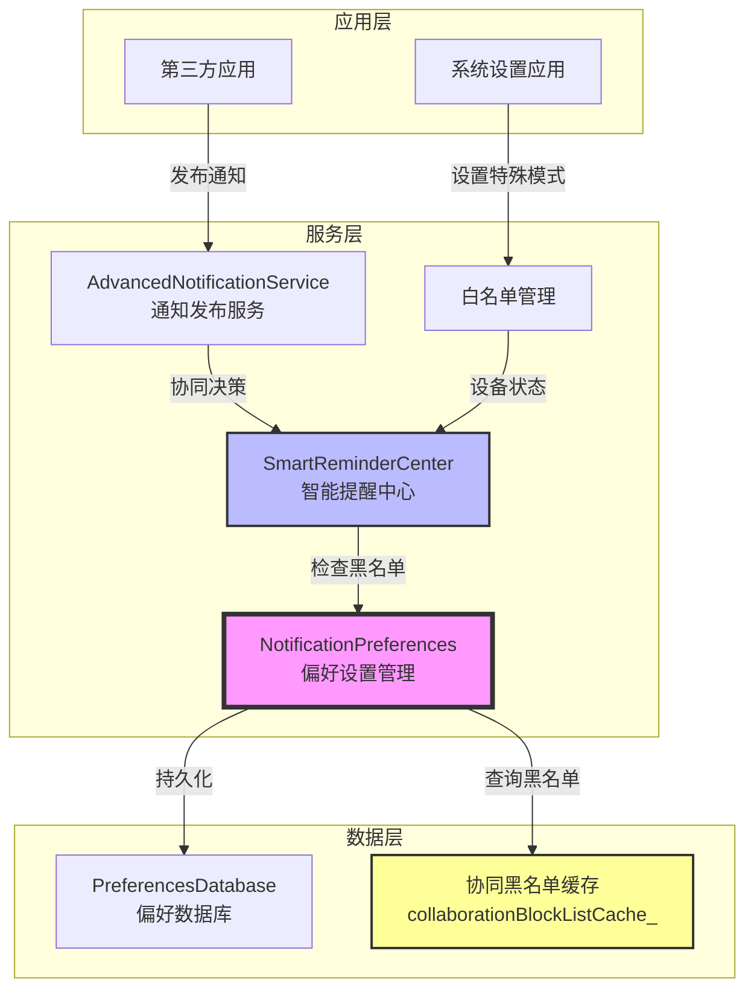
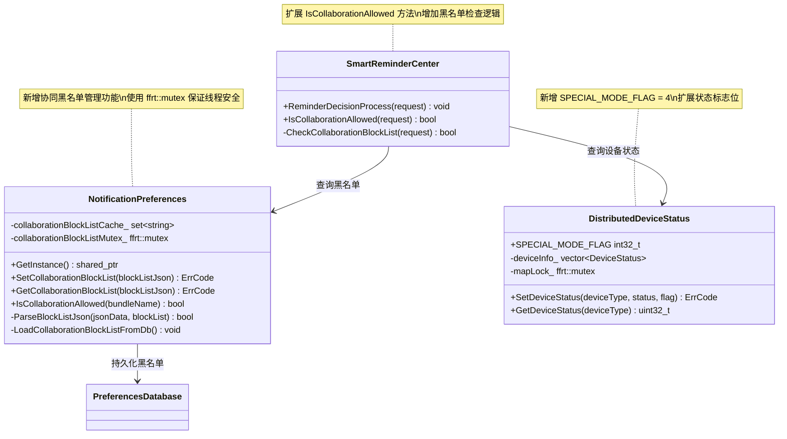
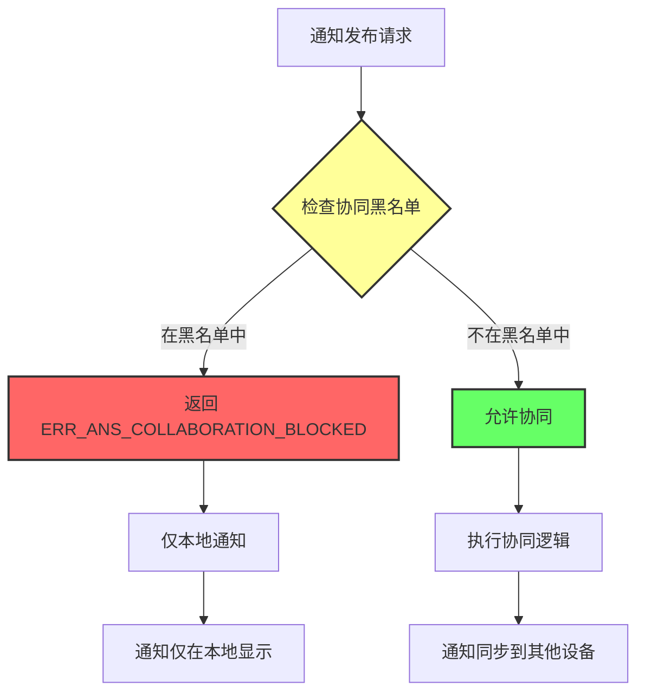

# Feature Dev-Design - 开发设计方案

## 特性信息

- **特性名称**: special-mode-collaboration-block
- **需求描述**: 支持设备处于特殊模式下时，禁止全场景通知消息协同
- **创建时间**: 2026-05-09
- **文档版本**: v1.0

---

## 1. 开发概述

### 1.1 功能实现概述

从开发视角实现特殊模式下的协同控制功能，通过在 `NotificationPreferences` 中新增协同黑名单缓存，并在 `SmartReminderCenter` 的协同决策流程中增加黑名单检查，实现特殊模式下禁止通知协同的功能。

**实现路径**：
1. **扩展 NotificationPreferences 类**：新增协同黑名单管理接口和缓存机制
2. **扩展 DistributedDeviceStatus 类**：新增特殊模式状态标志位
3. **扩展 SmartReminderCenter 类**：在 `IsCollaborationAllowed` 方法中增加黑名单检查逻辑
4. **新增错误码定义**：在 `ans_inner_errors.h` 中新增 `ERR_ANS_COLLABORATION_BLOCKED`
5. **编写单元测试**：在现有测试文件中新增测试用例，确保90%覆盖率

### 1.2 开发目标

- **目标1**: 实现协同黑名单的存储和查询功能，支持设备级和应用级的黑名单管理
- **目标2**: 在协同决策流程中正确拦截黑名单中的通知，返回明确的错误码
- **目标3**: 确保线程安全，使用 ffrt mutex 保护共享数据
- **目标4**: 实现持久化存储，使用数据库 Key `COLLABORATION_BLOCKLIST`
- **目标5**: 编写单元测试，达到90%分支覆盖率，避免无效断言

### 1.3 开发约束

- **约束1**: 类命名使用 `collaborationBlockListCache_`，不使用 `specialModeBlockListCache_`
- **约束2**: 拦截逻辑必须放在 `IsCollaborationAllowed` 方法中，不新增其他拦截方法
- **约束3**: 接口命名统一使用 `CollaborationBlockList`，保持命名一致性
- **约束4**: 线程安全使用 ffrt mutex，不使用 std::mutex
- **约束5**: 测试文件使用现有 `notification_preferences_test.cpp`，不新增测试文件
- **约束6**: 测试用例数量控制在合理范围，避免过多无效断言

---

## 2. 开发架构设计

### 2.1 整体架构图



### 2.2 新增模块说明

| 模块名称 | 文件路径 | 说明 | 职责 |
|----------|----------|------|------|
| CollaborationBlockListCache | services/ans/include/notification_preferences.h | 扩展类 | 协同黑名单缓存管理 |
| IsCollaborationAllowed扩展 | services/ans/include/smart_reminder_center.h | 扩展方法 | 黑名单检查逻辑 |
| DistributedDeviceStatus扩展 | services/ans/include/distributed_device_status.h | 扩展类 | 特殊模式状态标志位 |

### 2.3 扩展点说明

| 扩展点 | 现有文件 | 说明 | 扩展方式 |
|--------|----------|------|----------|
| NotificationPreferences接口 | services/ans/include/notification_preferences.h | 偏好设置管理 | 新增协同黑名单管理方法 |
| SmartReminderCenter接口 | services/ans/include/smart_reminder_center.h | 协同决策 | 扩展 IsCollaborationAllowed 方法 |
| DistributedDeviceStatus接口 | services/ans/include/distributed_device_status.h | 设备状态管理 | 新增特殊模式标志位 |
| ErrorCode枚举 | frameworks/core/common/include/ans_inner_errors.h | 错误码定义 | 新增 ERR_ANS_COLLABORATION_BLOCKED |

### 2.4 与现有架构集成方式

**集成步骤**：
1. **步骤1**: 在 `NotificationPreferences` 类中新增私有成员 `collaborationBlockListCache_`，使用 `std::set<std::string>` 存储黑名单设备ID
2. **步骤2**: 在 `NotificationPreferences` 类中新增公共接口 `AddCollaborationBlockList`、`RemoveCollaborationBlockList`、`GetCollaborationBlockList`、`IsInCollaborationBlockList`
3. **步骤3**: 在 `NotificationPreferences::Init()` 方法中从数据库加载黑名单数据到缓存
4. **步骤4**: 在 `SmartReminderCenter::IsCollaborationAllowed()` 方法中调用 `NotificationPreferences::IsInCollaborationBlockList()` 检查黑名单
5. **步骤6**: 在 `ans_inner_errors.h` 中新增 `ERR_ANS_COLLABORATION_BLOCKED` 错误码

---

## 3. 详细开发设计

### 3.1 类图



### 3.2 核心类设计

#### NotificationPreferences 类扩展（新增协同黑名单管理）

**文件位置**: `services/ans/include/notification_preferences.h` 和 `services/ans/src/notification_preferences.cpp`

**类定义框架**:
```cpp
// 在 notification_preferences.h 中新增

#include "ffrt.h"
#include <set>

namespace OHOS {
namespace Notification {

class NotificationPreferences final {
public:
    // ... 现有方法 ...
    
    /**
     * @brief 设置协同黑名单
     * @param blockListJson 黑名单JSON字符串，格式：{"userId":100,"bundleList":[{"bundleName":"com.wechat","index":1}]}
     * @return 返回 ERR_OK 成功，其他失败
     */
    ErrCode SetCollaborationBlockList(const std::string& blockListJson);
    
    /**
     * @brief 检查应用是否允许协同
     * @param bundleName 应用包名
     * @param uid 用户ID（包含 userId 和 appIndex 信息）
     * @return 返回 true 表示允许协同，false 表示禁止协同
     * 
     * @note 从 uid 中解析 userId 和 appIndex：
     *       - userId: 通过 OsAccountManagerHelper::GetOsAccountLocalIdFromUid 获取
     *       - appIndex: 通过 BundleManagerHelper::GetAppIndexByUid 获取
     */
    bool IsCollaborationAllowed(const std::string& bundleName, int32_t uid);

private:
    // ... 现有成员 ...
    
    // 新增协同黑名单缓存（存储 bundleName + appIndex 组合）
    std::set<std::pair<std::string, int32_t>> collaborationBlockListCache_;
    
    // 新增线程安全锁（使用 ffrt mutex）
    ffrt::mutex collaborationBlockListMutex_;
    
    // 新增内部方法
    bool ParseBlockListJson(const std::string& jsonData, 
        std::set<std::pair<std::string, int32_t>>& blockList, int32_t& userId);
    void LoadCollaborationBlockListFromDb();
    
    // 数据库 Key 常量
    static constexpr const char* COLLABORATION_BLOCKLIST_KEY = "COLLABORATION_BLOCKLIST";
};

}  // namespace Notification
}  // namespace OHOS
```

**实现要点**:
- 使用 `std::map<int32_t, std::set<std::pair<std::string, int32_t>>>` 存储多用户黑名单，支持多用户空间隔离
- 每个用户有独立的黑名单列表（bundleName + appIndex 组合），支持分身应用场景
- **并发安全设计（使用 ffrt::mutex）**：
  - 使用 `ffrt::mutex` 保护所有对 `std::map` 的访问
  - 所有操作（检查是否已加载、查询黑名单、加载黑名单）都使用 `std::lock_guard<ffrt::mutex>`
  - `std::map` 在并发访问时不安全，必须加锁保护
  - 性能考虑：虽然读写都使用同一个锁，但实际场景中查询频率不高，性能影响可接受
- **按需加载机制（Per-User Lazy Loading）**：
  - 不在系统启动时加载缓存（不在 InitSettingFromDisturbDB 中调用）
  - 首次查询某个 userId 时，仅加载该用户的黑名单（不加载所有用户）
  - 使用 per-user 加载标志位 `std::map<int32_t, bool>` 避免重复加载
  - LoadCollaborationBlockListFromDb(userId) 仅加载指定用户的黑名单
- ParseBlockListJson 解析 userId 字段并校验有效性：
  - userId > SUBSCRIBE_USER_INIT (userId > 0)
  - userId 存在于系统中（调用 OsAccountManagerHelper::CheckUserExists）
- SetCollaborationBlockList 使用解析出的 userId 写入数据库，不从当前调用用户获取
- GetCollaborationBlockList 提供查询接口，返回当前调用用户的黑名单（供外部查询使用）
- IsCollaborationAllowed 接口入参为 bundleName + uid：
  - 从 uid 解析 userId：OsAccountManagerHelper::GetOsAccountLocalIdFromUid
  - 从 uid 解析 appIndex：BundleManagerHelper::GetAppIndexByUid
  - 按需加载该 userId 的黑名单（如果未加载）
  - 查询对应 userId 的黑名单缓存，检查 bundleName + appIndex 组合
- 数据库 Key 使用 `COLLABORATION_BLOCKLIST`，与用户确认一致

#### SmartReminderCenter 类扩展（新增黑名单检查）

**文件位置**: `services/ans/include/smart_reminder_center.h` 和 `services/ans/src/smart_reminder_center.cpp`

**类定义框架**:
```cpp
// 在 smart_reminder_center.h 中扩展

namespace OHOS {
namespace Notification {

class SmartReminderCenter : public DelayedSingleton<SmartReminderCenter> {
public:
    // ... 现有方法 ...
    
    /**
     * @brief 检查是否允许协同（扩展方法）
     * @param request 通知请求
     * @return 返回 true 表示允许协同，false 表示禁止协同
     */
    bool IsCollaborationAllowed(const sptr<NotificationRequest>& request) const;

private:
    // ... 现有成员 ...
    
    // 新增内部方法
    bool CheckCollaborationBlockList(const sptr<NotificationRequest>& request) const;
};

}  // namespace Notification
}  // namespace OHOS
```

**实现要点**:
- 在 `CollaborateFilter()` 方法中调用 `NotificationPreferences::GetInstance()->IsCollaborationAllowed(bundleName, appIndex)` 检查黑名单
- 使用 `request->GetCreatorBundleName()` 获取 bundleName
- 使用 `request->GetAppIndex()` 获取 appIndex（分身应用ID）
- 如果应用在黑名单中，返回 `ERR_ANS_COLLABORATION_BLOCKED` 并记录日志

### 3.4 数据结构定义

#### 协同黑名单数据结构

**内存结构**:
```cpp
// 使用 std::map 支持多用户空间隔离
// Key: userId (用户空间ID)
// Value: std::set<std::pair<std::string, int32_t>> (bundleName + appIndex 组合)
std::map<int32_t, std::set<std::pair<std::string, int32_t>>> collaborationBlockListCache_;

// 缓存加载策略（按需加载单个用户）:
// 1. 系统启动时不加载缓存（不在 InitSettingFromDisturbDB 中调用）
// 2. 首次查询某个 userId 时，仅加载该用户的黑名单
// 3. 使用 per-user 加载标志位，避免重复加载
// 4. Double-checked locking 确保并发安全
// 5. 优点：
//    - 减少系统启动时间
//    - 避免加载不必要的数据（只加载实际查询的用户）
//    - 支持多用户并发查询，每个用户独立加载

// 每个用户的加载标志位:
std::map<int32_t, bool> collaborationBlockListLoadedMap_;

// 并发安全设计（使用 ffrt::mutex）:
// 1. 所有操作（检查是否已加载、查询黑名单、加载黑名单）都使用同一个 ffrt::mutex
// 2. std::map 在并发访问时不安全，必须加锁保护
// 3. 使用 std::lock_guard<ffrt::mutex> 确保线程安全
// 4. 性能考虑：虽然读写都使用同一个锁，但实际场景中查询频率不高，性能影响可接受

// 并发安全的实现示例:
bool IsCollaborationAllowed(const std::string& bundleName, int32_t uid) {
    // 从 uid 解析 userId
    int32_t userId = ...;
    
    // 使用锁保护所有 std::map 操作
    std::lock_guard<ffrt::mutex> lock(collaborationBlockListMutex_);
    
    // 检查是否已加载
    auto loadedIt = loadedMap_.find(userId);
    if (loadedIt == loadedMap_.end() || !loadedIt->second) {
        // 未加载，加载该用户的黑名单
        LoadCollaborationBlockListFromDb(userId);
    }
    
    // 查询黑名单
    auto userIt = cache_.find(userId);
    if (userIt == cache_.end()) {
        return true;  // 无黑名单，允许
    }
    
    auto key = std::make_pair(bundleName, appIndex);
    return userIt->second.find(key) == userIt->second.end();
}

// 内存占用估算:
// - 每个用户独立的黑名单列表
// - 典型场景: 5-10 个活跃用户，每个用户约 50 个屏蔽应用
// - 单用户内存: ~10KB (50个应用 * 200字节/应用)
// - 总内存: ~100KB (10个用户)
// - std::map 和 std::set 的内存开销相对较小

// bundleName格式规范
// 长度: 1-64 字符
// 字符集: [a-zA-Z0-9_.-]
// 示例: "com.wechat", "com.example.app", "com.test.bundle"

// appIndex格式规范
// 类型: int32_t
// 取值: 0 表示主应用，>0 表示分身应用
// 示例: 0 (主应用), 1 (分身1), 2 (分身2)
```

**序列化格式**:
```cpp
// JSON 序列化格式
// 数据库 Key: "COLLABORATION_BLOCKLIST"
// 数据格式: JSON Object

// 示例数据:
{
    "userId": 100,
    "bundleList": [
        {
            "bundleName": "com.wechat",
            "index": 1
        },
        {
            "bundleName": "com.example.app",
            "index": 2
        }
    ]
}

// 字段说明:
// - userId: 用户空间ID，用于多用户隔离（必需字段，必须 > 0）
// - bundleList: 屏蔽协同的应用列表（必需字段，JSON数组）
// - bundleName: 应用的bundle名称（必需字段，长度 1-64 字符）
// - index: 应用分身ID（可选字段，默认为 0，用于区分同一应用的多个分身）

// userId 处理逻辑:
// 1. userId 从 JSON 数据中解析，不从当前调用用户获取
// 2. userId 必须是有效的：
//    - userId > SUBSCRIBE_USER_INIT (即 userId > 0)
//    - userId 必须存在于系统中（调用 OsAccountManagerHelper::CheckUserExists 验证）
// 3. 无效的 userId 会导致解析失败，返回 ERR_ANS_INVALID_PARAM
// 4. userId 用于数据库存储的多用户隔离
// 5. 缓存结构支持多用户：std::map<int32_t, std::set<...>>
// 6. LoadCollaborationBlockListFromDb 加载所有活跃用户的黑名单到缓存

// 序列化实现
nlohmann::json jsonObject;
jsonObject["userId"] = userId;
jsonObject["bundleList"] = nlohmann::json::array();

for (const auto& item : collaborationBlockListCache_) {
    nlohmann::json bundleItem;
    bundleItem["bundleName"] = item.first;  // bundleName
    bundleItem["index"] = item.second;      // appIndex
    jsonObject["bundleList"].push_back(bundleItem);
}

std::string blockListData = jsonObject.dump();
```

---

## 4. 开发流程设计

### 4.1 核心流程图




### 6.2 功能测试策略

#### 正常场景测试
- 测试添加设备到黑名单
- 测试移除设备从黑名单
- 测试获取黑名单列表
- 测试检查设备是否在黑名单中
- 测试协同决策中的黑名单检查

#### 异常场景测试
- 测试数据库操作失败
- 测试并发添加/移除设备
- 测试黑名单缓存加载失败
- 测试黑名单持久化失败
