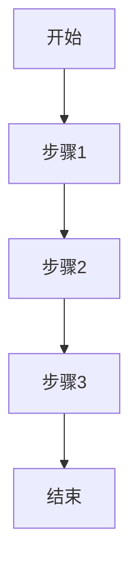

# Architecture 阶段输出文件模板

本文件包含 Architecture Skill 产出的文件模板。

**重要约定**：
- 所有过程文档存放在 `{kb_dir}/` 目录下，该目录由调用方指定
- `{name}`：需求/问题名称，用作目录名，英文小写字母，多个单词用 `-` 连接
- 模板中的路径需要替换为实际路径

---

## 1. architecture.md 输出文件模板

文件路径：`{kb_dir}/architecture.md`

实际路径示例：`{kb_dir}/architecture.md`

```markdown
# Architecture - 架构设计文档

## 1. 需求背景与价值

### 1.1 使用场景

**用户痛点**：
- <描述真实用户遇到的问题>
- <问题发生的频率和影响范围>

**问题分析**：
- 当前解决方案：<描述现有的临时方案或替代方案>
- 问题影响：<描述问题对用户或系统的影响>

### 1.2 业务价值

**不实现的影响**：
- 用户影响：<用户体验下降、功能缺失等>
- 业务影响：<业务流程受阻、效率降低等>
- 系统影响：<系统稳定性、可维护性等>

**实现的收益**：
- 效率提升：<量化指标，如提升X%>
- 成本降低：<量化指标，如降低Y%>
- 能力扩展：<新增的能力描述>

**量化指标**（如有数据支撑）：
- 预期用户覆盖：<数字>
- 预期调用频率：<数字>
- 预期性能提升：<百分比>

### 1.3 优先级

**为什么现在做**：
- 业务紧迫性：<描述紧迫的原因>
- 技术依赖：<描述技术上的依赖关系>
- 资源可用性：<描述开发资源的可用情况>

**优先级判断**：
- 影响面：<高/中/低>
- 复杂度：<高/中/低>
- 风险等级：<高/中/低>
- 最终优先级：<P0/P1/P2>

## 2. 上下游与边界

### 2.1 依赖方

**上游调用者**：
| 调用方 | 调用频率 | 调用场景 | 调用方式 |
|--------|----------|----------|----------|
| <调用方1> | <频率> | <场景> | <API/事件等> |

**依赖的服务**：
| 服务名称 | 依赖类型 | 稳定性要求 | 失败影响 |
|----------|----------|------------|----------|
| <服务1> | <强依赖/弱依赖> | <可用性要求> | <失败后的影响> |

**数据来源**：
| 数据源 | 数据类型 | 数据质量 | 更新频率 |
|--------|----------|----------|----------|
| <来源1> | <类型> | <质量评估> | <频率> |

### 2.2 影响方

**下游影响的模块**：
| 模块名称 | 影响程度 | 影响方式 | 需要的改动 |
|----------|----------|----------|------------|
| <模块1> | <高/中/低> | <接口/数据/行为> | <改动说明> |

**系统影响**：
| 系统名称 | 影响范围 | 协调方 | 协调事项 |
|----------|----------|----------|----------|
| <系统1> | <范围> | <协调方> | <事项> |

**数据影响**：
- 是否影响现有数据结构：<是/否>
- 是否需要数据迁移：<是/否>
- 迁移策略：<如有迁移，描述策略>

### 2.3 边界

**包含的功能**：
| 功能点 | 优先级 | 实现范围 | 说明 |
|--------|--------|----------|------|
| <功能1> | 核心 | <范围描述> | <补充说明> |
| <功能2> | 核心 | <范围描述> | <补充说明> |
| <功能3> | 扩展 | <范围描述> | <补充说明> |

**不包含的功能**：
| 功能点 | 排除原因 | 后续规划 |
|--------|----------|----------|
| <功能1> | <原因> | <后续安排> |

**MVP范围**（如有分期）：
- 第一期：<列出第一期的功能清单>
- 后续分期：<列出后续分期的规划>

## 3. 功能细节

### 3.1 业务流程

**核心路径**：
<使用 mermaid 流程图表示正常场景的完整流程>



**异常路径**：
| 异常场景 | 触发条件 | 处理方式 | 返回结果 |
|----------|----------|----------|----------|
| <异常1> | <条件> | <处理方式> | <结果> |

**边界场景**：
| 边界条件 | 触发场景 | 处理方式 | 注意事项 |
|----------|----------|----------|----------|
| <边界1> | <场景> | <处理方式> | <注意事项> |

### 3.2 数据流向

**数据来源**：
- 来源1：<描述数据的来源、获取方式>
- 来源2：<描述数据的来源、获取方式>

**数据去向**：
- 去向1：<描述数据的去向、使用方>
- 去向2：<描述数据的去向、使用方>

**数据格式**：
| 数据名称 | 格式定义 | 字段说明 | 示例 |
|----------|----------|----------|------|
| <数据1> | <格式> | <字段说明> | <示例> |

**数据转换**：
<描述中间的数据转换和处理逻辑>

### 3.3 接口定义

**API接口列表**：
| 接口名称 | 接口类型 | 调用场景 | 说明 |
|----------|----------|----------|----------|
| <API1> | <同步/异步> | <场景> | <功能说明> |

**接口详情**：

#### API1: <接口名称>

**接口路径**：<API路径>

**请求参数**：
| 参数名 | 类型 | 必填 | 默认值 | 说明 | 取值范围 |
|--------|------|------|--------|------|----------|
| <参数1> | <类型> | <是/否> | <默认值> | <说明> | <范围> |

**返回值**：
| 字段名 | 类型 | 说明 | 示例 |
|--------|------|------|------|
| <字段1> | <类型> | <说明> | <示例> |

**错误码**：
| 错误码 | 错误场景 | 错误信息 | 处理建议 |
|--------|----------|----------|----------|
| <错误码1> | <场景> | <信息> | <建议> |

## 4. 实现方案

### 4.1 技术方案

**可选方案**：
| 方案名称 | 方案描述 | 优点 | 缺点 | 适用场景 |
|----------|----------|------|------|----------|
| 方案A | <描述> | <优点> | <缺点> | <场景> |
| 方案B | <描述> | <优点> | <缺点> | <场景> |

**技术风险**：
| 风险点 | 风险等级 | 影响范围 | 应对措施 |
|--------|----------|----------|----------|
| <风险1> | <高/中/低> | <范围> | <措施> |

**推荐方案**：
- 方案选择：<选择方案A/B，说明理由>
- 实现路径：<简述实现路径>

### 4.2 性能要求

**并发要求**：
- 预期并发量：<数字>
- 峰值场景：<描述峰值场景>
- 峰值并发：<峰值数字>

**响应时间**：
- 预期响应时间：<数字ms/s>
- 超时阈值：<超时时间>
- 超时处理：<超时后的处理方式>

**数据量**：
- 预期数据规模：<数字>
- 增长趋势：<增长率>
- 数据存储：<存储方式和容量>

### 4.3 容错处理

**失败策略**：
| 失败场景 | 失败原因 | 处理方式 | 重试策略 |
|----------|----------|----------|----------|
| <场景1> | <原因> | <处理方式> | <重试策略> |

**降级方案**：
- 降级触发条件：<触发条件>
- 降级逻辑：<降级后的处理逻辑>
- 降级影响：<降级对用户的影响>

**重试机制**：
- 是否需要重试：<是/否>
- 重试策略：<重试次数、间隔、条件>
- 重试失败处理：<最终失败的处理>

## 5. 约束与要求

### 5.1 权限控制

**权限清单**：
| 权限名称 | 权限类型 | 权限来源 | 使用场景 |
|----------|----------|----------|----------|
| <权限1> | <系统/应用/用户> | <来源> | <场景> |

**权限校验**：
- 校验时机：<在哪个环节校验>
- 校验方式：<如何校验权限>
- 校验失败处理：<失败后的处理>

**权限管理**：
- 权限申请：<如何申请权限>
- 权限分配：<如何分配权限>
- 权限回收：<如何回收权限>

### 5.2 参数校验

**入参规则**：
| 参数名 | 格式要求 | 取值范围 | 长度限制 | 必填规则 |
|--------|----------|----------|----------|----------|
| <参数1> | <格式> | <范围> | <长度> | <必填规则> |

**边界值处理**：
| 参数名 | 最大值 | 最小值 | 边界场景 | 处理方式 |
|--------|--------|--------|----------|----------|
| <参数1> | <最大值> | <最小值> | <场景> | <处理方式> |

**校验时机**：
- 校验位置：<在哪里校验>
- 校验失败处理：<失败后的处理>

### 5.3 埋点打点

**上报指标**：
| 指标名称 | 指标类型 | 上报时机 | 上报维度 | 说明 |
|----------|----------|----------|----------|------|
| <指标1> | <计数/计时/状态> | <时机> | <维度> | <说明> |

**监控项**：
| 监控项 | 监控类型 | 监控阈值 | 告警级别 | 说明 |
|----------|----------|----------|----------|------|
| <监控1> | <可用性/性能/错误> | <阈值> | <级别> | <说明> |

**告警策略**：
| 告警项 | 告警条件 | 告警方式 | 告警接收方 | 处理流程 |
|----------|----------|----------|----------|----------|
| <告警1> | <条件> | <方式> | <接收方> | <流程> |

### 5.4 兼容性要求

**版本兼容**：
- 是否兼容老版本：<是/否>
- 兼容范围：<兼容的版本范围>
- 兼容方式：<如何兼容>

**数据迁移**：
- 是否需要迁移：<是/否>
- 迁移范围：<需要迁移的数据范围>
- 迁移策略：<迁移的方式和步骤>

**回滚机制**：
- 是否需要回滚：<是/否>
- 回滚触发：<回滚的触发条件>
- 回滚方式：<如何回滚>

## 6. 测试策略

### 6.1 测试场景

**正常场景**：
| 场景名称 | 场景描述 | 测试重点 | 验证点 |
|----------|----------|----------|--------|
| <场景1> | <描述> | <重点> | <验证点> |

**异常场景**：
| 场景名称 | 异常类型 | 异常触发 | 测试重点 | 验证点 |
|----------|----------|----------|----------|--------|
| <场景1> | <类型> | <触发> | <重点> | <验证点> |

**边界场景**：
| 场景名称 | 边界条件 | 测试重点 | 验证点 |
|----------|----------|----------|--------|
| <场景1> | <条件> | <重点> | <验证点> |

### 6.2 验证方法

**功能验证**：
- 验证方式：<如何验证功能正确>
- 验证工具：<使用的工具>
- 验证标准：<验证的标准>

**性能验证**：
- 验证方式：<如何验证性能达标>
- 测试工具：<使用的工具>
- 性能指标：<要验证的指标>

**兼容验证**：
- 验证方式：<如何验证兼容性>
- 测试范围：<兼容性测试范围>
- 验证标准：<兼容性标准>

### 6.3 测试数据

**测试环境**：
- 环境要求：<测试环境的要求>
- 环境搭建：<如何搭建环境>
- 环境差异：<与生产环境的差异>

**测试数据准备**：
| 数据类型 | 数据来源 | 数据规模 | 准备方式 |
|----------|----------|----------|----------|
| <类型1> | <来源> | <规模> | <准备方式> |

**数据隔离**：
- 测试数据：<测试数据的范围>
- 生产数据：<生产数据的范围>
- 隔离策略：<如何隔离>

---

## 附录

### A. 相关模块清单

| 模块名称 | 模块路径 | 模块职责 | 相关性 |
|----------|----------|----------|--------|
| <模块1> | <路径> | <职责> | <为何相关> |

### B. 技术架构快照

<使用 mermaid 表示当前的技术架构>

### C. 决策记录

| 决策ID | 决策点 | 决策结果 | 决策理由 | 决策时间 | 决策人 |
|--------|----------|----------|----------|----------|----------|
| ARCH-DEC-001 | <决策1> | <结果> | <理由> | <时间> | <架构师> |

### D. 待确认事项

| 事项 | 状态 | 负责人 | 预计完成时间 |
|----------|----------|----------|----------|
| <事项1> | <待确认/已确认> | <负责人> | <时间> |
```