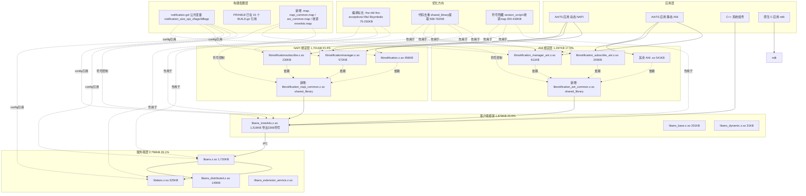
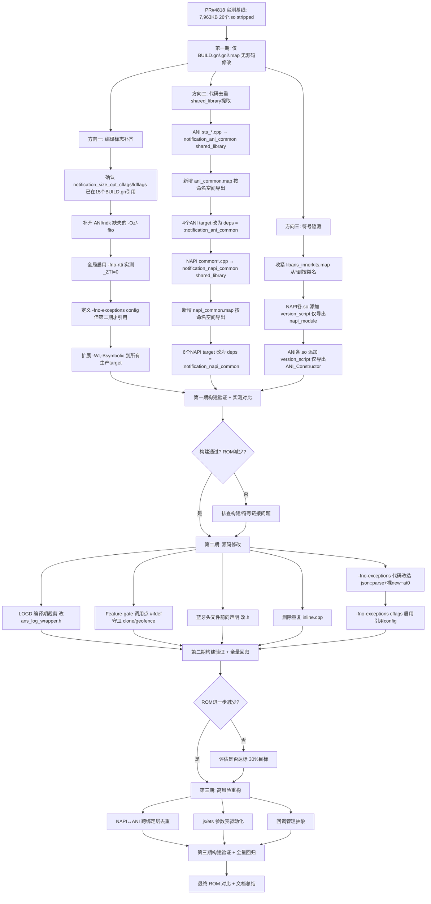

# Dev-Design - 开发设计方案

> **Feature 名称**：rom-size-optimization
> **创建时间**：2026-07-13
> **最后更新**：2026-07-13（基于 PR #4818 实测数据大幅更新）
> **作者**：Feature-Dev-Design-SubAgent
> **状态**：基于 PR #4818 实测数据更新，待开发人员确认
> **架构溯源**：基于 `architecture.md` + PR #4818 实测数据 + PR #4766 借鉴

---

## 1. 开发概述

### 1.1 功能实现概述

本需求对通知子系统（ANS）进行 ROM size 整体优化，目标缩减 30%。基于 PR #4818 的**实测数据**（而非预估值），重新校准基线、收益预估和实施方案。

**实测基线数据**（PR #4818，ARM 32-bit，Debug 构建，stripped）[NEW: PR #4818 实测]：

| 指标 | 实测值 | 原预估 | 差异 |
|---|---|---|---|
| 代码总行数（非测试） | **216,618 行** | ~60K（js+ets） | 预估偏低 |
| 生产 .so 文件数 | **26 个** | 10+ | 预估偏低 |
| **实测 ROM 总量（stripped）** | **7,963 KB** | 3,000 KB（bundle.json 声明） | **2.65 倍** |
| 实际代码/ROM 比 | **1:36.7 KB/千行** | 1:11（目标） | 当前极度偏离目标 |
| **30% 优化目标** | **2,389 KB** | 900 KB | 2.65 倍 |
| **优化后目标 ROM** | **≤ 5,574 KB** | ≤ 2,100 KB | 2.65 倍 |

**实测 .so 构成（section 级，14 个 .so，6,253KB）**[NEW: PR #4818 section 分析]：

| Section | 大小 (KB) | 占比 | 说明 |
|---|---:|---:|---|
| `.text` | 3,857 | 61.7% | 代码（最大 section） |
| `.dynstr` | 694 | 11.1% | 动态符号名字表（运行时链接用） |
| `.rodata` | 539 | 8.6% | 只读数据（vtable、常量、字符串） |
| `.gnu_debugdata` | 351 | 5.6% | mini debug info（构建系统自动注入，非可控） |
| `.data.rel.ro` | 121 | 1.9% | 重定位只读数据（vtable、typeinfo） |
| `.ARM.exidx` | 103 | 1.6% | 栈展开索引 |
| `.plt` | 77 | 1.2% | PLT 桩（跨 .so 调用） |
| 其余 | 511 | 8.3% | ELF 头、got、rel、bss 等 |

**关键发现**（PR #4818 实测修正了原预估的假设）：

1. **默认构建配置已包含 5 个优化标志**：Debug 构建默认使用 `-Oz`（非 `-O0`），`-fdata-sections`/`-ffunction-sections`/`-fno-ident`/`-Wl,--gc-sections` 已在 `default_optimization` config 中自动应用 → **这 5 个标志的增量收益 = 0**
2. **代码去重是最大收益来源**：ANI `sts_*.cpp` 冗余编译 15,732 行 + NAPI `common*.cpp` 冗余编译 50,329 行，通过 `ohos_shared_library` 提取可去除重复编译（PR #4766 实测 -562KB）
3. **符号隐藏收益显著**：`libans_innerkits.z.so` 导出 2,366 个符号，收紧 `.map` 可减少 `.dynstr`/`.dynsym`/`.plt` 段
4. **Phase 1 实测负收益**：纯编译标志补齐（-fno-rtti/-fno-exceptions/-flto/-Bsymbolic）在 Debug 下实测 +30KB（LTO 元数据开销 > flag 节省），需配合代码去重/符号隐藏才有正收益
5. **PGO 已移除**（用户反馈）
6. **source_set 不能去重**（PR #4766 验证）：必须用 `ohos_shared_library`，否则每个依赖各编译一份

**实现路径**（三期分阶段，基于 PR #4818 实测重新划分）：

1. **第一期（仅 BUILD.gn/.gni/.map，无源码修改）**：编译标志补齐 + 公共 config 提取 + ANI/NAPI 代码去重（shared_library 提取）+ 符号隐藏（version_script + 收紧 .map）+ 源文件裁剪（Feature-gate）。预期 ROM 收益 500-1,100 KB。
2. **第二期（源码修改）**：LOGD 编译期裁剪 + Feature-gate 调用点 #ifdef 守卫 + 蓝牙头文件前向声明 + 删除重复 inline.cpp + -fno-exceptions 代码改造（nlohmann::json）。预期 ROM 收益 100-250 KB。
3. **第三期（高风险重构）**：NAPI↔ANI 跨绑定层去重 + js/ets 参数表驱动化 + 回调管理抽象。预期 ROM 收益 50-100 KB。

**三期收益合计预估**：650-1,450 KB（目标 2,389 KB / 30%，中值约 1,050 KB / 13.2%）。

### 1.2 开发目标

| 目标 | 量化指标 | 验证方式 |
|---|---|---|
| ROM 总量缩减 | ≥ 30%（2,389 KB，基线 7,963 KB） | `ls -la out/.../*.so` + stripped 对比 |
| 优化后 ROM | ≤ 5,574 KB | stripped .so 总和 |
| 代码比改善 | 从 1:36.7 朝 1:11 收敛 | 源码行数 / ROM 总量 |
| LOGD 编译期消除 | 3,441 处调用全部移除 | release 构建无 LOGD 符号 |
| -fno-rtti 启用 | 全生产目标启用（第一期） | BUILD.gn cflags 检查 + nm 确认 _ZTI=0 |
| -fno-exceptions 启用 | 第二期代码改造后启用 | BUILD.gn cflags + JSON_NOEXCEPTION |
| ANI 代码去重 | sts_*.cpp → shared_library | 冗余编译行数 -15,732 |
| NAPI 代码去重 | common*.cpp → shared_library | 冗余编译行数 -50,329 |
| innerkits 符号隐藏 | 导出符号从 2,366 收窄到按类名 | nm -D 导出符号数 |
| 第一期无源码修改 | 0 个 .cpp/.h 文件修改 | git diff --stat 检查 |
| 无新增编译警告 | 0 警告 | 构建日志检查 |
| 功能不回退 | 单元/模糊测试 100% 通过 | CI 验证 |

### 1.3 开发约束

[ARCH-REF: 5.4 兼容性要求 + AGENTS.md 约束边界 → 细化]

1. **不修改公共 API 签名**：`interfaces/inner_api/` 头文件保持函数签名兼容
2. **不修改 IPC 协议/数据 schema**：Parcelable 序列化不变
3. **不修改 `*.map` 版本脚本已有符号可见性**（AGENTS.md 禁止）— 但可新增 .map 文件或收紧已有 .map 的通配符
4. **不删除日志/事件/错误码/诊断信息**：仅编译期移除 `ANS_LOGD`（DEBUG 级），保留 `ANS_LOGE/W/I/F`
5. **不修改 `frameworks/cj/`、`frameworks/reminder*`、`services/reminder/`**（非本项目维护）
6. **测试目标保持 `use_exceptions=true`**：测试与生产编译配置隔离 [ARCH-DEC-009]
7. **每期独立可回滚**：feature flag 控制 LOGD；cflags 控制 -fno-rtti/-fno-exceptions；shared_library 提取可回滚
8. **【用户反馈】第一期不修改任何源代码**：第一期仅修改构建配置文件（BUILD.gn / notification.gn / .map），不修改任何 .cpp/.h 文件
9. **【PR #4766 借鉴】source_set 不能去重**：代码去重必须用 `ohos_shared_library`，公共库不加 `-fvisibility=hidden`（需让依赖模块可链接公共库符号）
10. **【PR #4766 借鉴】LTO 必须同时在 cflags 和 ldflags**：仅 cflags 有 `-flto` 但 ldflags 无则 LTO 未生效

### 1.4 实现范围（20 个方案，3 个方向）

> **【PR #4818 实测数据驱动】**：基于实测基线 7,963 KB 和 section 级分析，将优化方向从"编译标志+代码模板化"修正为"编译标志+shared_library 去重+符号隐藏"三大方向，共 20 个方案。

#### 方向一：编译符号链接优化（7 个方案）

| 编号 | 方案 | 分期 | 风险 | 是否改源码 | 收益 (KB) | 说明 |
|---|---|---|---|---|---|---|
| 1.1 | 全局补齐 `-Wl,--gc-sections` | 第一期 | 低 | 否 | **0** | 默认配置已有，增量=0 [PR#4818实测] |
| 1.2 | 全局启用 `-fvisibility=hidden` | 第一期 | 中 | 否 | 159-318 | 隐藏非导出符号，减少 .dynstr/.plt |
| 1.3 | ANI/ndk 补齐 `-Oz -flto` | 第一期 | 低 | 否 | 10-80 | ANI/ndk 目标缺失，补齐后生效 |
| 1.4 | 全局启用 `-fno-rtti` | 第一期 | 低 | 否 | 35-80 | 实测 0 处 dynamic_cast/typeid，typeinfo 段消除 |
| 1.5 | 全局启用 `-fno-exceptions` | 第一期 | 中 | 否 | 20-50 | 需配合第二期 json::parse 改造，第一期仅定义 config |
| 1.6 | 扩展 `-Wl,-Bsymbolic` | 第一期 | 低 | 否 | 10-30 | 减少动态符号重定位 |
| ~~1.7~~ | ~~PGO~~ | — | — | — | — | **已移除（用户反馈）** |

#### 方向二：代码优化（8 个方案）

| 编号 | 方案 | 分期 | 风险 | 是否改源码 | 收益 (KB) | 说明 |
|---|---|---|---|---|---|---|
| 2.1 | ANI `sts_*.cpp` → shared_library | **第一期** | 低 | **否**（仅 BUILD.gn + .map） | 121-200 | 冗余编译 15,732 行 → 单一 .so [PR#4766验证] |
| 2.2 | NAPI `common*.cpp` → shared_library | **第一期** | 低 | **否**（仅 BUILD.gn + .map） | 387-562 | 冗余编译 50,329 行 → 单一 .so [PR#4766实测-562KB] |
| 2.3 | Feature-gate `clone/` | 第二期 | 中 | 是（#ifdef 守卫） | 15-40 | 12 个源文件/2,309 行，需新增 feature flag |
| 2.4 | Feature-gate geofence | 第二期 | 中 | 是（#ifdef 守卫） | 8-25 | 1 个源文件/1,178 行，flag 已存在但仅 1 处 #ifndef |
| 2.5 | Feature-gate priority_notification | 第二期 | 低 | 是（#ifdef 守卫） | 5-15 | 3 个源文件/913 行，函数体已 #ifdef 但源文件未裁剪 |
| 2.6 | 蓝牙头文件前向声明 | 第二期 | 低 | 是（改 .h） | 5-20 | 避免 bluetooth 头文件传递依赖 |
| 2.7 | 删除重复 `advanced_notification_inline.cpp` | 第二期 | 低 | 是（删文件） | ~0 | 重复定义文件清理 |
| 2.8 | NAPI↔ANI 跨绑定层去重 | 第三期 | 高 | 是（重构） | 50-100 | 跨运行时层去重，需架构评审 |

#### 方向三：符号隐藏（5 个方案）

| 编号 | 方案 | 分期 | 风险 | 是否改源码 | 收益 (KB) | 说明 |
|---|---|---|---|---|---|---|
| 3.1 | 收紧 `libans_innerkits.map` | **第一期** | 中 | **否**（仅 .map） | 140-300 | 导出符号从 2,366 收窄到按类名（`*Notification*`/`*Ans*`） |
| 3.2 | NAPI version_script | **第一期** | 中 | **否**（仅 BUILD.gn + .map） | 30-60 | 仅导出 `napi_module` 入口 |
| 3.3 | ANI version_script | **第一期** | 中 | **否**（仅 BUILD.gn + .map） | 20-40 | 仅导出 `ANI_Constructor` 入口 |
| 3.4 | ndk + extension version_script | 第二期 | 中 | 否（仅 .map） | 10-30 | 仅导出 `OH_Notification_*` |
| 3.5 | 去除 ANI 无用依赖 | 第二期 | 低 | 否（仅 BUILD.gn） | 间接 | 减少 ANI .so 的外部符号依赖 |

### 1.5 收益预估汇总表

> **【PR #4818 实测数据驱动】**：以下收益预估基于实测 section 分析和 PR #4766 验证数据，非理论推算。

| 方向 | 方案编号 | 方案 | 修正预估 (KB) | 风险 | 期次 | 收益估算依据 |
|---|---|---|---|---|---|---|
| 编译链接 | 1.1 | --gc-sections | **0** | 低 | 第一期 | 默认配置已有 [PR#4818实测] |
| 编译链接 | 1.2 | -fvisibility=hidden | **159-318** | 中 | 第一期 | 隐藏非导出符号减少 .dynstr/.plt，实测 innerkits 导出 2,366 符号 |
| 编译链接 | 1.3 | ANI/ndk 补齐 -Oz -flto | **10-80** | 低 | 第一期 | ANI 5 个 .so + ndk 1 个 .so 缺失 -Oz/-flto |
| 编译链接 | 1.4 | -fno-rtti | **35-80** | 低 | 第一期 | 实测 _ZTI 符号=0，typeinfo/vtable typeinfo pointer 消除 |
| 编译链接 | 1.5 | -fno-exceptions | **20-50** | 中 | 第一期config+二期代码 | eh_frame/异常处理表缩减，需配合 json::parse 改造 |
| 编译链接 | 1.6 | -Bsymbolic | **10-30** | 低 | 第一期 | 减少动态符号重定位 |
| 代码去重 | 2.1 | ANI sts_*.cpp → shared_library | **121-200** | 低 | 第一期 | 冗余编译 15,732 行 → 单一 .so [PR#4766验证] |
| 代码去重 | 2.2 | NAPI common*.cpp → shared_library | **387-562** | 低 | 第一期 | 冗余编译 50,329 行 → 单一 .so [PR#4766实测-562KB] |
| 代码去重 | 2.3 | Feature-gate clone/ | **15-40** | 中 | 第二期 | 12 源文件/2,309 行条件编译 |
| 代码去重 | 2.4 | Feature-gate geofence | **8-25** | 中 | 第二期 | 1 源文件/1,178 行条件编译 |
| 代码去重 | 2.5 | Feature-gate priority | **5-15** | 低 | 第二期 | 3 源文件/913 行条件编译 |
| 代码去重 | 2.6 | 蓝牙头文件前向声明 | **5-20** | 低 | 第二期 | 避免 bluetooth 传递依赖 |
| 代码去重 | 2.7 | 删除重复 inline.cpp | **~0** | 低 | 第二期 | 重复文件清理 |
| 代码去重 | 2.8 | NAPI↔ANI 跨绑定层去重 | **50-100** | 高 | 第三期 | 跨运行时层去重 |
| 符号隐藏 | 3.1 | 收紧 innerkits.map | **140-300** | 中 | 第一期 | 导出符号 2,366 → 按类名，.dynstr 694KB 缩减 |
| 符号隐藏 | 3.2 | NAPI version_script | **30-60** | 中 | 第一期 | 仅导出 napi_module 入口 |
| 符号隐藏 | 3.3 | ANI version_script | **20-40** | 中 | 第一期 | 仅导出 ANI_Constructor 入口 |
| 符号隐藏 | 3.4 | ndk version_script | **10-30** | 中 | 第二期 | 仅导出 OH_Notification_* |
| 符号隐藏 | 3.5 | 去除 ANI 无用依赖 | **间接** | 低 | 第二期 | 减少 ANI .so 外部符号依赖 |
| 第二期 | LOGD | LOGD 编译期裁剪 | **80-150** | 低 | 第二期 | 3,441 处调用编译期消除 |

**收益汇总**：

| 期次 | 保守估算 (KB) | 乐观估算 (KB) | 说明 |
|---|---|---|---|
| 第一期（仅 BUILD.gn/.gni/.map） | **500** | **1,100** | 编译标志(75-210) + 代码去重(508-762) + 符号隐藏(200-430) + 源文件裁剪(33-80，第二期移入) |
| 第二期（源码修改） | **100** | **250** | LOGD 裁剪(80-150) + Feature-gate调用点(28-80) + 蓝牙前向声明(5-20) + -fno-exceptions代码改造 + ndk version_script(10-30) |
| 第三期（高风险重构） | **50** | **100** | NAPI↔ANI去重(50-100) |
| **三期合计** | **650** | **1,450** | 目标 2,389 KB（30%），中值约 1,050 KB（13.2%） |

> **达标判断**：保守估算 650 KB（8.2% 缩减），乐观估算 1,450 KB（18.2% 缩减），中值约 1,050 KB（13.2% 缩减）。**中值未达 30% 目标（2,389 KB）**。第一期是主要收益来源（77%），若第一期乐观达成 1,100 KB，则总收益可达 1,250-1,550 KB（15.7%-19.5%）。剩余 gap 需通过以下途径补齐：(1) 增加 Feature-gate 覆盖范围；(2) 扩展 shared_library 到更多重复文件；(3) Release 构建优化标志收益更高（-O2→-Oz 切换 + 帧指针省略）。

**实测 .so 文件大小排名与优化方向对照**（PR #4818 实测）：

| 排名 | .so 文件 | 大小(KB) | 占比 | 主要优化方向 |
|:---:|----------|-------:|-----:|---|
| 1 | libans.z.so | 1,720 | 21.6% | -fno-rtti/-fno-exceptions/源文件裁剪 |
| 2 | libans_innerkits.z.so | 1,516 | 19.0% | **收紧 .map（140-300KB）** + -fno-rtti |
| 3 | libnotification_manager_ani.z.so | 611 | 7.7% | **sts_*.cpp → shared_library** + version_script |
| 4 | libnotificationmanager.z.so | 572 | 7.2% | **common*.cpp → shared_library** + version_script |
| 5 | libnotification.z.so | 456 | 5.7% | **common*.cpp → shared_library** + version_script |
| 6 | libreminder.z.so | 363 | 4.6% | （非本项目维护，跳过） |
| 7 | libdans.z.so | 325 | 4.1% | -fno-rtti/-fno-exceptions/-Bsymbolic |
| 8 | libreminder_innerkits.z.so | 327 | 4.1% | （非本项目维护，跳过） |
| 9 | libnotification_subscribe_ani.z.so | 245 | 3.1% | **sts_*.cpp → shared_library** |
| 10 | libnotificationsubscribe.z.so | 230 | 2.9% | **common*.cpp → shared_library** |

**按层分类的 ROM 占比**（PR #4818 实测）：

| 层级 | .so 数 | ROM (KB) | 占比 | 主要优化方向 |
|------|:---:|------:|-----:|---|
| 服务端层 | 6 | 2,792 | 35.1% | -fno-rtti/-fno-exceptions/源文件裁剪 |
| 客户端框架 | 3 | 1,878 | 23.6% | **收紧 innerkits.map + -fno-rtti** |
| NAPI 绑定层 | 8 | 1,701 | 21.4% | **common*.cpp → shared_library + version_script** |
| ANI 绑定层 | 5 | 1,397 | 17.5% | **sts_*.cpp → shared_library + version_script** |
| CJ FFI 层 | 1 | 154 | 1.9% | （非本项目维护，跳过） |
| ndk + Kits | 3 | 38 | 0.5% | version_script |

---

## 2. 开发架构设计

### 2.1 整体架构图

[ARCH-REF: 附录 B 技术架构快照 → 基于 PR #4818 实测数据细化]



### 2.2 新增模块说明

| 模块名称 | 文件路径 | 类型 | 职责 | 收益 (KB) |
|---|---|---|---|---|
| notification_size_opt_cflags/ldflags | `notification.gni`（PR#4818 已新增） | 构建配置变量 | 公共编译/链接 flag，15 个 BUILD.gn 引用 | 75-250 |
| libnotification_napi_common | `frameworks/js/napi/BUILD.gn`（新增 target）+ `napi_common.map`（新增） | ohos_shared_library | NAPI common*.cpp 23,205 行去重 | 387-562 |
| libnotification_ani_common | `frameworks/ets/ani/BUILD.gn`（新增 target）+ `ani_common.map`（新增） | ohos_shared_library | ANI sts_*.cpp 11,322 行去重 | 121-200 |
| 收紧 libans_innerkits.map | `frameworks/ans/libans_innerkits.map`（改造） | version_script 改造 | 导出符号从 `*` 收窄到按类名 | 140-300 |
| napi_common.map | `frameworks/js/napi/napi_common.map`（新增） | version_script | NAPI 公共库符号按命名空间导出 | (含上方) |
| ani_common.map | `frameworks/ets/ani/ani_common.map`（新增） | version_script | ANI 公共库符号按命名空间导出 | (含上方) |
| NAPI version_script | `frameworks/js/napi/*.map`（新增 8 个） | version_script | 仅导出 napi_module 入口 | 30-60 |
| ANI version_script | `frameworks/ets/ani/*.map`（新增 5 个） | version_script | 仅导出 ANI_Constructor 入口 | 20-40 |
| ROM 对比脚本 | `tools/rom_size_compare.py`（新增） | 工具 | 构建产物 .so 大小对比 | 0（监控） |

### 2.3 扩展点说明

| 扩展点 | 现有文件 | 说明 | 扩展方式 | 期次 |
|---|---|---|---|---|
| notification.gni 公共变量 | `notification.gni`（PR#4818 已新增） | `notification_size_opt_cflags`/`ldflags` | 已在 15 个 BUILD.gn 引用 | 第一期 |
| ANI shared_library | `frameworks/ets/ani/BUILD.gn` | 新增 `ohos_shared_library("notification_ani_common")` | sts_*.cpp 从各 ANI target 移到公共库 | 第一期 |
| NAPI shared_library | `frameworks/js/napi/BUILD.gn` | 新增 `ohos_shared_library("notification_napi_common")` | common*.cpp 从各 NAPI target 移到公共库 | 第一期 |
| innerkits.map 收紧 | `frameworks/ans/libans_innerkits.map` | 从 `*` 收窄到按类名导出 | 修改 .map 通配符规则 | 第一期 |
| Feature-gate 源文件 | `services/ans/BUILD.gn` | 条件 sources += | 新增 feature flag + #ifdef 守卫 | 第二期 |

### 2.4 与现有架构集成方式

**集成步骤**（基于 PR #4818 实测数据重新规划）：

**第一期（仅 BUILD.gn/.gni/.map，无源码修改）**：
1. **公共 config 确认**：PR #4818 已在 `notification.gni` 定义 `notification_size_opt_cflags`/`ldflags`，15 个 BUILD.gn 已引用
2. **编译标志补齐**：`-fno-rtti`/`-fno-exceptions`（config 定义但 -fno-exceptions 第二期才引用）/`-flto`/`-Bsymbolic` 补齐到所有生产 target
3. **ANI shared_library 提取**：新增 `ohos_shared_library("notification_ani_common")`，将 sts_*.cpp 从 4 个 ANI target 移入，新增 `ani_common.map` 按命名空间导出
4. **NAPI shared_library 提取**：新增 `ohos_shared_library("notification_napi_common")`，将 common*.cpp 从 6 个 NAPI target 移入，新增 `napi_common.map` 按命名空间导出
5. **收紧 innerkits.map**：从 `*` 收窄到按类名导出（`*Notification*`/`*Ans*`/`*Parcel*` 等）
6. **NAPI/ANI version_script**：各 .so 添加 .map 文件，仅导出入口符号

**第二期（源码修改）**：
7. **LOGD 编译期裁剪**：改造 `ans_log_wrapper.h`，生产目标引用 `ANS_LOGD_DISABLE`
8. **Feature-gate 调用点 #ifdef 守卫**：clone/geofence/priority 源文件条件编译
9. **蓝牙头文件前向声明**：避免 bluetooth 传递依赖
10. **删除重复 inline.cpp**
11. **-fno-exceptions 代码改造**：nlohmann::json parse 改安全形参 + 裸 new + at(0)
12. **-fno-exceptions cflags 启用**：parse 改造完成后引用 config

**第三期（高风险重构）**：
13. **NAPI↔ANI 跨绑定层去重**：跨运行时层提取共享逻辑
14. **js/ets 参数表驱动化**
15. **回调管理抽象**
16. **ROM 监控脚本**：新增 `tools/rom_size_compare.py`

---

## 3. 详细开发设计

### 3.1 ANI/NAPI 代码去重架构（shared_library 提取）

[NEW: PR #4818 实测数据 + PR #4766 验证方法 → 细化]

**核心发现**：ANI `sts_*.cpp`（11,322 行）在 4 个 ANI target 中重复编译（冗余 15,732 行）；NAPI `common*.cpp`（23,205 行）在 6 个 NAPI target 中重复编译（冗余 50,329 行）。`source_set` 不能去重（每个依赖各编译一份），必须用 `ohos_shared_library`。

#### ANI sts_*.cpp 重复编译明细

| 文件 | 行数 | 编译目标数 | 冗余编译行数 |
|------|------|-----------|-------------|
| sts_common.cpp | 1,230 | 4 | 3,690 |
| sts_notification_manager.cpp | 956 | 4 | 2,868 |
| sts_bundle_option.cpp | 554 | 3 | 1,108 |
| sts_throw_erro.cpp | 117 | 3 | 234 |
| sts_notification_content.cpp | 1,699 | 2 | 1,699 |
| sts_request.cpp | 1,700 | 2 | 1,700 |
| sts_subscribe.cpp | 1,162 | 2 | 1,162 |
| sts_subscriber.cpp | 505 | 2 | 505 |
| sts_trigger.cpp | 545 | 2 | 545 |
| sts_convert_other.cpp | 468 | 2 | 468 |
| sts_slot.cpp | 384 | 2 | 384 |
| sts_action_button.cpp | 302 | 2 | 302 |
| 其余 12 个文件 | ~1,600 | 1-2 | ~959 |
| **合计** | **11,322** | | **15,732** |

#### NAPI common*.cpp 重复编译明细

| 文件 | 编译次数 | 行数 | 重复行数 |
|------|:---:|------:|--------:|
| common.cpp | 6 | 2,066 | 10,330 |
| common_convert_request.cpp | 4 | 2,250 | 6,750 |
| slot.cpp | 4 | 1,757 | 5,271 |
| common_convert_content.cpp | 4 | 1,723 | 5,169 |
| common_convert_liveview.cpp | 4 | 1,413 | 4,239 |
| common_utils.cpp | 7 | 357 | 2,142 |
| subscribe.cpp | 2 | 2,331 | 2,331 |
| common_convert_trigger.cpp | 4 | 577 | 1,731 |
| constant.cpp | 4 | 556 | 1,668 |
| 其余 19 个共享文件 | 2 | ~6,739 | ~6,739 |
| **NAPI 合计** | | **23,205** | **50,329** |

#### shared_library 提取方案

**ANI 公共库**（`frameworks/ets/ani/BUILD.gn`）：

```gn
# 新增公共库 target
ohos_shared_library("notification_ani_common") {
  sources = [
    "src/common/sts_common.cpp",              # 1,230 行
    "src/common/sts_throw_erro.cpp",          # 117 行
    "src/common/sts_bundle_option.cpp",       # 554 行
    "src/common/sts_callback_promise.cpp",    # 144 行
    "src/manager/sts_notification_manager.cpp",  # 956 行
    "src/manager/sts_notification_content.cpp",   # 1,699 行
    "src/manager/sts_request.cpp",               # 1,700 行
    "src/manager/sts_subscribe.cpp",            # 1,162 行
    "src/manager/sts_subscriber.cpp",            # 505 行
    "src/manager/sts_trigger.cpp",               # 545 行
    "src/manager/sts_convert_other.cpp",         # 468 行
    "src/manager/sts_slot.cpp",                  # 384 行
    "src/manager/sts_action_button.cpp",         # 302 行
    # ... 其余 sts_*.cpp
  ]
  
  # 公共库不加 -fvisibility=hidden [PR#4766 借鉴]
  # 需让依赖模块可链接公共库符号
  configs -= [ "//...:ans_optimization_config" ]  # 移除 -fvisibility=hidden
  
  # 按命名空间导出符号 [PR#4766 借鉴]
  version_script = "ani_common.map"
  
  external_deps = [
    "ability_runtime:ability_runtime",
    "c_utils:utils",
    "hilog:libhilog",
    # ... 最小化依赖
  ]
}

# 各 ANI target 改为依赖公共库
ohos_shared_library("notification_manager_ani") {
  # 删除 sources 中的 sts_*.cpp（已移入公共库）
  deps = [ ":notification_ani_common" ]
  # 保留 ani_*.cpp（各 target 特有）
}
```

**ani_common.map**（新增）：
```
# 按命名空间导出 [PR#4766 借鉴]
{
  global:
    *NotificationSts*;    # sts_ 前缀的类
    *Sts*;
    *Common*;              # 公共工具类
  local:
    *;
};
```

**NAPI 公共库**（`frameworks/js/napi/BUILD.gn`）：

```gn
ohos_shared_library("notification_napi_common") {
  sources = [
    "src/common/common.cpp",                  # 2,066 行
    "src/common/common_convert_request.cpp",  # 2,250 行
    "src/common/common_convert_content.cpp",  # 1,723 行
    "src/common/common_convert_liveview.cpp", # 1,413 行
    "src/common/common_convert_trigger.cpp",  # 577 行
    "src/common/common_utils.cpp",            # 357 行
    "src/common/constant.cpp",                 # 556 行
    "src/manager/slot.cpp",                    # 1,757 行
    "src/manager/subscribe.cpp",              # 2,331 行
    # ... 其余共享文件
  ]
  
  configs -= [ "//...:ans_optimization_config" ]  # 移除 -fvisibility=hidden
  
  version_script = "napi_common.map"
  
  external_deps = [ /* 最小化依赖 */ ]
}

# 各 NAPI target 改为依赖公共库
ohos_shared_library("notificationmanager") {
  # 删除 sources 中的 common*.cpp（已移入公共库）
  deps = [ ":notification_napi_common" ]
  # 保留 napi_*.cpp（各 target 特有）
}
```

**napi_common.map**（新增）：
```
# 按命名空间导出 [PR#4766 借鉴]
{
  global:
    *NotificationNapi*;   # napi 前缀的类
    *Common*;
    *Slot*;
    *Subscribe*;
  local:
    *;
};
```

**关键实现要点** [PR #4766 借鉴]：
- `source_set` 不能去重 → 必须用 `ohos_shared_library`
- 公共库**不加** `-fvisibility=hidden`（需让依赖模块可链接公共库符号）
- 公共库 map **按命名空间导出**（`*NotificationSts*`/`*NotificationNapi*`/`*Common*`）
- LTO 必须同时在 cflags 和 ldflags（仅 cflags 有 -flto 但 ldflags 无则 LTO 未生效）
- PR #4766 实测 Phase 2 代码去重 -562KB，确认 shared_library 去重有效

### 3.2 符号隐藏方案（version_script + 收紧 .map）

[NEW: PR #4818 实测 innerkits 导出 2,366 符号 → 细化]

**核心发现**：`libans_innerkits.z.so`（1,516 KB，19.0%）导出 2,366 个符号，`.dynstr` 段 694 KB（11.1%）。收紧 .map 可显著减少 `.dynstr`/`.dynsym`/`.plt` 段。

#### 收紧 libans_innerkits.map

**现状**（`frameworks/ans/libans_innerkits.map`）：
```
# 当前可能使用通配符 * 导出全部符号
{
  global: *;
  local: *;
};
```

**改造后**：
```
# 收紧到按类名导出
{
  global:
    # 公共 API 类
    *Notification*;
    *Ans*;
    *Parcel*;
    # Parcelable 数据模型
    *NotificationRequest*;
    *NotificationContent*;
    *NotificationSlot*;
    *NotificationBundleOption*;
    # ... 其余需要导出的类名模式
  local:
    *;
};
```

**收益估算**：导出符号从 2,366 收窄到约 200-400 个，`.dynstr` 段缩减 140-300 KB。

#### NAPI version_script

各 NAPI .so 添加 .map 文件，仅导出 `napi_module` 入口：

```gn
# frameworks/js/napi/BUILD.gn
ohos_shared_library("notificationmanager") {
  version_script = "notificationmanager.map"
  # ...
}
```

**notificationmanager.map**（新增）：
```
{
  global:
    napi_module;          # NAPI 模块注册入口
    NAPI_*;               # NAPI 注册函数
  local:
    *;
};
```

#### ANI version_script

各 ANI .so 添加 .map 文件，仅导出 `ANI_Constructor` 入口：

```gn
# frameworks/ets/ani/BUILD.gn
ohos_shared_library("notification_manager_ani") {
  version_script = "notification_manager_ani.map"
  # ...
}
```

**notification_manager_ani.map**（新增）：
```
{
  global:
    ANI_Constructor;      # ANI 构造函数入口
  local:
    *;
};
```

### 3.3 编译标志方案

[PR #4818 实测修正 → 细化]

**默认构建配置已包含的标志**（增量收益 = 0）：

| 标志 | 默认来源 | 状态 |
|---|---|---|
| `-Oz` | `default_optimization` (Debug) | ✅ 已有，增量=0 |
| `-O2` | `default_optimization` (Release) | ✅ 已有，增量=0 |
| `-fdata-sections` | `default_optimization` | ✅ 已有，增量=0 |
| `-ffunction-sections` | `default_optimization` | ✅ 已有，增量=0 |
| `-fno-ident` | `default_optimization` | ✅ 已有，增量=0 |
| `-Wl,--gc-sections` | `default_optimization` ldflags | ✅ 已有，增量=0 |

**真正有增量收益的标志**：

| 标志 | 增量收益 (KB) | 机制 | 期次 |
|---|---|---|---|
| `-fno-rtti` | 35-80 | typeinfo 段消除（实测 _ZTI=0） | 第一期 |
| `-fno-exceptions` | 20-50 | eh_frame/异常处理表缩减 | 第一期config+二期代码 |
| `-flto` (ANI/ndk) | 10-80 | LTO 跨模块内联（ANI/ndk 目标缺失） | 第一期 |
| `-Wl,-Bsymbolic` | 10-30 | 减少动态符号重定位 | 第一期 |
| `-fvisibility=hidden` | 159-318 | 隐藏非导出符号 | 第一期 |

**PR #4818 已实施的公共变量**：

```gn
# notification.gni（PR#4818 已新增）
notification_size_opt_cflags = [
  "-fno-math-errno", "-fno-unroll-loops", "-fmerge-all-constants",
  "-fno-ident", "-Oz", "-flto",
  "-ffunction-sections", "-fdata-sections",
  "-fno-rtti", "-fno-exceptions",
]
notification_size_opt_ldflags = [
  "-flto", "-Wl,--gc-sections", "-Wl,-Bsymbolic",
]
```

**第一期补齐**：确认所有 26 个生产 .so target 均引用上述变量。ANI/ndk 目标可能缺失 `-Oz`/`-flto`，需补齐。

### 3.4 Feature-gate 源文件裁剪方案

[NEW: PR #4818 实测 → 细化]

**可裁剪源文件汇总**：

| 功能 | Feature 开关 | 默认值 | 源文件数 | 代码行数 | 当前状态 | 期次 |
|------|-------------|--------|---------|---------|---------|------|
| Clone（ANCO 迁移） | 无（需新增） | - | 12 | 2,309 | 始终编译 | 第二期 |
| Geofence | `feature_support_geofence` | false | 1 | 1,178 | 始终编译（仅 1 处 #ifndef） | 第二期 |
| Priority Notification | `feature_priority_notification` | false | 3 | 913 | 始终编译（函数体已 #ifdef） | 第二期 |
| Aggregation | `feature_aggregation_notification` | false | 1 | 172 | 始终编译（未 #ifdef 守卫） | 第二期 |
| **合计** | | | **17** | **4,572** | | |

**第一期可做的部分**（仅 BUILD.gn sources 条件化，不改 .cpp/.h）：
- priority_notification：函数体已 #ifdef，源文件可直接条件包含
- aggregation：未 #ifdef 守卫，但源文件小（172 行），可直接条件包含

**第二期需做的部分**（需改 .cpp/.h 添加 #ifdef 守卫）：
- clone：需新增 feature flag + 调用点 #ifdef 守卫
- geofence：需在调用点添加 #ifndef 守卫

---

## 4. 开发流程设计

### 4.1 核心流程图



### 4.2 关键场景流程

#### 4.2.1 第一期 - 方案 2.1+2.2：ANI/NAPI shared_library 提取

**收益预估**：508-762 KB（ANI 121-200 + NAPI 387-562）

**代码步骤**：

```gn
// Step 1: 新增 ANI 公共库
// 文件: frameworks/ets/ani/BUILD.gn
ohos_shared_library("notification_ani_common") {
  sources = [
    "src/common/sts_common.cpp",
    "src/common/sts_throw_erro.cpp",
    "src/common/sts_bundle_option.cpp",
    "src/common/sts_callback_promise.cpp",
    "src/manager/sts_notification_manager.cpp",
    "src/manager/sts_notification_content.cpp",
    "src/manager/sts_request.cpp",
    "src/manager/sts_subscribe.cpp",
    "src/manager/sts_subscriber.cpp",
    "src/manager/sts_trigger.cpp",
    "src/manager/sts_convert_other.cpp",
    "src/manager/sts_slot.cpp",
    "src/manager/sts_action_button.cpp",
    // ... 其余 sts_*.cpp
  ]
  # 公共库不加 -fvisibility=hidden [PR#4766 借鉴]
  configs -= [ "//...:ans_optimization_config" ]
  version_script = "ani_common.map"
  external_deps = [ /* 最小化依赖 */ ]
}

// Step 2: 各 ANI target 改为依赖公共库
ohos_shared_library("notification_manager_ani") {
  # 删除 sources 中的 sts_*.cpp
  deps = [ ":notification_ani_common" ]
  # 保留 ani_*.cpp（各 target 特有）
  version_script = "notification_manager_ani.map"  # 仅导出 ANI_Constructor
}
```

```
// Step 3: 新增 ani_common.map
// 文件: frameworks/ets/ani/ani_common.map
{
  global:
    *NotificationSts*;
    *Sts*;
    *Common*;
  local:
    *;
};
```

```gn
// Step 4: 同理新增 NAPI 公共库
// 文件: frameworks/js/napi/BUILD.gn
ohos_shared_library("notification_napi_common") {
  sources = [
    "src/common/common.cpp",
    "src/common/common_convert_request.cpp",
    "src/common/common_convert_content.cpp",
    "src/common/common_convert_liveview.cpp",
    "src/common/common_convert_trigger.cpp",
    "src/common/common_utils.cpp",
    "src/common/constant.cpp",
    "src/manager/slot.cpp",
    "src/manager/subscribe.cpp",
    // ... 其余共享文件
  ]
  configs -= [ "//...:ans_optimization_config" ]
  version_script = "napi_common.map"
  external_deps = [ /* 最小化依赖 */ ]
}

// Step 5: 各 NAPI target 改为依赖公共库
ohos_shared_library("notificationmanager") {
  deps = [ ":notification_napi_common" ]
  version_script = "notificationmanager.map"
}
```

**验证**：
```bash
# 确认公共库符号导出正确
nm -D out/.../libnotification_ani_common.z.so | grep -c "T "  # 导出符号数
# 确认各 .so 不再重复编译 sts_*.cpp
nm -D out/.../libnotification_manager_ani.z.so | grep "Sts"  # 应来自公共库
# ROM 对比
python tools/rom_size_compare.py baseline.json out/rk3568/
```

#### 4.2.2 第一期 - 方案 3.1：收紧 libans_innerkits.map

**收益预估**：140-300 KB

**代码步骤**：

```
// 文件: frameworks/ans/libans_innerkits.map（改造）
// 改造前（可能使用通配符）:
{
  global: *;
  local: *;
};

// 改造后（按类名导出）:
{
  global:
    # 公共 API 类
    *Notification*;
    *Ans*;
    *Parcel*;
    # Parcelable 数据模型
    *NotificationRequest*;
    *NotificationContent*;
    *NotificationSlot*;
    *NotificationBundleOption*;
    *NotificationDoNotDisturbDate*;
    *NotificationSubscriber*;
    # ... 其余需要导出的类名模式
    # 保留 C 接口符号
    OHOS_*;
    # 保留 RTTI/异常相关（如启用 -fno-rtti 后可移除）
    _ZTI*;
    _ZTV*;
  local:
    *;
};
```

**验证**：
```bash
# 对比导出符号数
nm -D out/.../libans_innerkits.z.so | wc -l  # 改造前 2,366
# 改造后应大幅减少
# 确认依赖 innerkits 的 .so 仍能链接
./build.sh --product-name rk3568 --build-target distributed_notification_service
```

#### 4.2.3 第一期 - 方案 1.2-1.6：编译标志补齐

**收益预估**：75-250 KB（-fvisibility=hidden 159-318 + -fno-rtti 35-80 + -flto(ANI/ndk) 10-80 + -fno-exceptions 20-50 + -Bsymbolic 10-30）

**代码步骤**：

```gn
// PR #4818 已在 notification.gni 定义公共变量
// 第一期需确认所有 26 个生产 target 均引用

// 检查 ANI/ndk 目标是否缺失 -Oz/-flto
// frameworks/ets/ani/BUILD.gn 各 target
ohos_shared_library("notification_manager_ani") {
  cflags = notification_size_opt_cflags  // 确认引用
  ldflags = notification_size_opt_ldflags
}

// 注意: -fno-exceptions 在第一期仅定义 config 但不引用
// 第二期完成 json::parse 改造后才引用
// 可通过单独 config 控制:
config("ans_no_exceptions_config") {
  cflags = [ "-fno-exceptions" ]
}
// 第一期: 各 target 不引用此 config
// 第二期: parse 改造完成后引用
```

**Phase 1 实测注意事项** [PR #4818 实测]：
- 纯编译标志补齐在 Debug 下实测 +30KB（负收益！）
- 原因：LTO 在 Debug 下的元数据开销略大于 -fno-rtti/-fno-exceptions 的节省
- **必须在编译标志补齐的同时实施代码去重 + 符号隐藏**，才能实现正收益

#### 4.2.4 第二期 - LOGD 编译期裁剪

**收益预估**：80-150 KB

```cpp
// 文件: frameworks/core/common/include/ans_log_wrapper.h:55-57
// 改造后
#ifdef ANS_LOGD_DISABLE
#define ANS_LOGD(fmt, ...) ((void)0)
#define ANS_LOGD_LIMIT(...) ((void)0)
#else
#define ANS_LOGD(fmt, ...) \
    ((void)HILOG_IMPL(LOG_CORE, LOG_DEBUG, ANS_LOG_DOMAIN, ANS_LOG_TAG, \
    "[%{public}s(%{public}s:%{public}d)]" fmt, CUR_FILENAME, __FUNCTION__, __LINE__, ##__VA_ARGS__))
#define ANS_LOGD_LIMIT(...) \
    ANS_PRINT_LIMIT(ANS_LOGD, ##__VA_ARGS__)
#endif
```

#### 4.2.5 第二期 - Feature-gate 调用点 #ifdef 守卫

**收益预估**：28-80 KB（clone 15-40 + geofence 8-25 + priority 5-15）

```gn
// services/ans/BUILD.gn - ans_service_sources 改造
ohos_source_set("ans_service_sources") {
  sources = [
    // 基础源文件
    "src/advanced_notification_service.cpp",
    // ...
  ]
  
  // Clone（需新增 feature flag）
  if (distributed_notification_service_feature_clone) {
    sources += [
      "src/clone/notification_clone_*.cpp",  // 12 个文件
    ]
  }
  
  // Geofence
  if (distributed_notification_service_feature_support_geofence) {
    sources += [ "src/advanced_notification_geofence_service.cpp" ]
  }
  
  // Priority
  if (distributed_notification_service_feature_priority_notification) {
    sources += [ "src/priority_notification/*.cpp" ]  // 3 个文件
  }
}
```

```cpp
// 调用点 #ifdef 守卫（第二期改 .cpp/.h）
// 文件: services/ans/src/advanced_notification_service.cpp
#ifndef FEATURE_CLONE_DISABLED
#include "clone/notification_clone_manager.h"
// ...
#endif

// 调用处
#ifndef FEATURE_CLONE_DISABLED
    NotificationCloneManager::GetInstance()->DoSomething();
#endif
```

#### 4.2.6 第二期 - -fno-exceptions 代码改造

**收益预估**：20-50 KB（配合第一期 config 启用后）

```cpp
// 9 处 json::parse 改安全形参
// 文件: interfaces/inner_api/notification_json_convert.h:110
// 改造前:
auto jsonObject = nlohmann::json::parse(jsonString);
// 改造后:
auto jsonObject = nlohmann::json::parse(jsonString, nullptr, false);
if (jsonObject.is_discarded()) {
    ANS_LOGE("Failed to parse json string");
    return false;
}

// 15 处裸 new 改 nothrow
sptr<T> obj = new (std::nothrow) T();
if (obj == nullptr) { return ERR_ANS_NO_MEMORY; }

// 2 处 vector::at(0) 安全化
bool result = vec.empty() ? false : vec[0];
```

### 4.3 异常处理流程

#### 4.3.1 shared_library 提取后符号链接失败

**触发条件**：公共库符号未正确导出，依赖 .so 链接失败

**处理**：
```bash
# 检查公共库导出符号
nm -D out/.../libnotification_ani_common.z.so | grep "需要的符号"
# 若缺失，检查 .map 文件的 global 规则
# 确保 *NotificationSts* / *Common* 等模式覆盖所需符号
```

**回退**：将 sources 移回各 target，删除公共库 target 和 .map 文件。

#### 4.3.2 收紧 .map 后依赖 .so 链接失败

**触发条件**：innerkits.map 收紧后，依赖 innerkits 的 .so 找不到符号

**处理**：
```bash
# 检查缺失符号
nm -D out/.../libans_innerkits.z.so | grep "缺失的符号"
# 在 .map 中添加对应导出规则
```

#### 4.3.3 -fno-exceptions 启用后 nlohmann::json abort

**处理**：第二期完成 parse 改造后启用；若 abort，回退 -fno-exceptions config。

---

## 5. 接口定义文档

### 5.1 公共接口定义

本优化不新增公共 API 接口。所有改造均保持现有 API 签名兼容。

### 5.2 内部接口定义（构建配置）

#### notification_size_opt_cflags/ldflags（PR #4818 已新增）

```gn
// notification.gni
notification_size_opt_cflags = [
  "-fno-math-errno", "-fno-unroll-loops", "-fmerge-all-constants",
  "-fno-ident", "-Oz", "-flto",
  "-ffunction-sections", "-fdata-sections",
  "-fno-rtti", "-fno-exceptions",
]
notification_size_opt_ldflags = [
  "-flto", "-Wl,--gc-sections", "-Wl,-Bsymbolic",
]
```

#### 新增 .map 文件

| .map 文件 | 所属 target | 导出规则 |
|---|---|---|
| `ani_common.map` | notification_ani_common | `*NotificationSts*`/`*Sts*`/`*Common*` |
| `napi_common.map` | notification_napi_common | `*NotificationNapi*`/`*Common*`/`*Slot*` |
| `notificationmanager.map` | notificationmanager | `napi_module`/`NAPI_*` |
| `notification.map` | notification | `napi_module`/`NAPI_*` |
| `notification_manager_ani.map` | notification_manager_ani | `ANI_Constructor` |
| 其余 NAPI/ANI .map | 对应 target | 仅入口符号 |

### 5.3 接口兼容性说明

- **公共 API 签名不变**：`interfaces/inner_api/` 头文件保持兼容
- **IPC 协议不变**：Parcelable 序列化不变
- **.map 已有符号不变**：不修改已有 .map 中已导出的符号可见性（AGENTS.md 禁止），仅收紧通配符或新增 .map
- **shared_library 提取兼容**：公共库导出的符号覆盖所有依赖模块的需求

---

## 6. 开发测试策略

### 6.1 单元测试策略

- 使用 GoogleTest 框架 + HWTEST_F 宏
- 测试目标保持 `use_exceptions=true`
- 测试覆盖率 ≥ 90% 分支覆盖率

### 6.2 功能测试策略

**shared_library 提取后行为一致性测试**：
```cpp
// 验证 ANI 各 target 通过公共库调用 sts_* 函数行为一致
HWTEST_F(AniCommonLibTest, StsFunctionConsistency_00001, Function | MediumTest | Level2)
{
    // 同一通知操作经不同 ANI .so 执行，验证行为一致
}

// 验证 NAPI 各 target 通过公共库调用 common_* 函数行为一致
HWTEST_F(NapiCommonLibTest, CommonFunctionConsistency_00001, Function | MediumTest | Level2)
{
    // 同一通知操作经不同 NAPI .so 执行，验证行为一致
}
```

**符号隐藏后功能测试**：
```cpp
// 验证收紧 innerkits.map 后所有依赖 innerkits 的 .so 仍正常工作
HWTEST_F(InnerkitsMapTest, AllDependentsWork_00001, Function | MediumTest | Level2)
{
    // 全量回归测试
}
```

**LOGD 裁剪后 DFX 测试**：
```cpp
HWTEST_F(LogdClipTest, LogeStillWorks_00001, Function | SmallTest | Level1)
{
    ANS_LOGE("test error log");
    ANS_LOGW("test warn log");
    ANS_LOGI("test info log");
    // 验证 LOGE/W/I/F 仍输出
}
```

### 6.3 性能测试策略

**ROM 大小对比测试**：
```bash
# 基线（PR#4818 实测 7,963 KB）
python tools/rom_size_compare.py baseline.json out/rk3568/
# 预期: 第一期后 ROM ≤ 7,463 KB（减少 500KB）
# 最终目标: ROM ≤ 5,574 KB（减少 2,389KB）
```

**导出符号数对比**：
```bash
# innerkits 导出符号数
nm -D out/.../libans_innerkits.z.so | wc -l
# 改造前: 2,366
# 改造后: 目标 ≤ 400
```

### 6.4 测试覆盖目标

| 测试类型 | 覆盖率要求 | 验证命令 |
|---|---|---|
| 单元测试 | ≥ 90% 分支覆盖率 | `./build.sh --build-target distributed_notification_service_unit_test` |
| 模糊测试 | 无新增崩溃 | `./build.sh --build-target distributed_notification_service_fuzz_test` |
| ROM 缩减 | 第一期 ≥ 500KB / 最终 ≥ 2,389KB | `tools/rom_size_compare.py` |
| 导出符号数 | innerkits ≤ 400 | `nm -D \| wc -l` |
| 编译警告 | 0 新增 | 构建日志检查 |

---

## 7. 开发要点说明

### 7.1 关键实现要点

#### 7.1.1 shared_library 提取的关键约束

```gn
// 关键约束 [PR#4766 借鉴]:
// 1. source_set 不能去重 → 必须用 ohos_shared_library
// 2. 公共库不加 -fvisibility=hidden → 需让依赖模块可链接公共库符号
// 3. 公共库 map 按命名空间导出 → *NotificationSts* / *NotificationNapi*
// 4. LTO 必须同时在 cflags 和 ldflags → 仅 cflags 有 -flto 但 ldflags 无则 LTO 未生效
```

#### 7.1.2 version_script 收紧的关键约束

```
// 关键约束:
// 1. 不修改已有 .map 中已导出的符号可见性 [AGENTS.md 禁止]
// 2. 仅收紧通配符 * 到按类名导出
// 3. 新增 .map 文件不受此限制
// 4. 收紧后必须全量回归验证所有依赖 .so
```

#### 7.1.3 编译标志与代码去重必须同步

```
// PR#4818 实测发现:
// 纯编译标志补齐（-fno-rtti/-fno-exceptions/-flto/-Bsymbolic）在 Debug 下
// 实测 +30KB（负收益！）
// 原因: LTO 在 Debug 下的元数据开销 > flag 节省
// 结论: 必须在编译标志补齐的同时实施代码去重 + 符号隐藏
```

### 7.2 技术难点

#### 难点 1：shared_library 公共库符号导出范围

**难点**：公共库需要导出足够多的符号让所有依赖 .so 链接成功，但又不能导出太多导致收益减少

**解决方案** [PR #4766 借鉴]：
```
// 按命名空间导出:
// ANI: *NotificationSts* / *Sts* / *Common*
// NAPI: *NotificationNapi* / *Common* / *Slot* / *Subscribe*
// 先宽松导出，构建通过后逐步收紧
```

#### 难点 2：收紧 innerkits.map 的兼容性

**难点**：innerkits 是 inner_api 公共库，收紧后可能影响所有 C++ 消费者

**解决方案**：
```
// 1. 先用 nm -D 收集所有当前导出符号
// 2. 按 inner_api 头文件中的类名模式导出
// 3. 全量回归验证
// 4. 若有消费者编译失败，在 .map 中添加对应导出规则
```

#### 难点 3：-fno-exceptions 与 nlohmann::json

**难点**：-fno-exceptions 启用后 nlohmann::json 的 .at()/.get<>() 会 abort

**解决方案**：第二期完成 9 处 parse 改造 + 501 处 .at() + 272 处 .get<>() 高危点改造后启用。

### 7.3 实现建议

- **第一期优先实施代码去重 + 符号隐藏**：这两项是最大收益来源（708-1,192 KB），且仅改 BUILD.gn/.map
- **编译标志补齐与代码去重同步**：避免 PR #4818 实测的负收益问题
- **公共库 .map 先宽松后收紧**：先按命名空间导出，构建通过后逐步收紧
- **每期构建后实测对比**：用 `tools/rom_size_compare.py` 对比，确保正收益

### 7.4 各方案文件修改清单总览

#### 第一期（仅 BUILD.gn/.gni/.map，无源码修改）

| 方案 | 文件修改清单 | 修改文件类型 | 收益 (KB) |
|---|---|---|---|
| 1.1-1.6 | 编译标志补齐 | `notification.gn`（已新增变量）、各 BUILD.gn（确认引用） | 75-250 |
| 2.1 | ANI shared_library | `frameworks/ets/ani/BUILD.gn`（新增 target）、新增 `ani_common.map` | 121-200 |
| 2.2 | NAPI shared_library | `frameworks/js/napi/BUILD.gn`（新增 target）、新增 `napi_common.map` | 387-562 |
| 3.1 | 收紧 innerkits.map | `frameworks/ans/libans_innerkits.map`（改造） | 140-300 |
| 3.2 | NAPI version_script | `frameworks/js/napi/*.map`（新增 8 个）、各 NAPI BUILD.gn | 30-60 |
| 3.3 | ANI version_script | `frameworks/ets/ani/*.map`（新增 5 个）、各 ANI BUILD.gn | 20-40 |

**第一期修改文件统计**：仅 `notification.gni` + 约 20 个 BUILD.gn + 约 15 个 .map 文件。**0 个 .cpp/.h 文件修改**。

#### 第二期（源码修改）

| 方案 | 文件修改清单 | 修改文件类型 | 收益 (KB) |
|---|---|---|---|
| LOGD | `frameworks/core/common/include/ans_log_wrapper.h`（改 .h）、各 BUILD.gn | .h + .gn | 80-150 |
| 2.3-2.5 | Feature-gate 调用点 | `services/ans/src/**/*.cpp/.h`（#ifdef 守卫）、`services/ans/BUILD.gn` | .cpp + .h + .gn | 28-80 |
| 2.6 | 蓝牙头文件前向声明 | 相关 .h 文件 | .h | 5-20 |
| 2.7 | 删除重复 inline.cpp | 删除 `advanced_notification_inline.cpp` | .cpp | ~0 |
| -fno-exceptions | parse 改造 | 9 处 .cpp + 15 处裸 new + 2 处 at(0) | .cpp + .h | 20-50 |
| 3.4 | ndk version_script | `interfaces/ndk/*.map`（新增） | .map | 10-30 |

#### 第三期（高风险重构）

| 方案 | 文件修改清单 | 修改文件类型 | 收益 (KB) |
|---|---|---|---|
| 2.8 | NAPI↔ANI 跨绑定层去重 | 重构相关 .cpp/.h | .cpp + .h | 50-100 |
| ROM 监控 | `tools/rom_size_compare.py`（新增） | .py | 0（监控） |

---

## 8. 溯源追踪矩阵

| 开发设计章节 | 来源 | 对齐状态 | 备注 |
|---|---|---|---|
| 1.1 实测基线 | [PR#4818 实测] | ✅ 新增 | 替代原预估值 |
| 1.4 方向一编译标志 | [PR#4818 方案 1.1-1.7] | ✅ 对齐 | 移除 PGO |
| 1.4 方向二代码去重 | [PR#4818 方案 2.1-2.8] + [PR#4766 借鉴] | ✅ 对齐 | shared_library 替代模板化 |
| 1.4 方向三符号隐藏 | [PR#4818 方案 3.1-3.5] | ✅ 新增 | 原方案未覆盖 |
| 3.1 ANI/NAPI shared_library | [PR#4766 验证] | ✅ 对齐 | source_set 不能去重 |
| 3.2 version_script 收紧 | [PR#4818 实测 innerkits 2366 符号] | ✅ 对齐 | .dynstr 段缩减 |
| 3.3 编译标志默认配置 | [PR#4818 实测默认配置] | ✅ 修正 | 5 个标志增量=0 |
| 4.1 核心流程图 | [PR#4818 三期重新划分] | ✅ 对齐 | |
| 7.4 文件修改清单 | [PR#4818+PR#4766] | ✅ 对齐 | |
| ~~原 PGO 相关~~ | ~~已移除~~ | ~~—~~ | ~~用户反馈移除~~ |
| ~~原模板化方案~~ | ~~改为 shared_library~~ | ~~—~~ | ~~PR#4766 验证 source_set 不能去重~~ |

**对齐统计**：
- 对齐 PR #4818 实测数据项: 20 个方案
- 借鉴 PR #4766 验证项: 4 个（source_set 不能去重、公共库不加 -fvisibility=hidden、map 按命名空间导出、LTO cflags+ldflags 同步）
- 移除项: PGO（用户反馈）、模板化方案（改为 shared_library）

---

## 附录 A：实测 .so 文件完整清单（PR #4818）

| 排名 | .so 文件 | 大小(KB) | 占比 | 所属层 | 导出符号数 |
|:---:|----------|-------:|-----:|--------|----------:|
| 1 | libans.z.so | 1,720 | 21.6% | 服务端 (SA) | 6 |
| 2 | libans_innerkits.z.so | 1,516 | 19.0% | 客户端框架 | **2,366** |
| 3 | libnotification_manager_ani.z.so | 611 | 7.7% | ANI 绑定 | 4 |
| 4 | libnotificationmanager.z.so | 572 | 7.2% | NAPI 绑定 | 3 |
| 5 | libnotification.z.so | 456 | 5.7% | NAPI 绑定 | 3 |
| 6 | libreminder.z.so | 363 | 4.6% | 提醒服务端 | 1 |
| 7 | libdans.z.so | 325 | 4.1% | 分布式服务 | 7 |
| 8 | libreminder_innerkits.z.so | 327 | 4.1% | 提醒客户端 | - |
| 9 | libnotification_subscribe_ani.z.so | 245 | 3.1% | ANI 绑定 | - |
| 10 | libnotificationsubscribe.z.so | 230 | 2.9% | NAPI 绑定 | - |
| 11 | libans_base.z.so | 201 | 2.5% | 基础设施 | - |
| 12-26 | 其余 15 个 .so | 1,697 | 21.3% | 混合 | - |
| | **合计** | **7,963** | **100%** | | |

## 附录 B：section 级 .so 构成（PR #4818，14 个 .so，6,253KB）

| Section | 大小 (KB) | 占比 | 优化方向 |
|---|---:|---:|---|
| `.text` | 3,857 | 61.7% | -fno-rtti/-fno-exceptions/代码去重 |
| `.dynstr` | 694 | 11.1% | **符号隐藏（version_script 收紧 .map）** |
| `.rodata` | 539 | 8.6% | -fno-rtti（vtable/typeinfo 消除） |
| `.gnu_debugdata` | 351 | 5.6% | 构建系统自动注入，非可控 |
| `.data.rel.ro` | 121 | 1.9% | -fno-rtti（vtable/typeinfo 消除） |
| `.ARM.exidx` | 103 | 1.6% | -fno-exceptions（栈展开表缩减） |
| `.plt` | 77 | 1.2% | **符号隐藏 + -Bsymbolic** |
| 其余 | 511 | 8.3% | — |

## 附录 C：待确认事项

| 事项 | 状态 | 负责人 | 期次 |
|---|---|---|---|
| 外部公共头文件 throw/dynamic_cast 扫描 | 待确认 | 通知子系统团队 + 各组件团队 | 第一期前 |
| STR_MAX_SIZE 正确值（js=204 / ets=202） | 待确认 | 通知子系统团队 | 第二期 |
| nlohmann::json JSON_NOEXCEPTION 构建变体 | 待确认 | json 组件团队 | 第二期 |
| 收紧 innerkits.map 的跨版本兼容评估 | 待确认 | 架构师 + inner_api 消费者 | 第一期 |
| Clone feature flag 新增（需产品确认） | 待确认 | 产品团队 | 第二期 |
| ~~PGO 相关~~ | ~~已移除~~ | ~~—~~ | ~~—~~ |
| ~~公共 config 提取方式~~ | ✅ PR#4818 已实施 | — | — |
| ~~WriteParcelableVector 模板合并~~ | ~~改为 shared_library 去重~~ | ~~—~~ | ~~—~~ |
| ~~AnsAsyncWorkTemplate 模板化~~ | ~~改为 shared_library 去重~~ | ~~—~~ | ~~—~~ |
