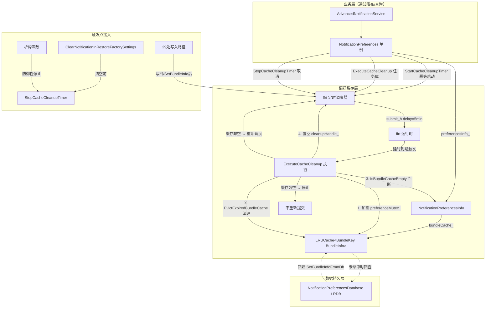
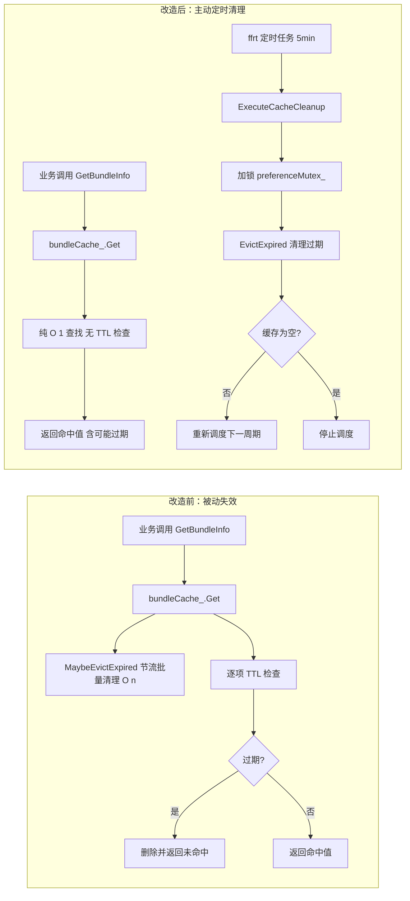

# Summary - cache-cleanup-ffrt

## 1. 功能概述

### 1.1 需求背景

通知子系统（ANS, Advanced Notification Service）通过 `NotificationPreferences` 单例的 `LRUCache<BundleKey, BundleInfo> bundleCache_` 缓存各应用的偏好信息（通知开关、渠道配置等），以避免频繁查询 RDB 数据库。原失效机制为**被动失效**：

- `Get()` 在每次查询时先调用 `MaybeEvictExpired()` 做节流批量清理（最坏 O(n) 遍历），再对目标条目做逐项 TTL 检查（`age > ttl`，默认 5 分钟）；
- `Peek()`、`Contains()` 同样在返回前逐项检查 TTL；
- `Put()`、`GetAllKeys()` 在操作前调用 `MaybeEvictExpired()`。

这意味着**每一次缓存访问都承担了失效判断的开销**，即便绝大多数访问并不会触发实际清理。缓存访问路径（偏好设置查询）是通知发布、订阅、查询的高频依赖路径，被动清理的 O(n) 遍历在缓存条目较多时会造成延迟抖动；且过期条目仅在被访问时才会清理，长期不被访问的条目会滞留内存。

### 1.2 核心功能

将 `LRUCache`（`bundleCache_`）的失效机制从"使用缓存时判断是否失效"的被动失效，改造为"基于 ffrt 循环定时清理"的主动失效机制：

- **仅在缓存内有数据时启动 ffrt 定时任务**，缓存内无数据时无需定时任务；
- 定时任务每 5 分钟执行一次，调用 `EvictExpired()` 清理过期条目；
- 清理后若缓存仍非空则自递归重新调度下一周期，缓存为空则停止调度；
- `LRUCache` 热路径（`Get`/`Peek`/`Contains`/`Put`/`GetAllKeys`）回归纯 O(1) 查找，不再做任何 TTL 检查。

### 1.3 实现范围

本次实现的范围：

| 范围项 | 说明 |
|--------|------|
| LRUCache 改造 | 移除 `Get`/`Peek`/`Contains`/`Put`/`GetAllKeys` 中的被动 TTL 检查与 `MaybeEvictExpired()` 调用；移除 `MaybeEvictExpired()` 方法定义；保留 `EvictExpired()`/`Empty()` 供外部调度器调用 |
| NotificationPreferencesInfo 扩展 | 新增 `EvictExpiredBundleCache()`/`IsBundleCacheEmpty()` 转发方法，将 `bundleCache_` 的清理能力暴露给外层调度器 |
| NotificationPreferences 调度器 | 新增 `cleanupHandle_`/`cleanupHandleMutex_`/`CACHE_CLEANUP_INTERVAL_US` 成员和 `StartCacheCleanupTimer()`/`ExecuteCacheCleanup()`/`StopCacheCleanupTimer()` 方法；在 29 处写入路径触发启动，在清空/析构路径触发停止 |
| 单元测试适配与新增 | 修改 11 个依赖被动失效的用例，新增 11 个验证新行为的用例（含 1 个性能测试） |
| 构建验证 | 子系统 + 单元测试 + 模糊测试编译通过，无新增警告 |
| 代码注释完善 | 在 `lru_cache.h` 添加改造说明，在 `notification_preferences.h` 增强调度器方法/成员的 doxygen 注释 |

---

## 2. 架构说明

### 2.1 最终实现架构图



### 2.2 改造前后对比



### 2.3 与现有架构集成说明

集成方式：

1. **LRUCache 改造**：移除被动检查后，`LRUCache` 仍由 `NotificationPreferencesInfo` 持有，访问方式不变。`LRUCache` 回归纯数据结构职责。
2. **NotificationPreferencesInfo 扩展**：新增 2 个转发方法（`EvictExpiredBundleCache`/`IsBundleCacheEmpty`），不改变现有方法签名，纯新增。
3. **NotificationPreferences 新增调度器**：`cleanupHandle_`/`cleanupHandleMutex_` 作为私有成员，与 `preferenceMutex_`/`preferencesInfo_` 并列。3 个调度方法（`Start`/`Execute`/`Stop`）为私有方法。
4. **写入路径集成**：在现有 29 处 `preferencesInfo_ = preferencesInfo` 或 `preferencesInfo_.SetBundleInfo()` 写回语句后添加 `StartCacheCleanupTimer()` 调用（幂等，不改变现有控制流）。
5. **清空/析构路径集成**：在 `ClearNotificationInRestoreFactorySettings()` 和析构函数中添加 `StopCacheCleanupTimer()` 调用。
6. **BUILD.gn 无需修改**：`ffrt:libffrt` 已在 `services/ans/BUILD.gn` L284 的 `external_deps` 中声明。

### 2.4 核心类和接口说明

| 类/接口 | 类型 | 说明 | 职责 |
|---------|------|------|------|
| `LRUCache<K,V>` | 改造（现有类） | 移除被动 TTL 检查，回归纯 O(1) 查找数据结构 | 保留 `EvictExpired()`/`Empty()` 供外部调度器调用 |
| `NotificationPreferencesInfo::EvictExpiredBundleCache()` | 新增方法 | 转发到 `bundleCache_.EvictExpired()` | 将缓存清理能力暴露给调度器 |
| `NotificationPreferencesInfo::IsBundleCacheEmpty()` | 新增方法 | 转发到 `bundleCache_.Empty()` | 供调度器判断是否继续调度 |
| `NotificationPreferences::StartCacheCleanupTimer()` | 新增方法 | 幂等启动 ffrt 延时 5 分钟任务 | 写入路径触发，任务名 "AnsCacheCleanup" |
| `NotificationPreferences::ExecuteCacheCleanup()` | ffrt 任务体 | 加锁清理过期条目 + 自递归调度 | 清理后缓存非空则重新调度，为空则停止 |
| `NotificationPreferences::StopCacheCleanupTimer()` | 新增方法 | `ffrt::skip` 取消挂起任务 | 清空/析构路径触发 |
| `NotificationPreferences::cleanupHandle_` | 新增成员 | `ffrt::task_handle`，nullptr 表示无任务 | 挂起的定时任务句柄 |
| `NotificationPreferences::cleanupHandleMutex_` | 新增成员 | `ffrt::mutex` | 保护 `cleanupHandle_` 并发访问 |
| `NotificationPreferences::CACHE_CLEANUP_INTERVAL_US` | 新增常量 | `5 * 60 * 1000 * 1000`（5 分钟，微秒） | 清理周期 |

---

## 3. 任务执行摘要

| 类型 | 任务数 | 状态 | 说明 |
|------|--------|------|------|
| 核心实现 | 4 | ✅ 全部完成 | T001（LRUCache 改造）、T002（Info 转发方法）、T003（ffrt 调度器）、T004（触发点接入） |
| 测试验证 | 6 | ✅ 全部完成 | T005（修改 11 用例）、T006（新增 5 用例）、T007（Info 测试 2 用例）、T008（调度器测试 3 用例）、T009（性能测试 1 用例）、T010（全量构建验证） |
| 文档完善 | 1 | ✅ 全部完成 | T011（代码注释与改造说明文档） |

### 各任务执行结果

| 任务ID | 名称 | 类型 | 状态 | 关键结论 |
|--------|------|------|------|----------|
| T001 | LRUCache 移除被动 TTL 检查与 MaybeEvictExpired | 核心实现 | ✅ | 移除 7 处被动检查 + 移除 `MaybeEvictExpired()` 方法定义；保留 `EvictExpired()`/`Empty()`；17 insertions, 64 deletions |
| T002 | NotificationPreferencesInfo 新增转发方法 | 核心实现 | ✅ | 新增 `EvictExpiredBundleCache()`/`IsBundleCacheEmpty()` 转发方法；26 insertions, 0 deletions |
| T003 | NotificationPreferences 新增 ffrt 调度器 | 核心实现 | ✅ (retry=1) | 新增 3 成员 + 3 方法；含锁安全设计与异常处理；90 insertions, 0 deletions；Build 阶段修复 `-fno-exceptions` 编译错误 |
| T004 | 触发点接入 | 核心实现 | ✅ | 29 处 Start + 2 处 Stop 接入；所有 Start 在 `preferenceMutex_` 锁内；31 行调用新增 |
| T005 | 修改 lru_cache_test.cpp 用例 | 测试验证 | ✅ | 修改 11 个用例（9 声明 + 2 额外）；97 insertions, 38 deletions |
| T006 | 新增 lru_cache_test.cpp 用例 | 测试验证 | ✅ | 新增 5 个验证"不再检查 TTL"用例；约 127 行纯新增 |
| T007 | 新增 Info 转发方法测试 | 测试验证 | ✅ | 新增 2 个用例（`EvictExpiredBundleCache_00001`/`IsBundleCacheEmpty_00001`）；55 insertions |
| T008 | 新增调度器生命周期测试 | 测试验证 | ✅ | 新增 3 个用例（幂等/取消/清空停止）；73 insertions |
| T009 | 新增 LRUCache 性能测试 | 测试验证 | ✅ | 新增 1 个性能测试（250 次查找 < 1ms）；标记 `Performance | MediumTest | Level2` |
| T010 | 全量构建验证 | 测试验证 | ✅ | 子系统 + 单元测试 + 模糊测试编译通过；BUILD_PASS；无新增警告 |
| T011 | 更新代码注释与说明文档 | 文档完善 | ✅ | `lru_cache.h` 添加改造说明；`notification_preferences.h` 增强方法/成员注释；51 行注释新增 |

---

## 4. 功能实现说明

### 4.1 LRUCache 改造（被动失效 → 纯数据结构）

**改造前**：`Get`/`Peek`/`Contains` 在返回前逐项检查 TTL，`Put`/`GetAllKeys` 调用 `MaybeEvictExpired()` 做节流批量清理。每次缓存访问都承担失效判断开销。

**改造后**：
- `Get()`：纯 O(1) 查找（`cache_.find` + `Touch` + 赋值），不检查 TTL
- `Peek()`：纯 O(1) 查找，不检查 TTL，不更新访问时间
- `Contains()`：纯存在性判断（`return cache_.find(key) != cache_.end();`）
- `Put(K, V&&)`/`Put(K, const V&)`：不调用 `MaybeEvictExpired()`，仅按 maxSize 做 LRU 驱逐
- `GetAllKeys()`：返回所有键（含过期），不调用 `MaybeEvictExpired()`
- `MaybeEvictExpired()`：**已移除**（移除后无任何调用方，为死代码）
- `EvictExpired()`/`Empty()`：**保留不变**，供外部 ffrt 调度器调用
- `lastEvictionTime_`：**保留**（`EvictExpired()` 仍写入，减少测试改动）

**行为变更说明**：`Get`/`Peek`/`Contains` 对过期条目现在返回 true（返回过期值），而非 false。最大数据滞留时间 = 清理周期（5 分钟），BundleInfo 有 DB 兜底。

### 4.2 NotificationPreferencesInfo 转发方法

新增 2 个公有方法，将 `bundleCache_` 的清理能力暴露给外层调度器：

```cpp
size_t EvictExpiredBundleCache();   // 转发到 bundleCache_.EvictExpired()
bool IsBundleCacheEmpty();          // 转发到 bundleCache_.Empty()
```

纯新增方法，不修改任何现有方法签名，向后兼容。

### 4.3 NotificationPreferences ffrt 定时调度器

**启动逻辑**（幂等）：
```cpp
void StartCacheCleanupTimer() {
    std::lock_guard<ffrt::mutex> lock(cleanupHandleMutex_);
    if (cleanupHandle_ != nullptr) return;  // 已有任务运行，幂等返回
    cleanupHandle_ = ffrt::submit_h([this]() { this->ExecuteCacheCleanup(); },
        {}, {}, ffrt::task_attr().delay(CACHE_CLEANUP_INTERVAL_US).name("AnsCacheCleanup"));
}
```

**执行与自递归调度**：
```cpp
void ExecuteCacheCleanup() {
    size_t evicted = 0; bool cacheEmpty = false;
    {   // Step 1: 持业务锁清理（获取→执行→释放，不嵌套句柄锁）
        std::lock_guard<ffrt::mutex> lock(preferenceMutex_);
        evicted = preferencesInfo_.EvictExpiredBundleCache();
        cacheEmpty = preferencesInfo_.IsBundleCacheEmpty();
    }
    if (evicted > 0) ANS_LOGI("Cache cleanup evicted %{public}zu expired entries", evicted);
    {   // Step 2: 持句柄锁置空（获取→执行→释放，不嵌套业务锁）
        std::lock_guard<ffrt::mutex> lock(cleanupHandleMutex_);
        cleanupHandle_ = nullptr;
    }
    if (!cacheEmpty) StartCacheCleanupTimer();  // 缓存非空，自递归重新调度
    // 缓存为空则不重新调度，满足"无数据时无定时任务"
}
```

**停止逻辑**：
```cpp
void StopCacheCleanupTimer() {
    std::lock_guard<ffrt::mutex> lock(cleanupHandleMutex_);
    if (cleanupHandle_ != nullptr) {
        ffrt::skip(cleanupHandle_);  // 取消未执行的任务
        cleanupHandle_ = nullptr;
    }
}
```

### 4.4 触发点接入

| 触发类型 | 数量 | 调用方法 | 说明 |
|----------|------|----------|------|
| 写回路径（`preferencesInfo_ = preferencesInfo`） | 26 | `StartCacheCleanupTimer()` | 所有影响 `bundleCache_` 的写回路径 |
| 直接写入（`preferencesInfo_.SetBundleInfo`） | 3 | `StartCacheCleanupTimer()` | SetRingtoneInfoByBundle 等 |
| 清空路径（`ClearNotificationInRestoreFactorySettings`） | 1 | `StopCacheCleanupTimer()` | 在 `preferenceMutex_` 锁内、DB 清空前 |
| 析构路径（`~NotificationPreferences`） | 1 | `StopCacheCleanupTimer()` | 防御性停止 |
| **总计** | **31** | — | 29 Start + 2 Stop |

> **说明**：设计文档列出 27 处写回，实际代码为 26 处（代码演进导致部分方法重构为不使用写回模式，同时新增了扩展订阅相关方法）。所有影响 `bundleCache_` 的写入路径均已接入，无遗漏。

---

## 5. 变更文件清单

| 文件路径 | 修改类型 | 涉及任务 | 变更说明 |
|----------|----------|----------|----------|
| `services/ans/include/utils/lru_cache.h` | 修改 | T001, T011 | 移除被动 TTL 检查 + `MaybeEvictExpired()` 方法定义；更新 6 个方法 doxygen 注释；新增类级改造说明注释。17 insertions, 64 deletions + 7 行注释 |
| `services/ans/include/notification_preferences_info.h` | 修改 | T002 | 新增 `EvictExpiredBundleCache()`/`IsBundleCacheEmpty()` 方法声明（含 doxygen 注释）。+16 行 |
| `services/ans/src/notification_preferences_info.cpp` | 修改 | T002 | 新增 2 个转发方法实现。+10 行 |
| `services/ans/include/notification_preferences.h` | 修改 | T003, T011 | 新增 3 私有方法声明 + 3 私有成员 + 1 常量 + 增强注释。+30 行代码 + 44 行注释 |
| `services/ans/src/notification_preferences.cpp` | 修改 | T003, T004 | 新增 3 方法实现（+52 行）+ 31 处触发点调用（+31 行） |
| `services/ans/test/unittest/lru_cache_test.cpp` | 修改 | T005, T006, T009 | 修改 11 用例 + 新增 5 用例 + 1 性能用例。97 insertions, 38 deletions + 约 127 行新增 + 31 行性能测试 |
| `services/ans/test/unittest/notification_preferences_info_test.cpp` | 修改 | T007 | 新增 2 个转发方法测试用例。+55 行 |
| `services/ans/test/unittest/notification_preferences_test.cpp` | 修改 | T008 | 新增 3 个调度器生命周期测试用例。+73 行 |

**变更统计**：
- 修改文件数：8
- 新增文件数：0
- 新增/修改测试用例总数：22（11 修改 + 11 新增）

---

## 6. 关键设计决策

| 决策ID | 决策点 | 决策结果 | 决策理由 |
|--------|--------|----------|----------|
| **DEC-001** | 改造范围 | 仅改造 `LRUCache`（`bundleCache_`） | `bundleCache_` 是唯一匹配"缓存"语义且使用 TTL 的通用缓存；其他列表（`uniqueKeyList_`/`flowControlTimestampMap_`/`badgeInfos`）为专用去重/流控，TTL 与锁模型各异，改造收益小风险高。待本方案验证稳定后作为模式扩展统一治理 |
| **DEC-002** | TTL 检查移除策略 | 完全移除 `Get`/`Peek`/`Contains` 中的逐项 TTL 检查 | 与需求"改成 ffrt 循环定时清理"意图最一致；BundleInfo 有 DB 兜底，5 分钟滞留可接受；`services/reminder` 同模式未保留被动检查；热路径收益最大化（100% 纯 O(1) 查找） |
| DEC-003 | ffrt 定时机制 | `ffrt::submit_h` + `task_attr().delay()` + `ffrt::skip` 自递归调度 | 与需求"ffrt 定时任务"吻合；`services/reminder` 已验证同模式；`BUILD.gn` 已有 `ffrt:libffrt` 依赖；API 简洁，无需管理额外队列生命周期 |
| DEC-004 | 清理周期 | 5 分钟（与原 TTL 一致） | 保持与原失效语义一致的最大滞留时间 |
| DEC-005 | 调度器宿主 | `NotificationPreferences`（缓存所有者） | 该类持有 `preferenceMutex_` 与 `preferencesInfo_`，是协调锁与缓存的天然宿主 |
| DEC-006 | 锁顺序 | 写入路径嵌套 `preferenceMutex_` → `cleanupHandleMutex_`；Execute 路径顺序不嵌套 | 所有路径锁顺序一致（A→B），不存在反向持有（B→A），无循环等待，无死锁风险 |
| DEC-007 | `MaybeEvictExpired` 方法 | 移除（死代码） | 移除所有调用方后，该方法无任何调用者，保留为死代码无意义 |
| DEC-008 | `lastEvictionTime_` 字段 | 保留 | `EvictExpired()` 仍写入该字段；保留以减少测试改动（部分测试断言该字段值）；拷贝语义完整 |
| DEC-009 | 触发点调用方式 | 在每处写回后内联调用 `StartCacheCleanupTimer`（幂等） | 避免重新结构化 29 处方法的锁作用域；幂等设计使无条件调用无副作用 |
| DEC-010 | 析构函数停止 | 防御性调用 `StopCacheCleanupTimer` | 单例实际不会在运行期析构（生命周期与进程一致），但防御性停止符合 RAII 原则 |

---

## 7. 实现过程摘要

### 7.1 工作流阶段


### 7.2 审批历史摘要

| 阶段 | 决策 | 摘要 |
|------|------|------|
| Architecture | approved | 确认改造范围（ARCH-DEC-001 仅 bundleCache_）、TTL 检查移除策略（ARCH-DEC-002 完全移除）、ffrt 机制选型（ARCH-DEC-003 submit_h+delay+skip 自递归）、清理周期（5 分钟）、调度器宿主（NotificationPreferences）、锁顺序约定 |
| Dev-Design | approved | 确认开发架构图、类图、核心方法代码框架、接口兼容性说明、锁安全分析、测试策略；新增 DEC-007~DEC-010 细化决策；溯源对齐率 88.9%（24/27 项对齐 + 3 项 NEW） |
| Plan | approved | 分解为 11 个任务（4 核心实现 + 6 测试验证 + 1 文档完善）；DAG 关键路径 T002→T003→T004→T008→T010；功能点覆盖率 13/14 = 92.9%（FP-013 DB 回填路径刻意排除）；34 个验收标准全部有任务覆盖 |

### 7.3 任务执行统计

- **总任务数**：11
- **完成数**：11（100%）
- **重试任务**：1（T003，Build 阶段修复 `-fno-exceptions` 编译错误）
- **检视通过**：11（全部 REVIEW_PASS）
- **Build 结果**：BUILD_PASS（编译通过，无新增警告）

---

## 8. 接口兼容性说明

### 8.1 兼容性结论

**本改造为进程内内部实现优化，无公共 API 变更，与历史版本完全兼容。**

| 兼容性维度 | 结论 | 说明 |
|------------|------|------|
| 公共 API（`interfaces/inner_api/`） | ✅ 无变更 | `LRUCache` 定义在 `services/ans/include/utils/`，为内部工具类 |
| NAPI 接口（`interfaces/kits/napi/`） | ✅ 无变更 | 本改造不涉及 NAPI 绑定 |
| NDK 接口（`interfaces/ndk/`） | ✅ 无变更 | 本改造不涉及 NDK 接口 |
| IDL 接口（`frameworks/ans/*.idl`） | ✅ 无变更 | 本改造不涉及 IPC 接口 |
| LRUCache 公共方法签名 | ✅ 全部保留 | `Get`/`Put`/`Peek`/`Contains`/`Remove`/`Clear`/`EvictExpired`/`Size`/`Empty`/`GetStats`/`GetAllKeys`/`UpdateConfig`/`ResetStats`/`GetConfig` 签名不变 |
| 行为语义 | 预期变更 | `Get`/`Peek`/`Contains` 不再过滤过期条目（返回过期值），由 ffrt 定时器主动清理。最大滞留 = 5 分钟，DB 兜底 |
| 数据迁移 | ✅ 不需要 | 纯内存缓存，进程重启后从 DB 重建 |
| 回滚机制 | ✅ 支持 | Git revert 相关提交即可恢复被动失效机制 |

### 8.2 新增内部接口

| 接口 | 可见性 | 兼容性影响 |
|------|--------|------------|
| `NotificationPreferencesInfo::EvictExpiredBundleCache()` | public（内部类） | 无影响——纯新增方法 |
| `NotificationPreferencesInfo::IsBundleCacheEmpty()` | public（内部类） | 无影响——纯新增方法 |
| `NotificationPreferences::StartCacheCleanupTimer()` | private | 无影响——私有方法 |
| `NotificationPreferences::ExecuteCacheCleanup()` | private | 无影响——私有方法 |
| `NotificationPreferences::StopCacheCleanupTimer()` | private | 无影响——私有方法 |

---

## 9. 已知问题与后续改进建议

### 9.1 本轮已完成

- ✅ `LRUCache`（`bundleCache_`）被动 TTL 失效机制完全移除，热路径回归纯 O(1) 查找
- ✅ `NotificationPreferences` ffrt 定时调度器实现（启动/执行/自递归/停止）
- ✅ 29 处写入路径触发启动 + 2 处清空/析构路径触发停止
- ✅ 锁安全设计（`preferenceMutex_` → `cleanupHandleMutex_` 顺序一致，无死锁）
- ✅ 异常处理（`submit_h` 失败记录日志，`skip` 失败置空句柄）
- ✅ 单元测试适配（11 个修改）与新增（11 个新增，含 1 个性能测试）
- ✅ 全量构建验证通过（子系统 + 单元测试 + 模糊测试）
- ✅ 代码注释与改造说明文档完善

### 9.2 本轮故意不做

| 项目 | 原因 | 后续规划 |
|------|------|----------|
| 改造 `uniqueKeyList_`/`distributedUniqueKeyList_`/`localUniqueKeyList_` 的被动清理 | 这些是"去重列表"而非通用缓存，TTL=1 天，访问频率低，无独立锁，改造收益小风险高 | 待本方案验证稳定后，作为模式扩展统一治理 |
| 改造 `flowControlTimestampMap_`/`GlobalFlowController`/`CallerFlowController`/`badgeInfos` | 这些是流控/打点专用时间戳列表，语义与"缓存"不同，已有各自 `ffrt::mutex` | 后续按需评估 |
| 新增缓存可观测性仪表盘 | 属运维增强，非本次目标 | 后续迭代 |
| 调整 TTL 默认值（5 分钟） | 当前 5 分钟 TTL 合理，不在本次范围 | 无 |
| DB 回填路径显式触发 `StartCacheCleanupTimer()` | DB 回填后由首次写入路径触发启动；回填数据为新鲜数据（非过期），下次写入会启动定时器 | 可选：在 `InitSettingFromDisturbDB` 完成后显式调用 `StartCacheCleanupTimer()`，确保回填后立即启动 |
| `lastEvictionTime_` 字段清理 | 该字段现为 dead store（`MaybeEvictExpired` 移除后无读取者），但验收标准明确要求保留 | 后续独立清理任务中评估是否移除 |
| `IsBundleCacheEmpty()` 改为 const | 当前声明为非 const（设计决策），但其转发目标 `Empty()` 是 const | 后续可选优化 |

### 9.3 后续可选优化

1. **性能观测**：在生产环境验证 `Get` 热路径延迟改善（改造前最坏 O(n) 遍历 → 改造后稳定 O(1)），可通过 `LRUCache::Stats`（hits/misses/evictions/expires）观测清理频次和命中率。
2. **清理周期调优**：当前固定 5 分钟（与原 TTL 一致）。可根据实际过期条目占比和内存压力评估是否调整周期。
3. **模式扩展**：将 ffrt 定时清理模式扩展到其他被动失效的列表/映射（见 9.2 表格）。
4. **`lastEvictionTime_` 清理**：若确认无需该字段，可在独立清理任务中移除（当前保留以减少测试改动）。
5. **4 个保留原名的用例语义优化**：`Peek_ExpiredAutoRemove_00001`/`Contains_ExpiredAutoRemove_00001`/`GetAllKeys_FiltersExpired_00001`/`RemoveInternal_ThroughPeek_00001` 在语义上略有误导（暗示自动移除，但新行为不再自动移除），`@tc.desc` 已更新为正确描述，后续可考虑调整用例名。

---

## 10. 使用说明

### 10.1 行为变更说明

**改造前**：
```cpp
// Get 对过期条目返回 false（自动清理）
LRUCache<std::string, BundleInfo> cache;
cache.Put("key", bundleInfo);
// 注入过期时间戳...
bool found = cache.Get("key", out);  // found = false（过期条目被自动清理）
```

**改造后**：
```cpp
// Get 对过期条目返回 true（返回过期值，由 ffrt 定时器清理）
LRUCache<std::string, BundleInfo> cache;
cache.Put("key", bundleInfo);
// 注入过期时间戳...
bool found = cache.Get("key", out);  // found = true（返回过期值）
// 过期条目由 NotificationPreferences::ExecuteCacheCleanup() 每 5 分钟清理
```

### 10.2 注意事项

1. **调用方无需修改**：`LRUCache` 所有公共方法签名不变，`NotificationPreferencesInfo`/`NotificationPreferences` 现有方法签名不变。
2. **行为差异**：`Get`/`Peek`/`Contains` 现在可能返回过期条目。调用方（`GetBundleInfo`）拿到过期 BundleInfo 后，最坏情况使用 5 分钟前的偏好数据，影响可忽略（DB 兜底）。
3. **定时任务自动管理**：写入数据后定时器自动启动（幂等），清空数据时自动停止。调用方无需手动管理定时器生命周期。
4. **日志观测**：可通过 `hilog` 过滤 `"AnsCacheCleanup"`/`"Cache cleanup"` 观测定时任务启停和清理结果。
