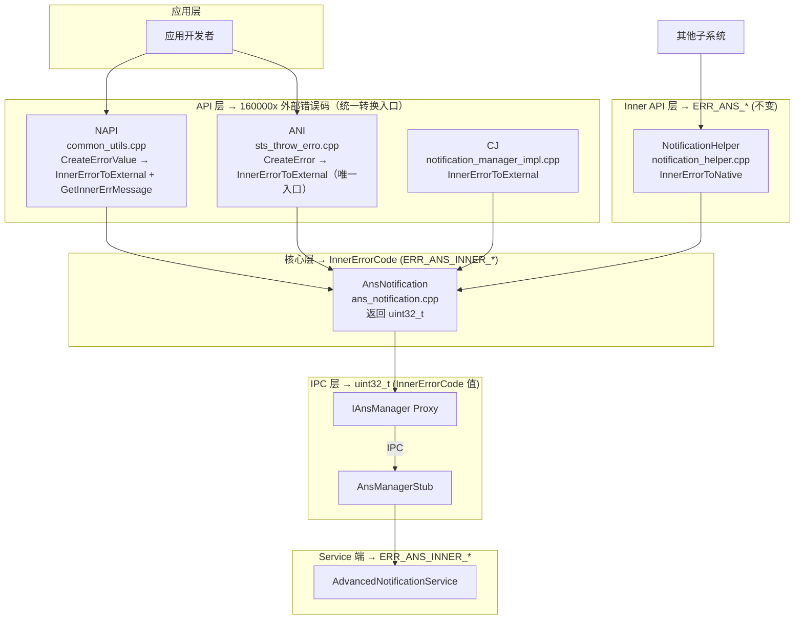
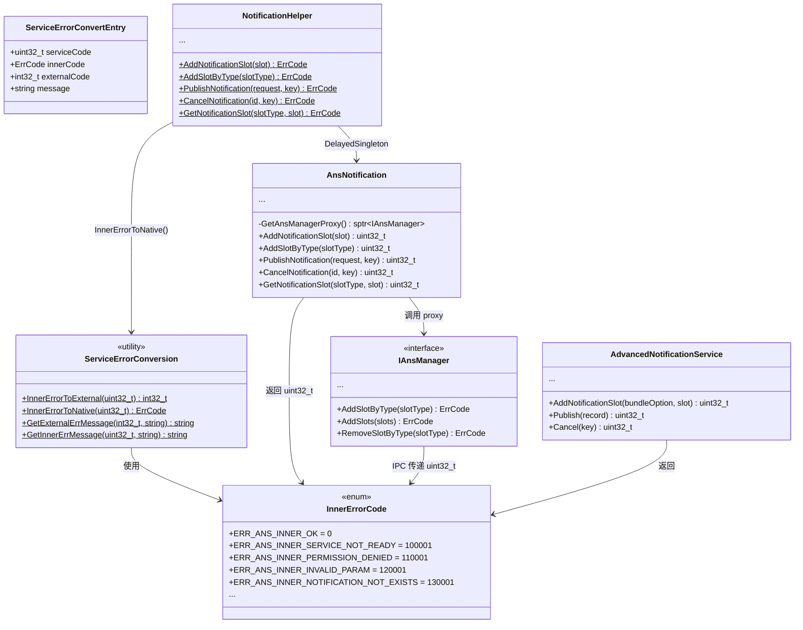
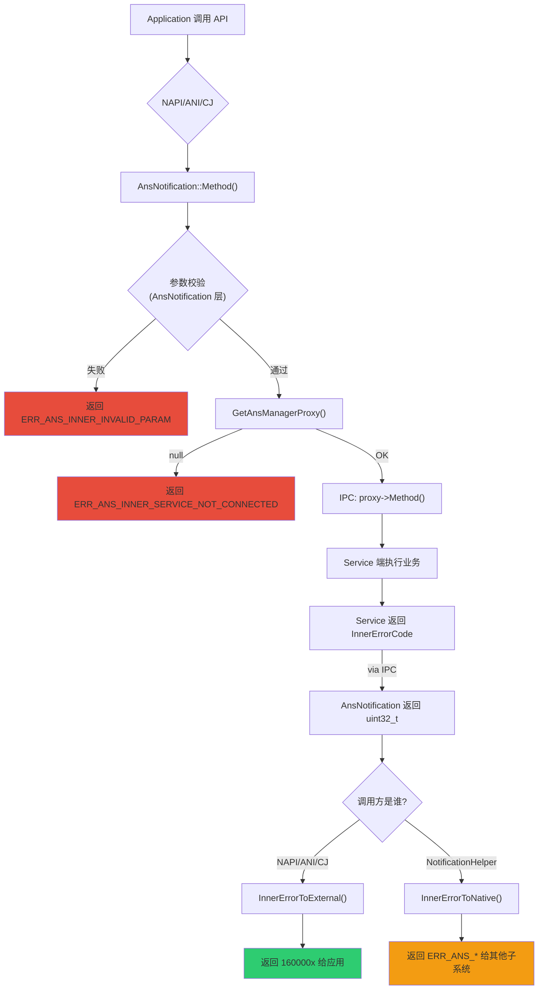
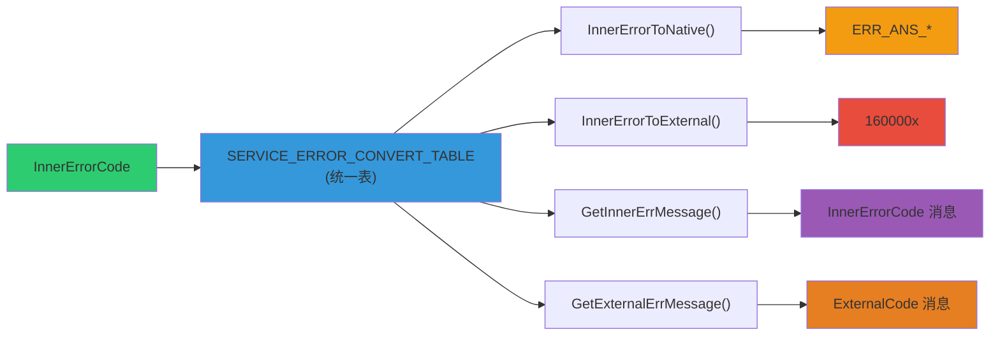
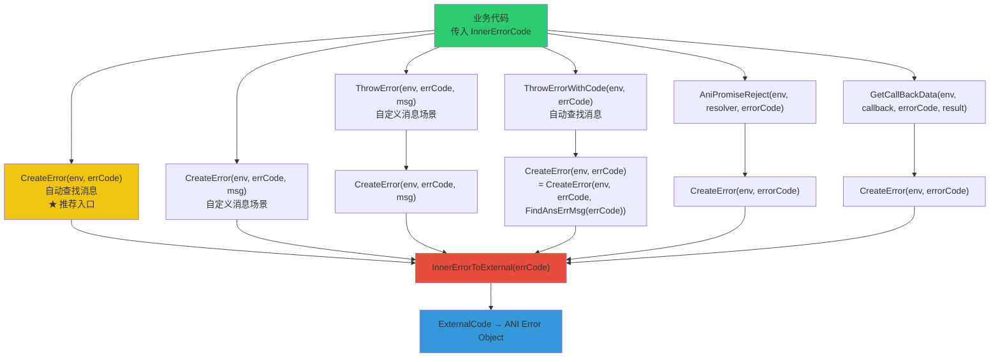
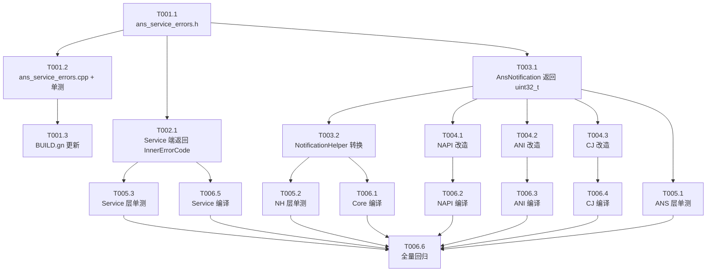

# 分布式通知服务错误码分层 — 开发设计文档

## 目录

- [Part A: 开发架构设计](#part-a-开发架构设计)
- [Part B: 详细开发设计](#part-b-详细开发设计)
- [Part C: 开发流程设计](#part-c-开发流程设计)
- [Part D: 开发测试策略](#part-d-开发测试策略)
- [Part E: 开发要点说明](#part-e-开发要点说明)

---

## Part A: 开发架构设计

### A.1 分层架构图



### A.2 新增 / 修改模块清单

| 类别 | 文件 | 变更说明 |
|------|------|---------|
| **新增** | `frameworks/core/common/include/ans_service_errors.h` | InnerErrorCode 枚举 + 转换函数声明 |
| **新增** | `frameworks/core/common/src/ans_service_errors.cpp` | 转换表 + 转换函数实现 |
| **修改** | `frameworks/core/include/ans_notification.h` | 方法返回类型 ErrCode → uint32_t |
| **修改** | `frameworks/core/src/ans_notification.cpp` | 返回 InnerErrorCode，使用 static_cast |
| **修改** | `frameworks/ans/src/notification_helper.cpp` | 增加 InnerErrorToNative() 调用 |
| **修改** | `services/ans/src/advanced_notification_service.cpp` | 返回 ERR_ANS_INNER_* |
| **修改** | `frameworks/js/napi/src/*.cpp` | 内部使用 InnerErrorCode，边界转换 |
| **修改** | `frameworks/ets/ani/src/*.cpp` | 内部使用 InnerErrorCode，ThrowError 内部转换 |
| **修改** | `frameworks/cj/ffi/src/*.cpp` | 改调用 AnsNotification + InnerErrorToExternal |

---

## Part B: 详细开发设计

### B.1 新增文件：ans_service_errors.h

```cpp
/*
 * Copyright (c) 2026 Huawei Device Co., Ltd.
 * [Apache 2.0 License Header]
 */

#ifndef BASE_NOTIFICATION_ANS_SERVICE_ERRORS_H
#define BASE_NOTIFICATION_ANS_SERVICE_ERRORS_H

#include <cstdint>
#include <string>
#include "errors.h"

namespace OHOS {
namespace Notification {

/**
 * Service-layer error code group base values.
 * Groups are spaced 10,000 apart to allow for future expansion.
 */
constexpr uint32_t ERR_ANS_INNER_BASE_INFRA          = 100000;
constexpr uint32_t ERR_ANS_INNER_BASE_PERMISSION     = 110000;
constexpr uint32_t ERR_ANS_INNER_BASE_PARAM          = 120000;
constexpr uint32_t ERR_ANS_INNER_BASE_NOTIFICATION   = 130000;
constexpr uint32_t ERR_ANS_INNER_BASE_SLOT           = 140000;
constexpr uint32_t ERR_ANS_INNER_BASE_SUBSCRIBE      = 150000;
constexpr uint32_t ERR_ANS_INNER_BASE_DISTRIBUTED    = 160000;
constexpr uint32_t ERR_ANS_INNER_BASE_GEOFENCE       = 170000;
constexpr uint32_t ERR_ANS_INNER_BASE_PUSH           = 180000;
constexpr uint32_t ERR_ANS_INNER_BASE_DIALOG         = 190000;
constexpr uint32_t ERR_ANS_INNER_BASE_ENCRYPT        = 200000;
constexpr uint32_t ERR_ANS_INNER_BASE_AGENT_EXT      = 210000;

/**
 * Service-layer error code enumeration.
 * Unified error codes used by AnsNotification, IPC, and the Service layer.
 */
enum InnerErrorCode : uint32_t {
    // ===== Group 0: Infrastructure (100000+) =====
    ERR_ANS_INNER_OK                              = 0,
    ERR_ANS_INNER_SERVICE_NOT_READY               = ERR_ANS_INNER_BASE_INFRA + 1,
    ERR_ANS_INNER_SERVICE_NOT_CONNECTED           = ERR_ANS_INNER_BASE_INFRA + 2,
    ERR_ANS_INNER_PARCELABLE_FAILED               = ERR_ANS_INNER_BASE_INFRA + 3,
    ERR_ANS_INNER_TRANSACT_FAILED                 = ERR_ANS_INNER_BASE_INFRA + 4,
    ERR_ANS_INNER_REMOTE_DEAD                     = ERR_ANS_INNER_BASE_INFRA + 5,
    ERR_ANS_INNER_NO_MEMORY                       = ERR_ANS_INNER_BASE_INFRA + 6,
    ERR_ANS_INNER_TASK_ERR                        = ERR_ANS_INNER_BASE_INFRA + 7,

    // ===== Group 1: Permission (110000+) =====
    ERR_ANS_INNER_PERMISSION_DENIED               = ERR_ANS_INNER_BASE_PERMISSION + 1,
    ERR_ANS_INNER_NON_SYSTEM_APP                  = ERR_ANS_INNER_BASE_PERMISSION + 2,
    ERR_ANS_INNER_NOT_SYSTEM_SERVICE              = ERR_ANS_INNER_BASE_PERMISSION + 3,
    ERR_ANS_INNER_NOT_ALLOWED                     = ERR_ANS_INNER_BASE_PERMISSION + 4,

    // ===== Group 2: Parameter validation (120000+) =====
    ERR_ANS_INNER_INVALID_PARAM                   = ERR_ANS_INNER_BASE_PARAM + 1,
    ERR_ANS_INNER_INVALID_UID                     = ERR_ANS_INNER_BASE_PARAM + 2,
    ERR_ANS_INNER_INVALID_PID                     = ERR_ANS_INNER_BASE_PARAM + 3,
    ERR_ANS_INNER_INVALID_BUNDLE                  = ERR_ANS_INNER_BASE_PARAM + 4,
    ERR_ANS_INNER_INVALID_BUNDLE_OPTION           = ERR_ANS_INNER_BASE_PARAM + 5,
    ERR_ANS_INNER_ICON_OVER_SIZE                  = ERR_ANS_INNER_BASE_PARAM + 6,
    ERR_ANS_INNER_PICTURE_OVER_SIZE               = ERR_ANS_INNER_BASE_PARAM + 7,
    ERR_ANS_INNER_PUSH_CHECK_EXTRAINFO_INVALID    = ERR_ANS_INNER_BASE_PARAM + 8,

    // ===== Group 3: Notification management (130000+) =====
    ERR_ANS_INNER_NOTIFICATION_NOT_EXISTS         = ERR_ANS_INNER_BASE_NOTIFICATION + 1,
    ERR_ANS_INNER_NOTIFICATION_IS_UNREMOVABLE     = ERR_ANS_INNER_BASE_NOTIFICATION + 2,
    ERR_ANS_INNER_NOTIFICATION_IS_UNALLOWED_REMOVEALLOWED = ERR_ANS_INNER_BASE_NOTIFICATION + 3,
    ERR_ANS_INNER_OVER_MAX_ACTIVE_PERSECOND       = ERR_ANS_INNER_BASE_NOTIFICATION + 4,
    ERR_ANS_INNER_OVER_MAX_UPDATE_PERSECOND       = ERR_ANS_INNER_BASE_NOTIFICATION + 5,
    ERR_ANS_INNER_DUPLICATE_MSG                   = ERR_ANS_INNER_BASE_NOTIFICATION + 6,
    ERR_ANS_INNER_EXPIRED_NOTIFICATION            = ERR_ANS_INNER_BASE_NOTIFICATION + 7,
    ERR_ANS_INNER_REPEAT_CREATE                   = ERR_ANS_INNER_BASE_NOTIFICATION + 8,
    ERR_ANS_INNER_END_NOTIFICATION                = ERR_ANS_INNER_BASE_NOTIFICATION + 9,
    ERR_ANS_INNER_DIALOG_POP_SUCCEEDED            = ERR_ANS_INNER_BASE_NOTIFICATION + 10,

    // ===== Group 4: Slot/channel (140000+) =====
    ERR_ANS_INNER_PREFERENCES_NOTIFICATION_SLOT_NOT_EXIST       = ERR_ANS_INNER_BASE_SLOT + 1,
    ERR_ANS_INNER_PREFERENCES_NOTIFICATION_BUNDLE_NOT_EXIST     = ERR_ANS_INNER_BASE_SLOT + 2,
    ERR_ANS_INNER_PREFERENCES_NOTIFICATION_SLOT_TYPE_NOT_EXIST  = ERR_ANS_INNER_BASE_SLOT + 3,
    ERR_ANS_INNER_PREFERENCES_NOTIFICATION_SLOTGROUP_NOT_EXIST  = ERR_ANS_INNER_BASE_SLOT + 4,
    ERR_ANS_INNER_PREFERENCES_NOTIFICATION_SLOTGROUP_ID_INVALID = ERR_ANS_INNER_BASE_SLOT + 5,
    ERR_ANS_INNER_PREFERENCES_NOTIFICATION_SLOTGROUP_EXCEED_MAX_NUM = ERR_ANS_INNER_BASE_SLOT + 6,
    ERR_ANS_INNER_PREFERENCES_NOTIFICATION_DB_OPERATION_FAILED  = ERR_ANS_INNER_BASE_SLOT + 7,
    ERR_ANS_INNER_PREFERENCES_NOTIFICATION_READ_TEMPLATE_CONFIG_FAILED = ERR_ANS_INNER_BASE_SLOT + 8,
    ERR_ANS_INNER_PREFERENCES_NOTIFICATION_SLOT_ENABLED         = ERR_ANS_INNER_BASE_SLOT + 9,

    // ===== Group 5: Subscription (150000+) =====
    ERR_ANS_INNER_SUBSCRIBER_IS_DELETING          = ERR_ANS_INNER_BASE_SUBSCRIBE + 1,
    ERR_ANS_INNER_LOCAL_SUBSCRIBE_CHECK_FAILED    = ERR_ANS_INNER_BASE_SUBSCRIBE + 2,
    ERR_ANS_INNER_GET_ACTIVE_USER_FAILED          = ERR_ANS_INNER_BASE_SUBSCRIBE + 3,

    // ===== Group 6: Distributed (160000+) =====
    ERR_ANS_INNER_DISTRIBUTED_OPERATION_FAILED    = ERR_ANS_INNER_BASE_DISTRIBUTED + 1,
    ERR_ANS_INNER_DISTRIBUTED_GET_INFO_FAILED     = ERR_ANS_INNER_BASE_DISTRIBUTED + 2,
    ERR_ANS_INNER_OPERATION_TIMEOUT               = ERR_ANS_INNER_BASE_DISTRIBUTED + 3,

    // ===== Group 7: Geofence (170000+) =====
    ERR_ANS_INNER_GEOFENCE_ENABLED                = ERR_ANS_INNER_BASE_GEOFENCE + 1,
    ERR_ANS_INNER_GEOFENCE_EXCEEDED               = ERR_ANS_INNER_BASE_GEOFENCE + 2,
    ERR_ANS_INNER_GEOFENCING_OPERATION_TIMEOUT    = ERR_ANS_INNER_BASE_GEOFENCE + 3,
    ERR_ANS_INNER_ERROR_LOCATION_CLOSED           = ERR_ANS_INNER_BASE_GEOFENCE + 4,
    ERR_ANS_INNER_AWARNESS_SUGGESTIONS_CLOSED     = ERR_ANS_INNER_BASE_GEOFENCE + 5,
    ERR_ANS_INNER_CHECK_WEAK_NETWORK              = ERR_ANS_INNER_BASE_GEOFENCE + 6,

    // ===== Group 8: Push (180000+) =====
    ERR_ANS_INNER_PUSH_CHECK_FAILED               = ERR_ANS_INNER_BASE_PUSH + 1,
    ERR_ANS_INNER_PUSH_CHECK_UNREGISTERED         = ERR_ANS_INNER_BASE_PUSH + 2,
    ERR_ANS_INNER_PUSH_CHECK_NETWORK_UNREACHABLE  = ERR_ANS_INNER_BASE_PUSH + 3,

    // ===== Group 9: Dialog (190000+) =====
    ERR_ANS_INNER_DIALOG_IS_POPPING               = ERR_ANS_INNER_BASE_DIALOG + 1,
    ERR_ANS_INNER_SETTING_WINDOW_EXIST            = ERR_ANS_INNER_BASE_DIALOG + 2,

    // ===== Group 10: Encryption (200000+) =====
    ERR_ANS_INNER_ENCRYPT_FAIL                    = ERR_ANS_INNER_BASE_ENCRYPT + 1,
    ERR_ANS_INNER_DECRYPT_FAIL                    = ERR_ANS_INNER_BASE_ENCRYPT + 2,

    // ===== Group 11: Agent/Extension (210000+) =====
    ERR_ANS_INNER_NO_AGENT_SETTING                = ERR_ANS_INNER_BASE_AGENT_EXT + 1,
    ERR_ANS_INNER_NO_PROFILE_TEMPLATE             = ERR_ANS_INNER_BASE_AGENT_EXT + 2,
    ERR_ANS_INNER_REJECTED_WITH_DISABLE_NOTIFICATION = ERR_ANS_INNER_BASE_AGENT_EXT + 3,
    ERR_ANS_INNER_NO_CUSTOM_RINGTONE_INFO         = ERR_ANS_INNER_BASE_AGENT_EXT + 4,
    ERR_ANS_INNER_VOICE_SUMMARY_COUNT_EXCEEDED    = ERR_ANS_INNER_BASE_AGENT_EXT + 5,
    ERR_ANS_INNER_DEVICE_NOT_SUPPORT              = ERR_ANS_INNER_BASE_AGENT_EXT + 6,
    ERR_ANS_INNER_NOT_IMPL_EXTENSIONABILITY       = ERR_ANS_INNER_BASE_AGENT_EXT + 7,
    ERR_ANS_INNER_DLP_HAP                         = ERR_ANS_INNER_BASE_AGENT_EXT + 8,
    ERR_ANS_INNER_NOTIFICATION_SNOOZE_NOTALLOWED  = ERR_ANS_INNER_BASE_AGENT_EXT + 9,
};

/**
 * Convert a Service-layer error code to an external error code.
 * Single-pass lookup: checks both serviceCode and innerCode in the same loop.
 * @param serviceErrCode A InnerErrorCode value or a legacy Inner API error code.
 * @return The corresponding external error code, or ERROR_INTERNAL_ERROR if unknown.
 */
int32_t InnerErrorToExternal(uint32_t serviceErrCode);

/**
 * Convert a Service-layer error code to an Inner API error code (ERR_ANS_*).
 * @param serviceErrCode A InnerErrorCode value.
 * @return The corresponding Inner API error code, or ERR_ANS_TASK_ERR if unknown.
 */
ErrCode InnerErrorToNative(uint32_t serviceErrCode);

/**
 * Get a human-readable message for an external error code.
 * @param externalErrCode An external error code (e.g. 1600001).
 * @param defaultMsg Fallback message for unknown codes.
 * @return The error message string.
 */
std::string GetExternalErrMessage(int32_t externalErrCode, std::string defaultMsg = "");

/**
 * Get error message by inner error code.
 * @param innerErrCode Inner error code (ERR_ANS_INNER_*)
 * @param defaultMsg Default message if error code not found
 * @return Error message string
 */
std::string GetInnerErrMessage(uint32_t innerErrCode, std::string defaultMsg = "");

}  // namespace Notification
}  // namespace OHOS

#endif  // BASE_NOTIFICATION_ANS_SERVICE_ERRORS_H
```

### B.2 新增文件：ans_service_errors.cpp（关键实现）

```cpp
/*
 * Copyright (c) 2026 Huawei Device Co., Ltd.
 * [Apache 2.0 License Header]
 */

#include "ans_service_errors.h"

#include "ans_inner_errors.h"
#include "ans_log_wrapper.h"

namespace OHOS {
namespace Notification {

struct ServiceErrorConvertEntry {
    uint32_t serviceCode;   // InnerErrorCode (ERR_ANS_INNER_*)
    ErrCode innerCode;      // Legacy Inner API code (ERR_ANS_*)
    int32_t externalCode;   // External API code (160000x, 401, etc.)
    std::string message;    // Human-readable message
};

/**
 * 统一转换表：一张表包含 InnerErrorCode → InnerCode → ExternalCode → Message
 * 的完整映射关系，避免维护多份独立映射表。
 */
static const std::vector<ServiceErrorConvertEntry> SERVICE_ERROR_CONVERT_TABLE = {
    // ===== 基础设施 =====
    {ERR_ANS_INNER_SERVICE_NOT_READY,       ERR_ANS_SERVICE_NOT_READY,       ERROR_SERVICE_CONNECT_ERROR,
        "Failed to connect to the service"},
    {ERR_ANS_INNER_SERVICE_NOT_CONNECTED,   ERR_ANS_SERVICE_NOT_CONNECTED,   ERROR_SERVICE_CONNECT_ERROR,
        "Failed to connect to the service"},
    // ... 其他条目与 B.1 中的枚举一一对应，此处省略 ...
    {ERR_ANS_INNER_DIALOG_IS_POPPING,       ERR_ANS_DIALOG_IS_POPPING,       ERROR_DIALOG_IS_POPPING,
        "Dialog is popping"},
    {ERR_ANS_INNER_SETTING_WINDOW_EXIST,    ERR_ANS_DIALOG_POP_SUCCEEDED,    ERROR_SETTING_WINDOW_EXIST,
        "The notification settings window is already displayed"},
    // ... 完整条目见 ans_service_errors.cpp ...
};

int32_t InnerErrorToExternal(uint32_t serviceErrCode)
{
    // Handle success case (both ERR_OK and ERR_ANS_INNER_OK)
    if (serviceErrCode == ERR_OK || serviceErrCode == ERR_ANS_INNER_OK) {
        return ERR_OK;
    }
    // Single pass: check both serviceCode and innerCode
    for (const auto &entry : SERVICE_ERROR_CONVERT_TABLE) {
        if (serviceErrCode == entry.serviceCode || serviceErrCode == entry.innerCode) {
            return entry.externalCode;
        }
    }
    ANS_LOGW("Unknown error code: %{public}u, fallback to ERROR_INTERNAL_ERROR", serviceErrCode);
    return ERROR_INTERNAL_ERROR;
}

ErrCode InnerErrorToNative(uint32_t serviceErrCode)
{
    if (serviceErrCode == ERR_ANS_INNER_OK || serviceErrCode == ERR_OK) {
        return ERR_OK;
    }
    for (const auto &entry : SERVICE_ERROR_CONVERT_TABLE) {
        if (serviceErrCode == entry.serviceCode ||
            serviceErrCode == static_cast<uint32_t>(entry.innerCode)) {
            return entry.innerCode;
        }
    }
    ANS_LOGW("Unknown service error code: %{public}u, fallback to ERR_ANS_TASK_ERR", serviceErrCode);
    return ERR_ANS_TASK_ERR;
}

std::string GetExternalErrMessage(int32_t externalErrCode, std::string defaultMsg)
{
    for (const auto &entry : SERVICE_ERROR_CONVERT_TABLE) {
        if (externalErrCode == entry.externalCode) {
            return entry.message;
        }
    }
    ANS_LOGW("Unknown external error code: %{public}d, return default message", externalErrCode);
    return defaultMsg;
}

std::string GetInnerErrMessage(uint32_t innerErrCode, std::string defaultMsg)
{
    for (const auto &entry : SERVICE_ERROR_CONVERT_TABLE) {
        if (entry.innerCode == innerErrCode) {
            return entry.message;
        }
    }
    ANS_LOGW("Unknown inner error code: %{public}u, return default message", innerErrCode);
    return defaultMsg;
}

}  // namespace Notification
}  // namespace OHOS
```

### B.3 类图



### B.4 AnsNotification 方法改造示例

**改造前**（`ans_notification.cpp`）：
```cpp
ErrCode AnsNotification::AddSlotByType(const NotificationConstant::SlotType &slotType)
{
    sptr<IAnsManager> proxy = GetAnsManagerProxy();
    if (!proxy) {
        ANS_LOGE("GetAnsManagerProxy fail.");
        return ERR_ANS_SERVICE_NOT_CONNECTED;
    }
    return proxy->AddSlotByType(slotType);
}
```

**改造后**：
```cpp
uint32_t AnsNotification::AddSlotByType(const NotificationConstant::SlotType &slotType)
{
    sptr<IAnsManager> proxy = GetAnsManagerProxy();
    if (!proxy) {
        ANS_LOGE("GetAnsManagerProxy fail.");
        return ERR_ANS_INNER_SERVICE_NOT_CONNECTED;
    }
    return static_cast<uint32_t>(proxy->AddSlotByType(slotType));
}
```

**改造前**（`ans_notification.cpp`，带参数校验）：
```cpp
ErrCode AnsNotification::AddNotificationSlots(const std::vector<NotificationSlot> &slots)
{
    if (slots.size() == 0) {
        ANS_LOGE("Failed to add notification slots because input slots size is 0.");
        return ERR_ANS_INVALID_PARAM;
    }
    // ...
    if (slotsSize > MAX_SLOT_NUM) {
        ANS_LOGE("slotsSize over max size");
        return ERR_ANS_INVALID_PARAM;
    }
    return proxy->AddSlots(slotsSptr);
}
```

**改造后**：
```cpp
uint32_t AnsNotification::AddNotificationSlots(const std::vector<NotificationSlot> &slots)
{
    if (slots.size() == 0) {
        ANS_LOGE("Failed to add notification slots because input slots size is 0.");
        return ERR_ANS_INNER_INVALID_PARAM;
    }
    // ...
    if (slotsSize > MAX_SLOT_NUM) {
        ANS_LOGE("slotsSize over max size");
        return ERR_ANS_INNER_INVALID_PARAM;
    }
    return static_cast<uint32_t>(proxy->AddSlots(slotsSptr));
}
```

### B.5 NotificationHelper 改造示例

**改造前**（`notification_helper.cpp`）：
```cpp
ErrCode NotificationHelper::AddNotificationSlot(const NotificationSlot &slot)
{
    return DelayedSingleton<AnsNotification>::GetInstance()->AddNotificationSlot(slot);
}

ErrCode NotificationHelper::PublishNotification(const NotificationRequest &request,
    const std::string &instanceKey)
{
    return DelayedSingleton<AnsNotification>::GetInstance()->PublishNotification(
        request, instanceKey);
}
```

**改造后**：
```cpp
#include "ans_service_errors.h"

ErrCode NotificationHelper::AddNotificationSlot(const NotificationSlot &slot)
{
    uint32_t result =
        DelayedSingleton<AnsNotification>::GetInstance()->AddNotificationSlot(slot);
    return InnerErrorToNative(result);
}

ErrCode NotificationHelper::PublishNotification(const NotificationRequest &request,
    const std::string &instanceKey)
{
    uint32_t result =
        DelayedSingleton<AnsNotification>::GetInstance()->PublishNotification(
            request, instanceKey);
    return InnerErrorToNative(result);
}
```

### B.6 NAPI 层改造示例（以 publish 为例）

**改造前**（`frameworks/js/napi/src/manager/napi_publish.cpp`）：
```cpp
asynccallbackinfo->info.errorCode = NotificationHelper::PublishNotification(
    asynccallbackinfo->request, instanceKey);
// 返回 ErrorCode (ERR_ANS_*)，后续 ErrorToExternal() 转换
```

**改造后**：
```cpp
#include "ans_service_errors.h"

// 内部使用 InnerErrorCode
asynccallbackinfo->info.errorCode =
    DelayedSingleton<AnsNotification>::GetInstance()->PublishNotification(
        asynccallbackinfo->request, instanceKey);
// Common::CreateReturnValue 内部调用 InnerErrorToExternal 进行边界转换
```

**NAPI 层错误码使用规范**：
- 内部变量（`info.errorCode`、`info.returnCode`）统一使用 `InnerErrorCode`
- 边界转换由 `Common::CreateErrorValue` 内部调用 `InnerErrorToExternal` + `GetInnerErrMessage` 完成
- 所有 `NapiThrow`/`NapiRejectError`/`Common::SetCallback`/`Common::SetPromise` 调用传入 `ERR_ANS_INNER_*` 码
- **禁止**在 NAPI 层业务代码中手动调用 `InnerErrorToExternal` 或比较外部码值（如 `ERROR_SETTING_WINDOW_EXIST`）
- 特殊错误码比较应使用 InnerErrorCode（如 `ERR_ANS_INNER_SETTING_WINDOW_EXIST`）

### B.7 ANI (STS) 层改造示例

**改造后 — 统一转换架构（当前实现）**：

`CreateError` 是 ANI 层唯一的 `InnerErrorToExternal` 转换入口，内部自动转换：

```cpp
ani_object CreateError(ani_env *env, int32_t errCode, const std::string &msg)
{
    if (env == nullptr) {
        ANS_LOGE("null env");
        return nullptr;
    }
    // 边界转换：InnerErrorCode → External error code（统一入口）
    int32_t externalCode = InnerErrorToExternal(static_cast<uint32_t>(errCode));
    ani_status status = ANI_ERROR;
    ani_class cls = nullptr;
    // ... 用 externalCode 创建 ANI error 对象 ...
}
```

`ThrowError` 不再做双重转换，直接调用 `CreateError`：

```cpp
void ThrowError(ani_env *env, int32_t errCode, const std::string &errorMsg)
{
    if (env == nullptr) {
        ANS_LOGE("null env");
        return;
    }
    // CreateError 内部做 InnerErrorToExternal，不再双重转换
    ThrowError(env, CreateError(env, errCode, errorMsg));
}
```

`CreateError(env, errCode)` 无msg重载自动查找错误消息，
简化所有 `FindAnsErrMsg+CreateError` 配对模式：

```cpp
ani_object CreateError(ani_env *env, int32_t errCode)
{
    // 自动调用 FindAnsErrMsg(errCode) 获取消息，无需外部手动调用
    return CreateError(env, errCode, FindAnsErrMsg(errCode));
}
```

`sts_callback_promise.cpp` 的 `AniPromiseReject` 和 `GetCallBackData` 直接使用无msg重载：

```cpp
void AniPromiseReject(ani_env *env, const ani_resolver &resolver, const int32_t &errorCode)
{
    // CreateError 内部做 InnerErrorToExternal + FindAnsErrMsg，无需手动转换和查找
    ani_object errorObj = CreateError(env, errorCode);
    env->PromiseResolver_Reject(resolver, static_cast<ani_error>(errorObj));
}
```

**ANI 层错误码使用规范**：
- 内部变量统一使用 `InnerErrorCode`（`ERR_ANS_INNER_*`）
- **所有**错误码到 ExternalCode 的转换统一由 `CreateError` 内部完成
- 调用方只需传 InnerErrorCode，无需手动 `InnerErrorToExternal` 或 `FindAnsErrMsg`：
  - `CreateError(env, errCode)` — 自动查找消息 + 转换（**推荐**）
  - `CreateError(env, errCode, msg)` — 自定义消息，仅做转换
  - `ThrowError(env, errCode, msg)` — 自定义消息，内部调用 CreateError
  - `ThrowErrorWithCode(env, errCode)` — 自动查找消息（**推荐**）
  - `AniPromiseReject(env, resolver, errorCode)` — 内部调用 `CreateError(env, errorCode)`
  - `GetCallBackData(env, callback, errorCode, result)` — 同上
- `FindAnsErrMsg` 仅供自定义消息场景使用
  （如 `ThrowError(env, ERR_ANS_INNER_TASK_ERR, FindAnsErrMsg(status))`，
  故意映射不同 errCode 的消息）
- **禁止**在 ANI 业务代码中手动调用 `InnerErrorToExternal`
- **禁止**在 ANI 业务代码中使用 `FindAnsErrMsg+CreateError` 配对
  （应改用 `CreateError(env, errCode)` 无msg重载）
- **禁止**在 ANI 业务代码中使用 `ThrowError(env, errCode, FindAnsErrMsg(errCode))`
  （应改用 `ThrowErrorWithCode(env, errCode)`）

### B.8 CJ 层改造示例

**改造前**（`frameworks/cj/ffi/src/notification_manager_impl.cpp`）：
```cpp
int NotificationManagerImplV2::Publish(CNotificationRequestV2 cjRequest)
{
    NotificationRequest request;
    if (!ParseParameters(cjRequest, request)) {
        return ERROR_PARAM_INVALID;
    }
    int code = NotificationHelper::PublishNotification(request);
    return ErrorToExternal(code);
}
```

**改造后**：
```cpp
#include "ans_service_errors.h"

int NotificationManagerImplV2::Publish(CNotificationRequestV2 cjRequest)
{
    NotificationRequest request;
    if (!ParseParameters(cjRequest, request)) {
        return ERROR_PARAM_INVALID;
    }
    uint32_t result =
        DelayedSingleton<AnsNotification>::GetInstance()->PublishNotification(request);
    return InnerErrorToExternal(result);
}
```

### B.9 Service 端改造示例（以 AdvancedNotificationService 为例）

**改造前**：
```cpp
int AdvancedNotificationService::AddSlots(const std::vector<NotificationSlot> &slots)
{
    // ... 业务逻辑 ...
    if (invalid) {
        return ERR_ANS_INVALID_PARAM;
    }
    // ...
}
```

**改造后**：
```cpp
uint32_t AdvancedNotificationService::AddSlots(const std::vector<NotificationSlot> &slots)
{
    // ... 业务逻辑 ...
    if (invalid) {
        return ERR_ANS_INNER_INVALID_PARAM;
    }
    // ...
}
```

### B.10 IPC Stub 改造示例

**改造前**（`ans_manager_stub.h`）：
```cpp
virtual ErrCode AddSlotByType(const NotificationConstant::SlotType &slotType) = 0;
```

**改造后**：
```cpp
// IPC 接口保持 ErrCode 返回类型不变，实际传输 InnerErrorCode 的 uint32_t 值
virtual ErrCode AddSlotByType(const NotificationConstant::SlotType &slotType) = 0;
```

> **注意**：`IAnsManager` 接口保持 `ErrCode`（int）返回类型不变。AnsNotification 内部通过 `static_cast<uint32_t>()` 将 IPC 返回值转换为 InnerErrorCode 值。这种方式避免了 IPC 接口签名变更带来的双端同步升级问题。

---

## Part C: 开发流程设计

### C.1 错误码流转流程图



### C.2 异常处理

1. **未知 InnerErrorCode**：
   - `InnerErrorToExternal()` → 返回 `ERROR_INTERNAL_ERROR` (1600001) + 日志告警
   - `InnerErrorToNative()` → 返回 `ERR_ANS_TASK_ERR` + 日志告警

2. **IPC 连接失败**：
   - AnsNotification 返回 `ERR_ANS_INNER_SERVICE_NOT_CONNECTED` (100002)
   - NAPI/ANI/CJ 转换为 `ERROR_SERVICE_CONNECT_ERROR` (1600003)
   - NotificationHelper 转换为 `ERR_ANS_SERVICE_NOT_CONNECTED`

3. **Service 端进程死亡**：
   - AnsNotification 层 `GetAnsManagerProxy()` 返回 null
   - 返回 `ERR_ANS_INNER_SERVICE_NOT_CONNECTED`

---

## Part D: 开发测试策略

### D.1 单元测试分层

| 层级 | 测试文件 | 断言目标 |
|------|---------|---------|
| 转换表 | `ans_service_errors_test.cpp` | InnerErrorCode → 160000x, ERR_ANS_* |
| AnsNotification 层 | 现有 ANS 单测更新 | InnerErrorCode (uint32_t) |
| NotificationHelper 层 | 现有 NH 单测（断言不变） | ERR_ANS_* |
| NAPI 层 | 现有 NAPI 单测更新 | ERR_ANS_INNER_* (内部), 160000x (边界) |
| ANI 层 | 现有 ANI 单测更新 | ERR_ANS_INNER_* (内部), 160000x (边界) |
| CJ 层 | 现有 CJ 单测更新 | 160000x |
| Service 层 | 现有 Service 单测更新 | InnerErrorCode |

### D.2 转换表单测框架

```cpp
#include <gtest/gtest.h>
#include "ans_service_errors.h"

using namespace OHOS::Notification;

class AnsServiceErrorsTest : public testing::Test {
public:
    static void SetUpTestCase() {}
    static void TearDownTestCase() {}
    void SetUp() {}
    void TearDown() {}
};

// --- InnerErrorToExternal ---

/**
 * @tc.name: InnerErrorToExternal_InvalidParam
 * @tc.desc: ERR_ANS_INNER_INVALID_PARAM -> ERROR_PARAM_INVALID (401)
 * @tc.type: FUNC
 */
HWTEST_F(AnsServiceErrorsTest, InnerErrorToExternal_InvalidParam_001,
    Function | SmallTest | Level1)
{
    EXPECT_EQ(InnerErrorToExternal(ERR_ANS_INNER_INVALID_PARAM), 401);
}

/**
 * @tc.name: InnerErrorToExternal_PermissionDenied
 * @tc.desc: ERR_ANS_INNER_PERMISSION_DENIED -> ERROR_PERMISSION_DENIED (201)
 * @tc.type: FUNC
 */
HWTEST_F(AnsServiceErrorsTest, InnerErrorToExternal_PermissionDenied_001,
    Function | SmallTest | Level1)
{
    EXPECT_EQ(InnerErrorToExternal(ERR_ANS_INNER_PERMISSION_DENIED), 201);
}

/**
 * @tc.name: InnerErrorToExternal_UnknownCode
 * @tc.desc: Unknown InnerErrorCode -> ERROR_INTERNAL_ERROR (1600001)
 * @tc.type: FUNC
 */
HWTEST_F(AnsServiceErrorsTest, InnerErrorToExternal_UnknownCode_001,
    Function | SmallTest | Level1)
{
    EXPECT_EQ(InnerErrorToExternal(999999999), 1600001);
}

/**
 * @tc.name: InnerErrorToExternal_OkCode
 * @tc.desc: ERR_ANS_INNER_OK (0) -> 0
 * @tc.type: FUNC
 */
HWTEST_F(AnsServiceErrorsTest, InnerErrorToExternal_OkCode_001,
    Function | SmallTest | Level1)
{
    EXPECT_EQ(InnerErrorToExternal(ERR_ANS_INNER_OK), 0);
}

// --- InnerErrorToNative ---

/**
 * @tc.name: InnerErrorToNative_InvalidParam
 * @tc.desc: ERR_ANS_INNER_INVALID_PARAM -> ERR_ANS_INVALID_PARAM
 * @tc.type: FUNC
 */
HWTEST_F(AnsServiceErrorsTest, InnerErrorToNative_InvalidParam_001,
    Function | SmallTest | Level1)
{
    EXPECT_EQ(InnerErrorToNative(ERR_ANS_INNER_INVALID_PARAM), ERR_ANS_INVALID_PARAM);
}

/**
 * @tc.name: InnerErrorToNative_NotificationNotExists
 * @tc.desc: ERR_ANS_INNER_NOTIFICATION_NOT_EXISTS -> ERR_ANS_NOTIFICATION_NOT_EXISTS
 * @tc.type: FUNC
 */
HWTEST_F(AnsServiceErrorsTest, InnerErrorToNative_NotificationNotExists_001,
    Function | SmallTest | Level1)
{
    EXPECT_EQ(InnerErrorToNative(ERR_ANS_INNER_NOTIFICATION_NOT_EXISTS),
              ERR_ANS_NOTIFICATION_NOT_EXISTS);
}

/**
 * @tc.name: InnerErrorToNative_UnknownCode
 * @tc.desc: Unknown InnerErrorCode -> ERR_ANS_TASK_ERR
 * @tc.type: FUNC
 */
HWTEST_F(AnsServiceErrorsTest, InnerErrorToNative_UnknownCode_001,
    Function | SmallTest | Level1)
{
    EXPECT_EQ(InnerErrorToNative(999999999), ERR_ANS_TASK_ERR);
}

// --- 分组编号验证 ---

/**
 * @tc.name: InnerErrorCode_GroupBaseValues
 * @tc.desc: 验证各分组起始值正确
 * @tc.type: FUNC
 */
HWTEST_F(AnsServiceErrorsTest, InnerErrorCode_GroupBaseValues_001,
    Function | SmallTest | Level1)
{
    EXPECT_EQ(ERR_ANS_INNER_BASE_INFRA, 100000u);
    EXPECT_EQ(ERR_ANS_INNER_BASE_PERMISSION, 110000u);
    EXPECT_EQ(ERR_ANS_INNER_BASE_PARAM, 120000u);
    EXPECT_EQ(ERR_ANS_INNER_BASE_NOTIFICATION, 130000u);
    EXPECT_EQ(ERR_ANS_INNER_BASE_SLOT, 140000u);
    EXPECT_EQ(ERR_ANS_INNER_BASE_SUBSCRIBE, 150000u);
    EXPECT_EQ(ERR_ANS_INNER_BASE_DISTRIBUTED, 160000u);
    EXPECT_EQ(ERR_ANS_INNER_BASE_GEOFENCE, 170000u);
    EXPECT_EQ(ERR_ANS_INNER_BASE_PUSH, 180000u);
    EXPECT_EQ(ERR_ANS_INNER_BASE_DIALOG, 190000u);
    EXPECT_EQ(ERR_ANS_INNER_BASE_ENCRYPT, 200000u);
    EXPECT_EQ(ERR_ANS_INNER_BASE_AGENT_EXT, 210000u);
}

// --- GetInnerErrMessage ---

/**
 * @tc.name: GetInnerErrMessage_InvalidParam
 * @tc.desc: ERR_ANS_INNER_INVALID_PARAM -> "Invalid parameter"
 * @tc.type: FUNC
 */
HWTEST_F(AnsServiceErrorsTest, GetInnerErrMessage_InvalidParam_001,
    Function | SmallTest | Level1)
{
    EXPECT_EQ(GetInnerErrMessage(ERR_ANS_INNER_INVALID_PARAM), "Invalid parameter");
}

/**
 * @tc.name: GetInnerErrMessage_PermissionDenied
 * @tc.desc: ERR_ANS_INNER_PERMISSION_DENIED -> "Permission denied"
 * @tc.type: FUNC
 */
HWTEST_F(AnsServiceErrorsTest, GetInnerErrMessage_PermissionDenied_001,
    Function | SmallTest | Level1)
{
    EXPECT_EQ(GetInnerErrMessage(ERR_ANS_INNER_PERMISSION_DENIED), "Permission denied");
}

/**
 * @tc.name: GetInnerErrMessage_UnknownCode_DefaultMsg
 * @tc.desc: Unknown InnerErrorCode -> return defaultMsg
 * @tc.type: FUNC
 */
HWTEST_F(AnsServiceErrorsTest, GetInnerErrMessage_UnknownCode_001,
    Function | SmallTest | Level1)
{
    EXPECT_EQ(GetInnerErrMessage(999999999, "default error"), "default error");
    EXPECT_EQ(GetInnerErrMessage(999999999), "");
}

/**
 * @tc.name: GetInnerErrMessage_AllCovered
 * @tc.desc: 验证所有 SERVICE_ERROR_CONVERT_TABLE 条目均有 message，
 *           且 message 与现有 ANS_ERROR_CODE_MESSAGE_MAP 中对应外部码的消息一致
 * @tc.type: FUNC
 */
HWTEST_F(AnsServiceErrorsTest, GetInnerErrMessage_AllCovered_001,
    Function | SmallTest | Level1)
{
    // 验证关键条目的 message 与现有 ANS_ERROR_CODE_MESSAGE_MAP 一致
    EXPECT_EQ(GetInnerErrMessage(ERR_ANS_INNER_PERMISSION_DENIED),
        GetExternalErrMessage(ERROR_PERMISSION_DENIED));
    EXPECT_EQ(GetInnerErrMessage(ERR_ANS_INNER_INVALID_PARAM),
        GetExternalErrMessage(ERROR_PARAM_INVALID));
    EXPECT_EQ(GetInnerErrMessage(ERR_ANS_INNER_SERVICE_NOT_READY),
        GetExternalErrMessage(ERROR_SERVICE_CONNECT_ERROR));
    EXPECT_EQ(GetInnerErrMessage(ERR_ANS_INNER_NOTIFICATION_NOT_EXISTS),
        GetExternalErrMessage(ERROR_NOTIFICATION_NOT_EXIST));
    EXPECT_EQ(GetInnerErrMessage(ERR_ANS_INNER_DISTRIBUTED_OPERATION_FAILED),
        GetExternalErrMessage(ERROR_DISTRIBUTED_OPERATION_FAILED));
    EXPECT_EQ(GetInnerErrMessage(ERR_ANS_INNER_NO_AGENT_SETTING),
        GetExternalErrMessage(ERROR_NO_AGENT_SETTING));
    EXPECT_EQ(GetInnerErrMessage(ERR_ANS_INNER_DIALOG_IS_POPPING),
        GetExternalErrMessage(ERROR_DIALOG_IS_POPPING));
}
```

---

## Part E: 开发要点说明

### E.1 IPC 接口设计

- `IAnsManager` 接口方法保持 `ErrCode`（int）返回类型不变
- AnsNotification 内部通过 `static_cast<uint32_t>()` 将 IPC 返回值转换为 InnerErrorCode 值
- 这种方式避免了 IPC 接口签名变更带来的双端同步升级问题
- IPC 底层传输的仍是 32-bit 整数值，类型签名不变

### E.2 日志替换

- 所有 `ANS_LOG*` 中的 `ERR_ANS_*` 常量引用替换为 `ERR_ANS_INNER_*`
- 日志格式符不变（`%{public}d`/`%{public}u`）

### E.3 CJ 层特殊处理

- 废弃 `frameworks/cj/ffi/src/inner_errors.cpp`（CJ 的 ErrorToExternal 映射表不完整）
- 改为直接 #include `ans_service_errors.h` 并使用 `InnerErrorToExternal()`
- `CJSystemapi::Notification::ErrorToExternal()` 保留但标记 deprecated

### E.3.1 错误消息映射策略（统一表设计）

采用**统一转换表**策略，一张表包含 InnerErrorCode → InnerCode → ExternalCode → Message 的完整映射关系：



- **统一表**：`ServiceErrorConvertEntry` 包含 4 个字段（serviceCode、innerCode、externalCode、message）
- **消息一致性**：message 字段与现有 `ANS_ERROR_CODE_MESSAGE_MAP` 中对应外部错误码的消息**完全一致**，确保同一错误在不同路径下产生相同的用户提示
- **单一事实来源**：新增 InnerErrorCode 时只需在统一表中添加一条记录，自动获得 inner/external/message 三种映射
- **保留**：现有 `GetAnsErrMessage()` 和 `ANS_ERROR_CODE_MESSAGE_MAP`（在 `ans_inner_errors.cpp`）保留用于向后兼容，不新增条目
- **日志改造**：所有 `ANS_LOG*` 中的 `ERR_ANS_*` 字面量引用，改为调用 `GetInnerErrMessage(ERR_ANS_INNER_*)` 输出消息

### E.4 NotificationHelper 内调用方式

- NotificationHelper 当前通过 `DelayedSingleton<AnsNotification>::GetInstance()` 调用
- 改造后返回类型为 `ErrCode`（不变），但中间值类型为 `uint32_t`（InnerErrorCode 值）
- 每个方法均需 `InnerErrorToNative()` 包装

### E.5 NAPI/ANI/CJ 层获取 AnsNotification 的方式

由于 NAPI/ANI/CJ 不再调用 NotificationHelper，需要直接访问 AnsNotification：
```cpp
#include "ans_notification.h"
#include "singleton.h"

// 替换原有的 NotificationHelper:: 调用
auto ansNotification = DelayedSingleton<AnsNotification>::GetInstance();
uint32_t result = ansNotification->PublishNotification(request);
// 内部使用 InnerErrorCode，边界处调用 InnerErrorToExternal 转换
```

### E.6 ANI/NAPI 层统一转换架构

#### E.6.1 ANI 层统一转换原则

`CreateError` 是 ANI 层唯一的 `InnerErrorToExternal` 转换入口，所有其他函数（ThrowError、ThrowErrorWithCode、AniPromiseReject、GetCallBackData）均不做转换，只传 InnerErrorCode 给 `CreateError`。



**核心规则**：
- `CreateError(env, errCode)` 无msg重载是**推荐用法**，
  自动做 `FindAnsErrMsg(errCode)` + `InnerErrorToExternal(errCode)`
- `CreateError(env, errCode, msg)` 仅用于自定义消息场景
  （如故意映射不同 errCode 的消息）
- `ThrowError(env, errCode, msg)` 不做转换，
  直接调用 `CreateError(env, errCode, msg)`
- `ThrowErrorWithCode(env, errCode)` 不做转换，
  内部调用 `CreateError(env, errCode)` 自动查找消息
- `AniPromiseReject(env, resolver, errorCode)` 不做转换，直接调用 `CreateError(env, errorCode)`
- `GetCallBackData(env, callback, errorCode, result)` 不做转换，直接调用 `CreateError(env, errorCode)`
- **禁止**在 ANI 业务代码中使用 `FindAnsErrMsg+CreateError` 配对
  （改用无msg重载）
- **禁止**在 ANI 业务代码中使用
  `ThrowError(env, errCode, FindAnsErrMsg(errCode))`（改用 ThrowErrorWithCode）
- **禁止**在 ANI 业务代码中手动调用 `InnerErrorToExternal`

#### E.6.2 NAPI 层统一转换原则

`Common::CreateErrorValue` 是 NAPI 层唯一的 `InnerErrorToExternal` 转换入口，内部同时做 `GetInnerErrMessage` 查找和 `InnerErrorToExternal` 转换。

**核心规则**：
- `Common::SetCallback(env, callback, errorCode, result, newType)` 传 **InnerErrorCode**，内部调用 `CreateErrorValue`
- `Common::SetPromise(env, deferred, errorCode, result, newType)` 传 **InnerErrorCode**，内部调用 `CreateErrorValue`
- `Common::NapiThrow(env, errCode)` 传 **InnerErrorCode**
- **禁止**在 NAPI 业务代码中手动调用 `InnerErrorToExternal` 或比较外部码值
- 特殊错误码比较应使用 InnerErrorCode（如 `ERR_ANS_INNER_SETTING_WINDOW_EXIST`）

#### E.6.3 已修复的 Bug 列表

| Bug | 文件 | 描述 | 修复 |
|-----|------|------|------|
| 双重转换 | `ani_open_subscribe_settings.cpp:182,285` | `ThrowError(env, externalCode, msg)` 传入已转换的外部码，ThrowError 再做一次转换 | 改为 `ThrowError(env, svcCode, msg)` 传 InnerErrorCode |
| 双重转换 | `ani_notification_enable.cpp:456` | `ThrowErrorWithCode(env, externalCode)` 传入已转换的外部码 | 改为 `ThrowErrorWithCode(env, svcCode)` |
| 双重转换 | `ani_on.cpp:101` | `ThrowErrorWithCode(env, externalCode)` 传入已转换的外部码 | 改为 `ThrowErrorWithCode(env, svcResult)` |
| 类型混淆 | `ani_open_settings.cpp:156-165` | errorCode 先转 External，后覆写 InnerErrorCode（ERR_ANS_INNER_TASK_ERR） | errorCode 保持 InnerErrorCode，CreateError 内部转换 |
| 类型混淆 | `ani_open_subscribe_settings.cpp:221` | 同上 | 同上 |
| 类型混淆 | `sts_subscribe.cpp:75,87` | FindAnsErrMsg(externalErrCode) 传 ExternalCode 给期望 InnerErrorCode 的函数 | 改为 FindAnsErrMsg(operationResult) |
| 类型混淆 | `napi_open_settings.cpp:80-84` | info.errorCode(InnerErrorCode) 与 ERROR_SETTING_WINDOW_EXIST(ExternalCode) 比较 | 移除冗余 if-else，直接用 InnerErrorCode |
| 类型混淆 | `napi_notification_extension.cpp:679-684` | 同上 | 同上 |
| 类型混淆 | `napi_open_settings.cpp:136,199` | errCode != ERROR_SETTING_WINDOW_EXIST 比较类型不一致 | 改为 errCode != ERR_ANS_INNER_SETTING_WINDOW_EXIST |
| 类型混淆 | `napi_notification_extension.cpp:884` | 同上 | 同上 |
| OnError | `napi_open_settings.cpp:470-472` | ProcessStatusChanged(ERROR_SYSTEM_CAP_ERROR) 传外部码 | 改为 ERR_ANS_INNER_DEVICE_NOT_SUPPORT |
| OnError | `napi_notification_extension.cpp:1452-1454` | 同上 | 同上 |
| NapiThrow | `napi_disable_notification.cpp:77` | NapiThrow(ERROR_SYSTEM_CAP_ERROR) 传外部码 | 改为 ERR_ANS_INNER_DEVICE_NOT_SUPPORT |
| 冗余模式 | `ani_open_settings.cpp` 等 5 文件 | `FindAnsErrMsg+CreateError` 配对模式 | 改用 `CreateError(env, errCode)` 无msg重载 |
| 冗余模式 | `ani_open_settings.cpp` 等 7 文件 | `ThrowError(env, errCode, FindAnsErrMsg(errCode))` 模式 | 改用 `ThrowErrorWithCode(env, errCode)` |
| 冗余模式 | `sts_callback_promise.cpp` 2处 | `CreateError(env, errorCode, FindAnsErrMsg(errorCode))` | 改用 `CreateError(env, errorCode)` |
| 冗余模式 | `ani_remove.cpp` 6处 | `ThrowError(env, ret, FindAnsErrMsg(ret))` | 改用 `ThrowErrorWithCode(env, ret)` |

---

## Part F: 任务分解计划

### F.1 任务清单

| ID | 名称 | 依赖 | 优先级 | files_write |
|----|------|------|--------|-------------|
| **T1: 核心基础设施** |
| T001.1 | 新增 ans_service_errors.h | - | P0 | `frameworks/core/common/include/ans_service_errors.h` |
| T001.2 | 新增 ans_service_errors.cpp + 转换表单测 | T001.1 | P0 | `frameworks/core/common/src/ans_service_errors.cpp`, `frameworks/core/test/unittest/.../ans_service_errors_test.cpp` |
| T001.3 | BUILD.gn 新增源文件引用 | T001.2 | P0 | `frameworks/core/common/BUILD.gn` |
| **T2: Service 层改造** |
| T002.1 | Service 端返回 ERR_ANS_INNER_* | T001.1 | P1 | `services/ans/**/*.cpp` |
| **T3: 核心层改造** |
| T003.1 | AnsNotification 全部方法返回 uint32_t | T001.1 | P1 | `frameworks/core/include/ans_notification.h`, `frameworks/core/src/ans_notification.cpp` |
| T003.2 | NotificationHelper 增加 InnerErrorToNative | T003.1 | P1 | `frameworks/ans/src/notification_helper.cpp` |
| **T4: API 层改造** |
| T004.1 | NAPI 层内部使用 InnerErrorCode + 边界转换 | T003.1 | P1 | `frameworks/js/napi/src/**/*.cpp` |
| T004.2 | ANI 层内部使用 InnerErrorCode + ThrowError 内部转换 | T003.1 | P1 | `frameworks/ets/ani/src/**/*.cpp` |
| T004.3 | CJ 层改调用 AnsNotification + 废弃 cj inner_errors | T003.1 | P1 | `frameworks/cj/ffi/src/**/*.cpp`, `frameworks/cj/ffi/src/inner_errors.cpp` |
| **T5: 测试验证** |
| T005.1 | AnsNotification 层单测更新 | T003.1 | P2 | `frameworks/core/test/unittest/**/*.cpp` |
| T005.2 | NotificationHelper 层单测（验证转换后不变） | T003.2 | P2 | `frameworks/ans/test/**/*.cpp` |
| T005.3 | Service 层单测更新 | T002.1 | P2 | `services/ans/test/**/*.cpp` |
| **T6: 编译验证与收尾** |
| T006.1 | Core 模块编译验证 | T003.2 | P1 | - |
| T006.2 | NAPI 模块编译验证 | T004.1 | P1 | - |
| T006.3 | ANI 模块编译验证 | T004.2 | P1 | - |
| T006.4 | CJ 模块编译验证 | T004.3 | P1 | - |
| T006.5 | Service 模块编译验证 | T002.1 | P1 | - |
| T006.6 | 全量回归 + 单测运行 | T005.1, T005.2, T005.3, T006.1~T006.5 | P2 | - |

### F.2 DAG 依赖图



### F.3 结构化 JSON

```json
{
  "tasks": [
    {
      "id": "T001.1",
      "name": "新增 ans_service_errors.h",
      "depends": [],
      "priority": "P0",
      "files_write": ["frameworks/core/common/include/ans_service_errors.h"]
    },
    {
      "id": "T001.2",
      "name": "新增 ans_service_errors.cpp + 转换表单测",
      "depends": ["T001.1"],
      "priority": "P0",
      "files_write": [
        "frameworks/core/common/src/ans_service_errors.cpp",
        "frameworks/core/test/unittest/ans_core_common_test/ans_service_errors_test.cpp"
      ]
    },
    {
      "id": "T001.3",
      "name": "BUILD.gn 新增源文件引用",
      "depends": ["T001.2"],
      "priority": "P0",
      "files_write": ["frameworks/core/common/BUILD.gn"]
    },
    {
      "id": "T002.1",
      "name": "Service 端返回 ERR_ANS_INNER_*",
      "depends": ["T001.1"],
      "priority": "P1",
      "files_write": ["services/ans/src/**/*.cpp", "services/ans/src/**/*.h"]
    },
    {
      "id": "T003.1",
      "name": "AnsNotification 全部方法返回 uint32_t",
      "depends": ["T001.1"],
      "priority": "P1",
      "files_write": ["frameworks/core/include/ans_notification.h", "frameworks/core/src/ans_notification.cpp"]
    },
    {
      "id": "T003.2",
      "name": "NotificationHelper 增加 InnerErrorToNative",
      "depends": ["T003.1"],
      "priority": "P1",
      "files_write": ["frameworks/ans/src/notification_helper.cpp"]
    },
    {
      "id": "T004.1",
      "name": "NAPI 层内部使用 InnerErrorCode + 边界转换",
      "depends": ["T003.1"],
      "priority": "P1",
      "files_write": ["frameworks/js/napi/src/**/*.cpp"]
    },
    {
      "id": "T004.2",
      "name": "ANI 层内部使用 InnerErrorCode + ThrowError 内部转换",
      "depends": ["T003.1"],
      "priority": "P1",
      "files_write": ["frameworks/ets/ani/src/**/*.cpp"]
    },
    {
      "id": "T004.3",
      "name": "CJ 层改造",
      "depends": ["T003.1"],
      "priority": "P1",
      "files_write": ["frameworks/cj/ffi/src/**/*.cpp", "frameworks/cj/ffi/src/inner_errors.cpp"]
    },
    {
      "id": "T005.1",
      "name": "AnsNotification 层单测更新",
      "depends": ["T003.1"],
      "priority": "P2",
      "files_write": ["frameworks/core/test/unittest/**/*.cpp"]
    },
    {
      "id": "T005.2",
      "name": "NotificationHelper 层单测验证",
      "depends": ["T003.2"],
      "priority": "P2",
      "files_write": ["frameworks/ans/test/**/*.cpp"]
    },
    {
      "id": "T005.3",
      "name": "Service 层单测更新",
      "depends": ["T002.1"],
      "priority": "P2",
      "files_write": ["services/ans/test/**/*.cpp"]
    },
    {
      "id": "T006.1",
      "name": "Core 模块编译验证",
      "depends": ["T003.2"],
      "priority": "P1",
      "files_write": []
    },
    {
      "id": "T006.2",
      "name": "NAPI 模块编译验证",
      "depends": ["T004.1"],
      "priority": "P1",
      "files_write": []
    },
    {
      "id": "T006.3",
      "name": "ANI 模块编译验证",
      "depends": ["T004.2"],
      "priority": "P1",
      "files_write": []
    },
    {
      "id": "T006.4",
      "name": "CJ 模块编译验证",
      "depends": ["T004.3"],
      "priority": "P1",
      "files_write": []
    },
    {
      "id": "T006.5",
      "name": "Service 模块编译验证",
      "depends": ["T002.1", "T002.3"],
      "priority": "P1",
      "files_write": []
    },
    {
      "id": "T006.6",
      "name": "全量回归 + 单测运行",
      "depends": ["T005.1", "T005.2", "T005.3", "T006.1", "T006.2", "T006.3", "T006.4", "T006.5"],
      "priority": "P2",
      "files_write": []
    }
  ]
}
```
