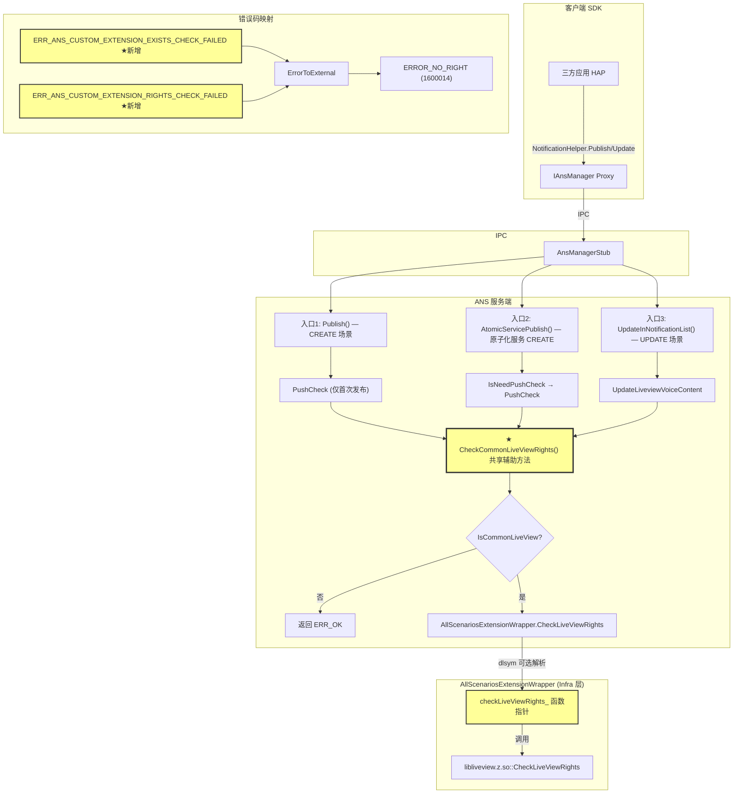

# Summary - liveview-rights-check

## 1. 功能概述

### 1.1 需求背景

三方应用通过 commonLiveView（实况通知）发布通知时，缺乏完整的权益校验机制。现有 PushCheck 仅在 `LIVE_VIEW_CREATE` 和 `LIVE_VIEW_PENDING_CREATE` 状态时触发，实况更新（`LIVE_VIEW_INCREMENTAL_UPDATE`、`LIVE_VIEW_FULL_UPDATE`）不经过 PushCheck，存在权益管控缺口。

权益校验规则由外部团队（libliveview.z.so 提供方）定义和维护，ANS 仅做校验判断的执行者，不内置规则逻辑。

### 1.2 核心功能

为三方实况通知（commonLiveView）的**普通发布**、**原子化服务发布**和**更新**流程增加权益校验能力：

1. **动态加载**：ANS 通过 AllScenariosExtensionWrapper 动态加载 `libliveview.z.so` 中的 `CheckLiveViewRights` 函数
2. **共享辅助方法**：提取 `CheckCommonLiveViewRights` 为 `AdvancedNotificationService` 的私有辅助方法，封装 `IsCommonLiveView` 判断 + `CheckLiveViewRights` 调用，三个入口复用
3. **普通发布入口校验**：在 PushCheck 之后、PublishPreparedNotification 之前调用 `CheckCommonLiveViewRights`（覆盖 CREATE 场景）
4. **原子化服务发布入口校验**：在 `IsNeedPushCheck` 分支内 PushCheck 之后调用 `CheckCommonLiveViewRights`（覆盖原子化服务 CREATE 场景）
5. **更新入口校验**：在 UpdateInNotificationList 函数内先调用 `UpdateLiveviewVoiceContent`，再调用 `CheckCommonLiveViewRights`（覆盖 INCREMENTAL_UPDATE / FULL_UPDATE 场景）
6. **容错处理**：符号未加载时跳过校验（返回 ERR_OK），兼容旧版本 .so
7. **错误码映射**：两个新内部错误码均映射为对外 `ERROR_NO_RIGHT` (1600014)

### 1.3 实现范围

**包含**：
- AllScenariosExtensionWrapper 新增 CheckLiveViewRights 符号解析和调用
- 新增两个内部错误码及 ErrorToExternal 映射
- 提取 CheckCommonLiveViewRights 共享辅助方法（三个入口复用）
- 普通发布流程（advanced_notification_publish.cpp）调用 CheckCommonLiveViewRights
- 原子化服务发布流程（advanced_notification_atomic_service_publish.cpp）调用 CheckCommonLiveViewRights
- 更新流程（advanced_notification_service.cpp UpdateInNotificationList）调用 CheckCommonLiveViewRights
- AllScenariosExtensionWrapper 单元测试框架搭建及 5 个测试用例
- CheckCommonLiveViewRights 辅助方法直接测试 3 个用例

**不包含**：
- ~~CJ/FFI 错误码同步~~ — CJ/FFI 非本项目维护范围（用户决策取消）
- ~~特性开关~~ — 无需条件编译包裹（用户决策取消）
- SystemLiveView（LOCAL_LIVE_VIEW）权益校验
- 分布式实况权益校验
- PushCheck 机制修改
- 公共 API / NAPI / NDK 变更

---

## 2. 架构说明

### 2.1 新增模块架构图



### 2.2 与现有架构集成说明

本次变更完全在现有架构框架内扩展，未引入新模块或新依赖：

1. **AllScenariosExtensionWrapper 扩展**：在现有 dlopen/dlsym 模式中追加一个可选符号（`CheckLiveViewRights`），遵循 `OnNotifyDelayedNotification` / `OnNotifyClearNotification` 的可选解析模式
2. **CheckCommonLiveViewRights 共享辅助方法**：在 `AdvancedNotificationService` 中新增私有辅助方法，封装 `IsCommonLiveView` 判断 + `CheckLiveViewRights` 调用，三个入口（普通发布、原子化服务发布、更新）复用此方法，避免代码重复
3. **普通发布流程集成**：在 `advanced_notification_publish.cpp` 中 PushCheck 失败检查之后调用 `CheckCommonLiveViewRights`
4. **原子化服务发布流程集成**：在 `advanced_notification_atomic_service_publish.cpp` 的 `IsNeedPushCheck` 分支内 PushCheck 之后调用 `CheckCommonLiveViewRights`
5. **更新流程集成**：在 `advanced_notification_service.cpp` 的 `UpdateInNotificationList` 函数内先调用 `UpdateLiveviewVoiceContent`（更新路径特有），再调用 `CheckCommonLiveViewRights`
6. **错误码扩展**：在 `ans_inner_errors.h` 的 ErrorCode enum 末尾和 `ans_inner_errors.cpp` 的 errorsConvert vector 末尾追加

### 2.3 核心类和接口说明

| 类/接口 | 说明 | 职责 |
|---------|------|------|
| `AllScenariosExtensionWrapper` | 现有类扩展 | 动态加载 libliveview.z.so，新增 `CheckLiveViewRights` 符号解析和调用 |
| `AllScenariosExtensionWrapper::CheckLiveViewRights()` | 新增方法 | 调用 libliveview.z.so 的 CheckLiveViewRights 函数进行权益校验 |
| `AdvancedNotificationService::CheckCommonLiveViewRights()` | 新增辅助方法 | 封装 IsCommonLiveView 判断 + CheckLiveViewRights 调用，三个入口复用 |
| `CHECK_LIVEVIEW_RIGHTS` | 新增 typedef | 函数指针类型：`ErrCode (*)(const sptr<NotificationRequest> &)` |
| `ERR_ANS_CUSTOM_EXTENSION_EXISTS_CHECK_FAILED` | 新增错误码 | 标识符号不可用（供 libliveview.z.so 内部使用或未来扩展） |
| `ERR_ANS_CUSTOM_EXTENSION_RIGHTS_CHECK_FAILED` | 新增错误码 | 标识权益校验失败（供 libliveview.z.so 内部使用或未来扩展） |

---

## 3. 任务执行摘要

| 类型 | 任务数 | 状态 | 说明 |
|------|--------|------|------|
| 核心实现 | 3 | ✅ 全部完成 | T001（错误码）、T004（Wrapper 扩展）、T005（流程集成） |
| 测试验证 | 1 | ✅ 完成 | T006（单元测试 5 个用例） |
| 已取消 | 2 | ❌ 取消 | T002（CJ/FFI）、T003（特性开关）— 用户决策 |

---

## 4. 功能实现说明

### 4.1 共享辅助方法 — CheckCommonLiveViewRights

**文件**：`services/ans/include/advanced_notification_service.h` + `services/ans/src/advanced_notification_service.cpp`

**设计说明**：提取为 `AdvancedNotificationService` 的私有辅助方法，封装 `IsCommonLiveView` 判断 + `CheckLiveViewRights` 调用，三个入口复用，避免代码重复。

```cpp
ErrCode AdvancedNotificationService::CheckCommonLiveViewRights(const sptr<NotificationRequest> &request)
{
    if (!request->IsCommonLiveView()) {
        return ERR_OK;
    }
    return Infra::ALL_SCENARIOS_EXTENTION_WRAPPER.CheckLiveViewRights(request);
}
```

### 4.2 入口1 — 普通发布流程（CREATE 场景）

**文件**：`services/ans/src/advanced_notification_manager/advanced_notification_publish.cpp`

**位置**：PushCheck 失败检查之后、PublishPreparedNotification 之前

**逻辑**：
```
→ 调用 CheckCommonLiveViewRights(request)
→ 校验失败：AnsStatus 封装 + ReportPublishFailedEvent + break
→ 校验通过/非 commonLiveView/符号未加载：继续发布流程
```

### 4.3 入口2 — 原子化服务发布流程（CREATE 场景）

**文件**：`services/ans/src/advanced_notification_manager/advanced_notification_atomic_service_publish.cpp`

**位置**：`CheckAndPrepareNotificationInfoWithAtomicService` 函数内 `IsNeedPushCheck` 分支中 PushCheck 成功之后

**逻辑**：
```
if (IsNeedPushCheck(request)) {
    PushCheck(request) → 失败则 return
    → 调用 CheckCommonLiveViewRights(request)
    → 校验失败：return AnsStatus(rightsResult, ...)
    → 校验通过/非 commonLiveView/符号未加载：继续流程
}
```

### 4.4 入口3 — 更新流程（UPDATE 场景）

**文件**：`services/ans/src/advanced_notification_service.cpp`

**位置**：`UpdateInNotificationList` 函数内，先调用 `UpdateLiveviewVoiceContent`（更新路径特有），再调用 `CheckCommonLiveViewRights`

**背景**：PushCheck 仅在首次发布（CREATE）时校验三方实况，更新场景（INCREMENTAL_UPDATE / FULL_UPDATE）不经过 PushCheck，需独立校验

**逻辑**：
```
if (record->request->IsCommonLiveView()) {
    → 调用 UpdateLiveviewVoiceContent(record->request)  // 更新路径特有
}
→ 调用 CheckCommonLiveViewRights(record->request)
→ 校验失败：AnsStatus 封装 + ReportPublishFailedEvent + return rightsResult
→ 校验通过/非 commonLiveView/符号未加载：继续更新流程
```

### 4.5 AllScenariosExtensionWrapper 扩展

**头文件**：`services/infrastructure/interfaces/all_scenarios_extension_wrapper.h`
- 新增 `CHECK_LIVEVIEW_RIGHTS` typedef
- 新增 `CheckLiveViewRights()` 公共方法声明
- 新增 `checkLiveViewRights_` 私有成员变量（初始化为 nullptr）

**实现文件**：`services/infrastructure/external_adapter/extension/all_scenarios_extension_wrapper.cpp`
- `InitExtensionWrapper()`：可选 dlsym 解析 `CheckLiveViewRights` 符号（不做 nullptr 检查和 early return）
- `CloseExtensionWrapper()`：`checkLiveViewRights_ = nullptr` 清理
- `CheckLiveViewRights()` 方法：
  - nullptr → `ANS_LOGW` + 返回 `ERR_OK`（跳过校验）
  - 调用函数 → 直接返回原始结果（透传错误码）
  - 校验失败 → `ANS_LOGE` 记录

### 4.6 错误码定义与映射

**ans_inner_errors.h**：ErrorCode enum 末尾新增
- `ERR_ANS_CUSTOM_EXTENSION_EXISTS_CHECK_FAILED`
- `ERR_ANS_CUSTOM_EXTENSION_RIGHTS_CHECK_FAILED`

**ans_inner_errors.cpp**：errorsConvert vector 末尾新增
- `{ERR_ANS_CUSTOM_EXTENSION_EXISTS_CHECK_FAILED, ERROR_NO_RIGHT}`
- `{ERR_ANS_CUSTOM_EXTENSION_RIGHTS_CHECK_FAILED, ERROR_NO_RIGHT}`

---

## 5. 修改文件清单

| 序号 | 文件路径 | 修改类型 | 所属任务 | 说明 |
|------|----------|----------|----------|------|
| 1 | `frameworks/core/common/include/ans_inner_errors.h` | 修改 | T001 | ErrorCode enum 末尾新增两个错误码 |
| 2 | `frameworks/core/common/src/ans_inner_errors.cpp` | 修改 | T001 | errorsConvert vector 新增两个映射 |
| 3 | `services/infrastructure/interfaces/all_scenarios_extension_wrapper.h` | 修改 | T004 | 新增 typedef、方法声明、成员变量 |
| 4 | `services/infrastructure/external_adapter/extension/all_scenarios_extension_wrapper.cpp` | 修改 | T004 | 新增可选 dlsym、方法实现、Close 清理 |
| 5 | `services/ans/include/advanced_notification_service.h` | 修改 | T005 | 新增 CheckCommonLiveViewRights 辅助方法声明 |
| 6 | `services/ans/src/advanced_notification_service.cpp` | 修改 | T005 | 新增 CheckCommonLiveViewRights 实现 + UpdateInNotificationList 内调用 |
| 7 | `services/ans/src/advanced_notification_manager/advanced_notification_publish.cpp` | 修改 | T005 | 新增 include + 调用 CheckCommonLiveViewRights（普通发布） |
| 8 | `services/ans/src/advanced_notification_manager/advanced_notification_atomic_service_publish.cpp` | 修改 | T005 | 新增 include + 调用 CheckCommonLiveViewRights（原子化服务发布） |
| 9 | `services/ans/test/unittest/advanced_notification_publish_service_test.cpp` | 修改 | T006 | 新增 3 个 CheckCommonLiveViewRights 直接测试用例 |
| 10 | `services/infrastructure/test/unittest/all_scenarios_extension/mock_dlfcn.h` | 新增 | T006 | MockDlfcnState 结构体定义 |
| 11 | `services/infrastructure/test/unittest/all_scenarios_extension/mock_dlfcn.cpp` | 新增 | T006 | --wrap 拦截实现 |
| 12 | `services/infrastructure/test/unittest/all_scenarios_extension/all_scenarios_extension_wrapper_test.cpp` | 新增 | T006 | 5 个测试用例 |
| 13 | `services/infrastructure/test/unittest/all_scenarios_extension/BUILD.gn` | 新增 | T006 | 测试 target 配置 |
| 14 | `services/infrastructure/test/unittest/BUILD.gn` | 修改 | T006 | 注册测试 target 依赖 |

---

## 6. 关键设计决策

### 6.1 架构决策

| 决策ID | 决策点 | 决策结果 | 决策理由 |
|--------|--------|----------|----------|
| ARCH-DEC-001 | 动态加载方式 | 扩展 AllScenariosExtensionWrapper | libliveview.z.so 已被此 wrapper 加载，避免重复 dlopen |
| ARCH-DEC-002 | dlsym 策略 | 可选解析（符号不存在时不中断初始化） | 兼容旧版本 .so |
| ARCH-DEC-003 | 校验插入位置 | PushCheck 之后、PublishPreparedNotification 之前 | 依赖 PushCheck 结果 |
| ARCH-DEC-004 | 校验覆盖范围 | CREATE + UPDATE（不含 END） | 需求明确 |
| ARCH-DEC-005 | 错误码映射 | 两个新内部错误码均映射为 ERROR_NO_RIGHT (1600014) | 需求明确 |

### 6.2 用户修改（偏离原始架构设计）

| 编号 | 修改点 | 原始设计 | 用户修改后 | 影响 |
|------|--------|----------|------------|------|
| MOD-1 | 符号未加载行为 | 返回 `ERR_ANS_CUSTOM_EXTENSION_EXISTS_CHECK_FAILED`（阻断发布） | 返回 `ERR_OK`（跳过校验，不阻断发布，记录 WARN 日志） | 兼容旧版本 .so 时不阻断发布流程 |
| MOD-2 | 校验失败返回值 | 统一返回 `ERR_ANS_CUSTOM_EXTENSION_RIGHTS_CHECK_FAILED` | 直接透传 libliveview.z.so 的原始错误码 | 上层可精确判断失败原因 |
| MOD-3 | CJ/FFI 错误码同步 | 需同步修改 CJ/FFI 层错误码 | 取消 — CJ/FFI 非本项目维护范围 | 减少修改范围，遵循 AGENTS.md 约束 |
| MOD-4 | 特性开关 | 新增 `distributed_notification_service_feature_liveview_rights_check` 特性开关 | 取消 — 无需特性开关，直接集成 | 简化代码，无 `#ifdef` 包裹 |
| MOD-5 | 更新入口 | 仅在发布流程 PushCheck 之后校验 | 新增 `UpdateInNotificationList` 更新入口 | PushCheck 仅首次发布校验三方实况，更新场景需独立入口 |
| MOD-6 | 原子化服务发布入口 | 未覆盖原子化服务发布 | 新增 `AtomicServicePublish` 入口，在 `IsNeedPushCheck` 分支内 PushCheck 之后调用 `CheckCommonLiveViewRights` | 原子化服务有独立发布接口，需单独覆盖 |

### 6.3 实现优化

| 优化点 | 说明 |
|--------|------|
| CheckCommonLiveViewRights 共享辅助方法 | 提取为 `AdvancedNotificationService` 私有方法，三个入口复用，避免代码重复 |
| LiveViewStatus 获取方式 | 发现 `NotificationRequest` 提供直接的 `GetLiveViewStatus()` 方法，无需通过 `static_pointer_cast<NotificationLiveViewContent>` 获取，代码更简洁 |
| 嵌套深度优化 | 将 `UpdateInNotificationList` 中的权益校验逻辑提取到 `CheckCommonLiveViewRights`，解决函数嵌套深度超过 4 层的静态告警 |

---

## 7. 审批历史摘要

| 阶段 | 状态 | 决策 | 摘要 |
|------|------|------|------|
| Architecture | ✅ done | approved | 确定扩展 AllScenariosExtensionWrapper、可选 dlsym、PushCheck 之后校验、两个新错误码映射 ERROR_NO_RIGHT |
| Dev-Design | ✅ done | approved | 细化实现方案，用户确认 5 项修改：符号未加载跳过校验、透传错误码、移除 CJ/FFI、移除特性开关、新增更新入口 |
| Plan | ✅ done | approved | 4 个有效任务（T001→T004→T005→T006），2 个取消（T002 CJ/FFI、T003 特性开关） |
| Execute | ✅ done | 4/4 done | 所有任务执行完成，T005 经历 1 次重试 |
| Build | ✅ done | BLOCKED（预存错误） | 本次变更文件全部编译成功，整体编译被预存的 notification_preferences_database.cpp 错误阻塞 |
| Doc | ✅ done | — | 本文档 |

---

## 8. 各任务执行结果

| 任务ID | 名称 | 类型 | 状态 | Review | Build | 关键结论 |
|--------|------|------|------|--------|-------|----------|
| T001 | 新增内部错误码定义及映射 | 核心实现 | ✅ done | ✅ pass | ✅ 编译成功 | ErrorCode enum 末尾新增两个值，errorsConvert 新增两个映射 |
| ~~T002~~ | ~~CJ/FFI 错误码同步~~ | — | ❌ 取消 | — | — | CJ/FFI 非本项目维护范围 |
| ~~T003~~ | ~~新增特性开关定义~~ | — | ❌ 取消 | — | — | 无需特性开关 |
| T004 | AllScenariosExtensionWrapper 扩展 | 核心实现 | ✅ done | ✅ pass | ✅ 编译成功 | 新增 typedef + 可选 dlsym + CheckLiveViewRights 方法 |
| T005 | 发布和更新流程集成权益校验 | 核心实现 | ✅ done | ✅ pass（retry 1） | ✅ 编译成功 | 三个入口（普通发布+原子化服务发布+更新）集成，提取 CheckCommonLiveViewRights 共享辅助方法，修复嵌套深度告警 |
| T006 | 单元测试框架搭建及用例编写 | 测试验证 | ✅ done | ✅ pass | ✅ 编译成功 | 5 个 Wrapper 测试用例 + 3 个 CheckCommonLiveViewRights 直接测试用例 |

---

## 9. 接口兼容性说明

### 9.1 公共接口

本次修改**不涉及**任何公共 API 变更：
- `interfaces/inner_api/` — 未修改
- `interfaces/kits/napi/` — 未修改
- `interfaces/ndk/` — 未修改

权益校验完全在服务端内部执行，对客户端透明。校验失败时 ArkTS 应用通过现有的 `ErrorToExternal` 映射收到 `ERROR_NO_RIGHT` (1600014)。

### 9.2 内部接口

| 接口 | 变更类型 | 兼容性 |
|------|----------|--------|
| `AllScenariosExtensionWrapper::CheckLiveViewRights()` | 新增方法 | 不影响现有方法 |
| `ERR_ANS_CUSTOM_EXTENSION_EXISTS_CHECK_FAILED` | 新增枚举值 | 追加在 enum 末尾，不影响现有值 |
| `ERR_ANS_CUSTOM_EXTENSION_RIGHTS_CHECK_FAILED` | 新增枚举值 | 追加在 enum 末尾，不影响现有值 |

### 9.3 libliveview.z.so 版本兼容

| .so 版本 | 行为 |
|----------|------|
| 新版本（含 CheckLiveViewRights 符号） | 正常调用权益校验 |
| 旧版本（不含 CheckLiveViewRights 符号） | dlsym 返回 nullptr，调用时返回 ERR_OK（跳过校验，不阻断发布） |

---

## 10. 遗留问题与后续建议

### 10.1 本轮已完成

- ✅ AllScenariosExtensionWrapper 新增 CheckLiveViewRights 符号解析和调用
- ✅ 新增两个内部错误码及 ErrorToExternal 映射
- ✅ 提取 CheckCommonLiveViewRights 共享辅助方法（三个入口复用）
- ✅ 普通发布流程（CREATE）权益校验集成
- ✅ 原子化服务发布流程（CREATE）权益校验集成
- ✅ 更新流程（UPDATE）权益校验集成
- ✅ AllScenariosExtensionWrapper 单元测试 5 个用例（覆盖三个分支 + 错误码映射）
- ✅ CheckCommonLiveViewRights 直接测试 3 个用例（commonLiveView 失败/跳过 + 非 commonLiveView 跳过）
- ✅ 所有变更文件编译成功

### 10.2 本轮故意不做

| 项目 | 原因 |
|------|------|
| CJ/FFI 错误码同步 | CJ/FFI 非本项目维护范围（AGENTS.md 约束） |
| 特性开关 | 用户确认无需条件编译包裹 |
| SystemLiveView 权益校验 | 需求明确仅针对三方实况（commonLiveView） |
| 分布式实况权益校验 | 需求仅针对本地发布流程 |
| 修复预存编译错误 | notification_preferences_database.cpp 的 RDB 接口不匹配问题非本次变更引入 |
| 修复 onNotifyDelayedNotification_/onNotifyClearNotification_ Close 遗漏 | 已知预存问题，非本次任务范围 |

### 10.3 后续可选优化

| 优化项 | 优先级 | 说明 |
|--------|--------|------|
| 修复预存 RDB 编译错误 | P0 | `NotificationRdbMgr` 缺少 `QueryDataEndsWithOr` 和 `QueryDataWithKeys` 方法，阻塞整体编译 |
| UpdateInNotificationList 部分调用方忽略返回值 | LOW | `PublishContinuousTaskNotification` 和 `OnDistributedUpdate` 忽略 UpdateInNotificationList 返回值，为预存设计问题 |
| mock_dlfcn 中无效注册项清理 | LOW | `ResetMockDlfcn` 注册了 `OnNotifyDelayedNotification` 和 `OnNotifyClearNotification` 但 `__wrap_dlsym` 中无对应处理分支 |
| 集成测试 | 中 | 功能测试 FT-001 ~ FT-006 需在设备/模拟器环境执行 |

---

## 11. 使用说明

### 11.1 权益校验行为说明

| 场景 | 行为 | 返回值 |
|------|------|--------|
| commonLiveView CREATE + 校验通过 | 正常发布 | ERR_OK |
| commonLiveView CREATE + 校验失败 | 阻断发布，返回错误 | libliveview.z.so 原始错误码 → ERROR_NO_RIGHT |
| commonLiveView UPDATE + 校验通过 | 正常更新 | ERR_OK |
| commonLiveView UPDATE + 校验失败 | 阻断更新，返回错误 | libliveview.z.so 原始错误码 → ERROR_NO_RIGHT |
| commonLiveView END | 跳过校验 | 正常处理 |
| SystemLiveView / 普通通知 | 跳过校验 | 正常处理 |
| 旧版本 .so（符号不存在） | 跳过校验，记录 WARN 日志 | ERR_OK |
| dlopen 失败 | 跳过校验 | ERR_OK |

### 11.2 注意事项

1. 权益校验依赖 libliveview.z.so 提供方确保 `CheckLiveViewRights` 函数导出并符合接口约定
2. 校验失败时 ArkTS 应用收到 `ERROR_NO_RIGHT` (1600014)，无法区分是符号不可用还是权益规则判定失败（两个内部错误码映射为同一外部错误码）
3. 当前整体编译被预存的 `notification_preferences_database.cpp` 错误阻塞，需先修复该问题才能进行完整的编译验证和测试执行
